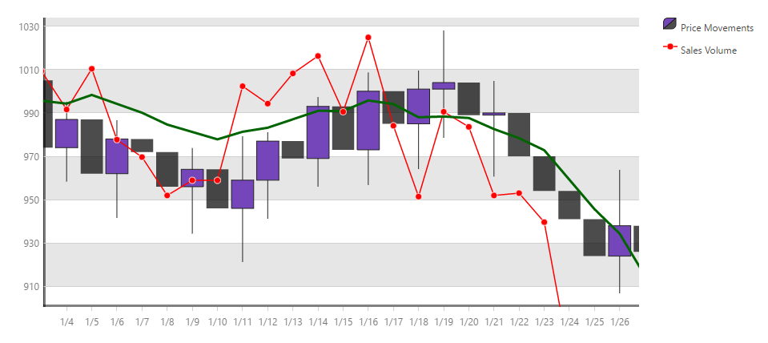

<!--
|metadata|
{
    "fileName": "igdatachart-adding",
    "controlName": "igDataChart",
    "tags": ["Charting","Data Presentation","Getting Started"]
}
|metadata|
-->

# Adding igDataChart


## Topic Overview
### Purpose

This topic demonstrates how to add the `igDataChart`™ control to a page and bind it to data.

### Required Background

The following table lists the materials required as a prerequisite to understanding this topic.


**Concepts**

-   [jQuery](http://docs.jquery.com/Main_Page), [jQuery UI](http://jqueryui.com/)
-   [ASP.NET MVC](http://www.asp.net/mvc)

**Topics**

-	[Ignite UI Overview](NetAdvantage-for-jQuery-Overview.html): General information on the Ignite UI™ library.

-	[Using JavaScript Resources in Ignite UI](Deployment-Guide-JavaScript-Resources.html): This topic provides general guidance on adding required JavaScript resources to use controls from the Ignite UI library.

-	[igDataChart Overview](igDataChart-Overview.html): This topic provides conceptual information about the `igDataChart`™ control including its main features, minimum requirements for using charts and user functionality.

### In This Topic

This topic contains the following sections:

-   [Add Chart to a Web Page](#add-chart)
   -   [Introduction](#introduction)
    -   [Preview](#preview)
    -   [Requirements](#requirements)
    -   [Overview](#overview)
    -   [Steps](#steps)
-   [Resources for Charts Reference](#charts-reference)
-   [Related Content](#related-content)
   -   [Topics](#topics)
    -   [Samples](#samples)
    -   [Resources](#resources)

##<a id="add-chart"></a>Add Chart to a Web Page


###<a id="introduction"></a> Introduction

This procedure will guide you through the process of adding a chart control with legend and data series to a web page. The data for the chart in the example is supplied into a JavaScript array for the HTML/jQuery example and from a model object for the ASP.NET MVC example. The chart includes financial and line charts.

### <a id="preview"></a>Preview

The following screenshot is a preview of the final result.



###<a id="requirements"></a> Requirements

-   To complete the procedure, you need the following:
  -   An ASP.NET MVC web application in Visual Studio for the MVC examples.
    -   An HTML5 web page for the HTTP examples.

###<a id="overview"></a> Overview

This topic takes you step-by-step toward adding a chart control to a web page. The following is a conceptual overview of the process:

1.  [Add references to required resources](#add-references-to-required-resources)
    1.  [Preparation](#preparation)
    2.  [Use igLoader in JavaScript](#use-igLoader-in-js)
    3.  [Use MVC Loader](#use-mvc-loader)
    4.  [Loading Resources Statically](#load-resources-staticallty)
2.  [Add HTML markup required by the igDataChart](#add-html-markup)
3.  [Add data source](#add-data-array)
4.  [Configure basic chart options](#configure-basic)
5.  [Configure chart axis options](#configure-axis)
6.  [Data series options](#configure-dataSeries)
7.  [(Optional) Observe Final Result](#view-results)

###<a id="steps"></a> Steps

The following steps demonstrate how to add an `igDataChart` control to a web page.

1. Add references to required resources.<a id="add-references-to-required-resources"></a> 

	<a id="preparation"></a>**Preparation**
	
	Add the jQuery, jQueryUI and Modernizr JavaScript resources to a folder named `Scripts` in your web site or web application.
	
	Add the Ignite UI CSS files to a folder named `Content/ig` in your web site or web application (see the [Styling and Theming in Ignite UI](Deployment-Guide-Styling-and-Theming.html) topic for details).
	
	Add the Ignite UI JavaScript files to a folder named `Scripts/ig` in your web site or web application (see the [Using JavaScript Resouces in Ignite UI](Deployment-Guide-JavaScript-Resources.html) topic for details).
	
	<a id="use-igLoader-in-js"></a>**Use igLoader in JavaScript**
	
	The `igLoader`™ control is the recommended way to load JavaScript and CSS resources required by the Ignite UI library controls. First the `igLoader` script must be included in the page:
	
	**In HTML:**
	
	```html
	<script  type="text/javascript" src="Scripts/ig/infragistics.loader.js"></script>
	```
	
	For HTML views the `igLoader` must be instantiated this way:
	
	**In HTML:**
	
	```html
	<script type="text/javascript">
	    $.ig.loader({
	        scriptPath: "Scripts/ig/",
	        cssPath: "Content/ig/",
	        resources: "igDataChart.Category.Financial,igChartLegend"
	    });
	<script>
	```
	
	The `resources` option specifies the particular chart series type that will be rendered. Multiple data series types can be specified in a comma separated list. For details on how to refer to different series types with `igLoader` see the reference section [Resources for Charts Reference](#charts-reference) at the end of this document.
	
	<a id="use-mvc-loader"></a>**Use MVC Loader**
	
	The `Infragistics.Web.Mvc` assembly must be referenced in your ASP.NET MVC project and the corresponding namespace must be referenced in your view. For details, see [Using JavaScript Resources in Ignite UI](Deployment-Guide-JavaScript-Resources.html) but for clarity the code to reference the namespace is given here.
	
	**In ASPX:**
	
	```csharp
	<%@ Import Namespace="Infragistics.Web.Mvc" %>
	<%= Html.Infragistics().Loader()
	        .ScriptPath(Url.Content("~/Scripts/ig/"))
	        .CssPath(Url.Content("~/Content/ig/"))
	        .Render()
	%>
	```
	
	The MVC helper for `igLoader` automatically detects required resources and specifying resources is not necessary.
	
	<a id="load-resources-staticallty"></a>**Loading Resources Statically**
	
	In case static resource loading is preferred you can refer to the [igDataChart Overview: Minimum Requirements](igDataChart-Overview.html#min-requirements) to see which resource files must be linked to use charts.

2. Add HTML markup required by the `igDataChart`.<a id="add-html-markup"></a>  

	**HTML example**

	Add the div elements for the chart and the legend which will be referred in the chart instantiation code.
	
	**In HTML:**
	
	```html
	<div id="chart" class="chartContainer"></div>
	<div id="legend" class="chartContainer"></div>
	```
	
	**ASP.NET Example**
	
	For ASP.NET MVC no container elements are needed because the MVC helper adds the required markup automatically.

3. Add data source. <a id="add-data-array"></a> 

	**HTML example**
	
	For the HTML example some JavaScript code must be added that defines an array with several data records for financial data. In order to get information on binding to other data sources you may refer to the [Binding igDataChart to Data](igDataChart-DataBinding.html) topic. 
	
	Include the following code in the head section of your HTML document.
	
	**In HTML:**
	
	```html
	<script type="text/javascript">
	    var data = [
	        { "DateString": "1/2", "Open": 1000, "High": 1028.75, "Low": 985.25, "Close": 1020, "Volume": 1995 },            
			{ "DateString": "1/3", "Open": 1020, "High": 1032.5, "Low": 999.5, "Close": 1021, "Volume": 1964.5 },            
			{ "DateString": "1/4", "Open": 1021, "High": 1033.5, "Low": 996, "Close": 1033, "Volume": 1974.75 },            
			{ "DateString": "1/5", "Open": 1033, "High": 1062, "Low": 1018.75, "Close": 1042, "Volume": 1978.5 },            
			{ "DateString": "1/6", "Open": 1042, "High": 1058.5, "Low": 1019.75, "Close": 1029, "Volume": 1979 },            
			{ "DateString": "1/7", "Open": 1029, "High": 1050.75, "Low": 1006, "Close": 1042, "Volume": 1990 }        
		];
	</script>
	```
	
	**ASP.NET example**
	
	The way to supply data for an ASP.NET MVC view is through a controller method and appropriate data model definition. Here follows the data model part. Create a new empty class into the Models folder of you ASP.NET MVC application and add the following code.
	
	**In C#:**
	
	```csharp
	public class StockMarketDataPoint
	{
	    public double Open { get; set; }
	    public double High { get; set; }
	    public double Low { get; set; }
	    public double Close { get; set; }
	    public double Volume { get; set; }
	    public DateTime Date { get; set; }
	    public string DateString { get { return string.Format("{0:M/d}", Date); } }
	}
	```
	
	Add an empty controller class in the Controllers folder and the following code for the Index (or whatever your view is named) method:
	
	**In C#:**
	
	```csharp
	public ActionResult Index()
	{
	    List<StockMarketDataPoint> stockMarketData = new List<StockMarketDataPoint>
	    {
	        new StockMarketDataPoint { Date = DateTime.Parse("2.1.2010"), Open = 1000, High = 1028.75, Low = 985.25, Close = 1020, Volume = 1995 },
	        new StockMarketDataPoint { Date = DateTime.Parse("3.1.2010"), Open = 1020, High = 1032.5, Low = 999.5, Close = 1021, Volume = 1964.5 },
	        new StockMarketDataPoint { Date = DateTime.Parse("4.1.2010"), Open = 1021, High = 1033.5, Low = 996, Close = 1033, Volume = 1974.75 },
	        new StockMarketDataPoint { Date = DateTime.Parse("5.1.2010"), Open = 1033, High = 1062, Low = 1018.75, Close = 1042, Volume = 1978.5 },
	        new StockMarketDataPoint { Date = DateTime.Parse("6.1.2010"), Open = 1042, High = 1058.5, Low = 1019.75, Close = 1029, Volume = 1979 },
	        new StockMarketDataPoint { Date = DateTime.Parse("7.1.2010"), Open = 1029, High = 1050.75, Low = 1006, Close = 1042, Volume = 1990 }
	    };
	            
	    return View(stockMarketData);
	}
	```
	
	Add the following code in your ASP.NET MVC view to make it strongly-typed and point to the data model class created above:
	
	**In ASPX:**
	
	```csharp
	<%@ Page Language="C#" Inherits="System.Web.Mvc.ViewPage<IQueryable<DataChartSample.Models.StockMarketDataPoint>>" %>
	```

4. Configure basic chart options. <a id="configure-basic"></a> 

	**HTML example**
	
	For the chart and legend div tags to be wrapped and chart drawn, the `igDataChart` control must be instantiated and its main options set. Add the code below to the existing code in the `<script>` tag used above for data array definition:
	
	**In Javascript:**
	
	```js
	$(function () {
	    $("#chart").igDataChart({
	        width: "500px",
	        height: "500px",
	        dataSource: data,
	        crosshairVisibility: "visible"
	    });
	});
	```
	
	Note how the previously defined array data has been assigned to the `dataSource` option of the chart control and the `crosshairVisibility` option that enables cross-hair in the chart when its value is set to “visible”.
	
	**ASP.NET example**
	
	The code below instantiates and sets the main features of the `igDataChart` using the MVC helper for chart provided in the `Infragistics.Web.Mvc` assembly. The data model is associated with the control with the DataChart(Model) call and the rest of the calls act similarly to the HTML example.
	
	**In ASPX:**
	
	```csharp
	<%= Html.Infragistics().DataChart(Model)
	    .ID("chart")
	    .Width("500px")
	    .Height("500px")
	    .CrosshairVisibility(Visibility.Visible)
	    .DataBind()
	    .Render()
	%>
	```

5. Configure chart axis options. <a id="configure-axis"></a> 

	**HTML example**
	
	The code in the previous step is not sufficient to display a meaningful chart and axis settings must also be configured on instantiation. The code below must be added after the `crosshairVisibility` option.
	
	**In Javascript:**
	
	```js
	axes: [{
	    type: "categoryX",
	    name: "xAxis",
	    label: "DateString",
	    stroke: "rgba(0, 0, 0, 0.5)",
	    strokeThickness: 5,
	    interval: 1
	}, {
	    type: "numericY",
	    name: "priceAxis",
	    stroke: "rgba(0, 0, 0, 0.5)",
	    strip: "rgba(0, 0, 0, 0.1)",
	    strokeThickness: 5
	}, {
	    type: "numericY",
	    name: "volumeAxis",
	    labelVisibility: "collapsed",
	    stroke: "rgba(0, 0, 0, 0.5)",
	    majorStroke: "rgba(0, 0, 0, 0)"
	}]
	```
	
	The code above sets values for constants used to assign brushes to the axes properties. Then the `igDataChart` instantiation code sets basic options for the axes. The axis type determines if this is the category X-axis or a numeric (value) Y-axis, and the axes names are used in data series configuration to refer to which axis to map a particular data series. Brushes assigned to stroke set how an axis must be plotted on the page. Setting a brush to the strip option causes axis strips to be plotted to the `priceAxis`.
	
	**ASP.NET example**
	
	For simplicity the full ASP.NET view code at this point in the procedure is given below:
	
	**In ASPX:**
	
	```csharp
	<%= Html.Infragistics().DataChart(Model)
	        .ID("chart")
	        .Width("500px")
	        .Height("500px")
	        .CrosshairVisibility(Visibility.Visible)
	        .Axes(axes =>
	            {
					axes.CategoryX("xAxis")
					.Label(item => item.DateString)
					.Stroke("rgba(0, 0, 0, 0.5)")
					.StrokeThickness(5)
					.Interval(1);
	
					axes.NumericY("priceAxis")
					.Stroke("rgba(0, 0, 0, 0.5)")
					.StrokeThickness(5)
					.Strip("rgba(0, 0, 0, 0.1)");
	
					axes.NumericY("volumeAxis")
					.LabelVisibility(Visibility.Collapsed)
					.Stroke("rgba(0, 0, 0, 0.5)")
					.MajorStroke("rgba(0, 0, 0, 0)");
	            })
	        .DataBind()
	        .Render();
	%>
	```
	
	This code defines the three axes the same way as in the HTML example. The difference here is how the category X-axis is mapped to the date property of each data item which is done by assigning `item.DataString` in the `Label()` function call.

6. Data series options.<a id="configure-dataSeries"></a> 

	**HTML example**
	
	The last step to make a chart functional is to set the data series options. Add the following code to the `igDataChart` instantiation code.
	
	**In Javascript:**
	
	```js
	series: [{
	    type: "financial",
	    name: "finSeries",
	    title: "Price Movements",
	    brush: "rgba(116, 70, 185, 1)",
	    negativeBrush: "rgba(0, 0, 0, 0.7)",
	    xAxis: "xAxis",
	    yAxis: "priceAxis",
	    openMemberPath: "Open",
	    lowMemberPath: "Low",
	    highMemberPath: "High",
	    closeMemberPath: "Close",
	    showTooltip: true,
	    tooltipTemplate: "priceTooltip",
	    legend: { element: "legend" }
	}, {
	    type: "line",
	    name: "volumeSeries",
	    brush: "rgba(255, 0, 0, 1)",
	    title: "Sales Volume",
	    markerType: "circle",
	    xAxis: "xAxis",
	    yAxis: "volumeAxis",
	    valueMemberPath: "Volume",
	    trendLineThickness: 3,
	    trendLineBrush: "rgba(0, 100, 0, 1)",
	    trendLineType: "modifiedAverage",
	    showTooltip: true,
	    tooltipTemplate: "volumeTooltip",
	    legend: { element: "legend" }
	}]
	```
	
	This code defines two data series to be plotted on the chart. The two data series are mapped to the corresponding Y-axes because the values in the two data series exist in different value ranges and we want to display them in a different way.
	
	The first one is of the financial or “candlestick” type and its title is set to “Price Movements” which is displayed on the chart legend. Legend itself is assigned with the legend option which just points to the div element that has been previously included on the page. The `openMemberPath`, `lowMemberPath`, `highMemberPath` and `closeMemberPath` options determine which member of the objects in the data array will be used for the corresponding parameters of the financial data series plot.
	
	The second data series is of the line type which plots individual points and connects them by straight lines. It is titled “Sales Volume” and also is configured to plot circles as markers for each data point with the `markerType` option. Here it is important to note the function of the `valueMemberPath` option which determines which member of the objects in the data array will be used to get individual data points. Additionally, setting the `trendlineType` option to ‘`modifiedAverage`’ causes a trend line for the `volumeSeries` to be computed and plotted on the chart.
	
	**ASP.NET example**
	
	Add the following code just before the `.DataBind()` statement in the HTML helper code. This code is valid for both ASPX and Razor.
	
	**In ASPX:**
	
	```csharp
	.Series(series =>
	    {
			series.Financial("finSeries")
					.Title("Price Movements")
					.XAxis("xAxis")
					.YAxis("priceAxis")
					.OpenMemberPath(item => item.Open)
					.CloseMemberPath(item => item.Close)
					.LowMemberPath(item => item.Low)
					.HighMemberPath(item => item.High)
					.Brush("rgba(116, 70, 185, 1)")
					.NegativeBrush("rgba(0, 0, 0, 0.7)")
					.Legend(legend => legend.ID("legend"));
	
			series.Line("volumeSeries")
					.Title("Sales Volume")
					.XAxis("xAxis")
					.YAxis("volumeAxis")
					.ValueMemberPath(item => item.Volume)
					.MarkerType(MarkerType.Circle)
					.Brush("rgba(255, 0, 0, 1)")
					.MarkerBrush("rgba(255, 0, 0, 1)")
					.TrendLineType(TrendLineType.ModifiedAverage)
					.TrendLineBrush("rgba(0, 100, 0, 1)")
					.TrendLineThickness(3)
					.Legend(legend => legend.ID("legend"));
		}
	)
	```
	
	The meaning of the code is the same as with the JavaScript code given above.

7. (Optional) Observe Final Result.<a id="view-results"></a> 

	After completing all the above steps you may save the page and view the final result in a web browser. It must look like the figure shown in the beginning of the procedure.

##<a id="charts-reference"></a>Resources for Charts Reference


### Introduction

This section is reference for Infragistics® Loader™ resource names for different series types supported by the `igDataChart` control.

### igLoader resource reference

The following table specifies resource names to be used with `igLoader`™ for different `igDataChart` series types.

<table class="table">
	<thead>
		<tr>
			<th>Chart Series Type</th>
			<th>Resource Name</th>
		</tr>
	</thead>
	<tbody>
		<tr>
			<td>area, column, line, spline, splineArea, stepArea, stepLine, waterfall</td>
			<td>igDataChart.Category</td>
		</tr>
		<tr>
			<td>bar</td>
			<td>igDataChart.VerticalCategory</td>
		</tr>
		<tr>
			<td>rangeArea, rangeColumn</td>
			<td>igDataChart.RangeCategory</td>
		</tr>
		<tr>
			<td>financial</td>
			<td>igDataChart.Financial</td>
		</tr>
		<tr>
			<td>typicalPriceIndicator, absoluteVolumeOscillatorIndicator, averageTrueRangeIndicator, accumulationDistributionIndicator, averageDirectionalIndexIndicator</td>
			<td>igDataChart.ExtendedFinancial</td>
		</tr>
		<tr>
			<td>polarArea, polarLine, polarScatter</td>
			<td>igDataChart.Polar</td>
		</tr>
		<tr>
			<td>radialColumn, radialLine, radialPie</td>
			<td>igDataChart.Radial</td>
		</tr>
		<tr>
			<td>scatter, scatterLine</td>
			<td>igDataChart.Scatter</td>
		</tr>
		<tr>
			<td>stackedBar, stacked100Bar, stackedArea, stacked100Area, stackedColumn, stacked100Column, stackedLine, stacked100Line, stackedSpline, stacked100Spline, stackedSplineArea, stacked100SplineArea</td>
			<td>igDataChart.Stacked</td>
		</tr>
		<tr>
			<td>crosshairLayer, categoryHighlightLayer, categoryItemHighlightLayer, itemToolTipLayer, categoryToolTipLayer</td>
			<td>igDataChart.Annotation</td>
		</tr>
		<tr>
			<td>Date-time axis</td>
			<td>igDateTimeAxis</td>
		</tr>
		<tr>
			<td>Chart legend</td>
			<td>igChartLegend</td>
		</tr>
		<tr>
			<td>Overview Plus Detail Pane</td>
			<td>igOverviewPlusDetailPane</td>
		</tr>
	</tbody>
</table>


##<a id="related-content"></a>Related Content


###<a id="topics"></a> Topics

The following topics provide additional information related to this topic.

-	[Binding igDataChart to Data](igDataChart-DataBinding.html): Shows how to bind data from various data sources to a chart control. This includes JavaScript arrays, JSON, WCF service. Shows how a big volume of data can be data bound to a chart control.

-	[jQuery and ASP.NET MVC Helper API Reference Links (igDataChart)](igDataChart-API-Links.html): References to the jQuery API reference of `igDataChart` and contains a reference table with all MVC helper properties with code snippets.

-	[Styling igDataChart](igDataChart-Styling-Themes.html): Demonstrates how to use the `igDataChart`™ control to apply styles and themes.


###<a id="samples"></a> Samples

The following samples provide additional information related to this topic.


-	[Bar and Column Series](%%SamplesUrl%%/data-chart/bar-and-column-series): Demonstrates how bar and column charts can be implemented using the `igDataChart` control.

-	[Composite Chart](%%SamplesUrl%%/data-chart/composite-chart): This sample demonstrates how to configure a composite chart with two Y-axes with different range and two different data series types: column and line series.


###<a id="resources"></a> Resources

The following material (available outside the Infragistics family of content) provides additional information related to this topic.

-	[jQuery Home Page](http://jquery.com/): This is a link to the main page of the jQuery library where more detailed information on installing and features of the library can be found.

-	[ASP.NET MVC Home Page](http://www.asp.net/mvc): This is a link to the main page of ASP.NET MVC where more detailed information on installing and using ASP.NET MVC can be found.