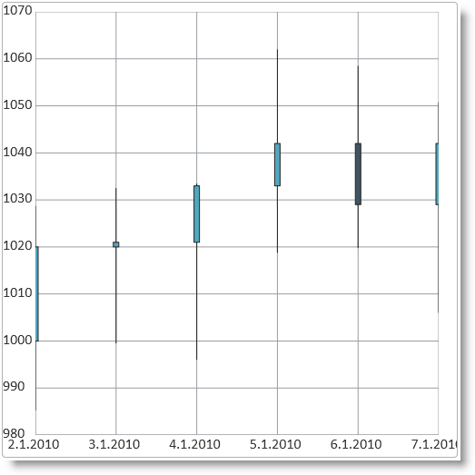
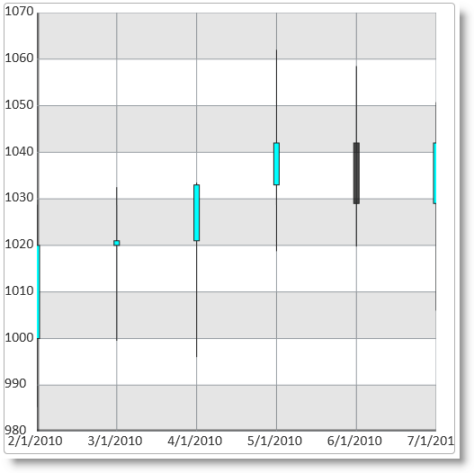
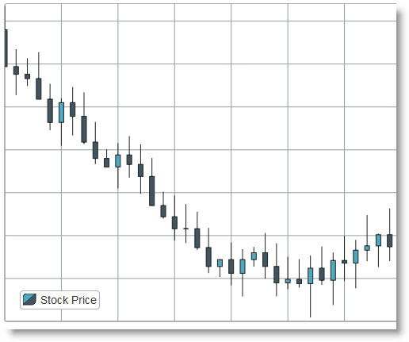

<!--
|metadata|
{
    "fileName": "igdatachart-databinding",
    "controlName": "igDataChart",
    "tags": ["Charting","Data Binding","How Do I"]
}
|metadata|
-->

# Binding igDataChart to Data


##Topic Overview


### Purpose

This topic explains how to bind the `igDataChart`™ control to various data sources (JavaScript array, IQueryable&lt;T&gt;, web service).

### Required background

The following table lists the materials required as a prerequisite to understanding this topic.


**Concepts**

-   Data Binding
-   JSON
-	XML
-   Web Services
-   WCF Services
-   ASP.NET MVC


**Topics**

-	[igDataSource Overview](igDataSource-igDataSource-Overview.html): General description of the `igDataSource`™ control which serves as an intermediate layer between the data bound controls and the actual data source.

-	[igDataChart Overview](igDataChart-Overview.html): This topic provides conceptual information about the `igDataChart` control including its main features, minimum requirements for using charts and user functionality.

-	[Adding igDataChart](igDataChart-Adding.html): This topic demonstrates how to create add the `igDataChart` control and bind it to data.


### In this topic

This topic contains the following sections:

-   [Binding to Data Sources](#binding-to-data-sources)
   -   [Supported data sources](#supported-data-sources)
    -   [Requirements for binding](#requirements-for-binding)
    -   [Data sources summary](#data-sources-summary)
-   [Binding to a JavaScript Array](#bind-to-js-array)
   -   [Introduction](#js-introduction)
    -   [Prerequisites](#js-array-prerequisites)
    -   [Preview](#js_preview)
    -   [Steps](#js_steps)
-	[Binding to an XML string](#binding-to-xml)
	-   [Introduction](#xml-introduction)
	-	[Example](#xml-example)
-   [Binding to an IQueryable&lt;T&gt; in ASP.NET MVC](#binding-to-iqueryable)
   -   [Introduction](#mvc-introduction)
    -   [Prerequisites](#mvc_prerequisites)
    -   [Preview](#mvc_preview)
    -   [Steps](#mvc_steps)
-   [Binding to an WCF Service](#binding_wcf)
   -   [Introduction](#wcf-introduction)
    -   [Preview](#wcf-preview)
    -   [Steps](#wcf-steps)
-   [Related Content](#related-content)
   -   [Topics](#topics)
    -   [Samples](#samples)
    -   [Resources](#resources)


##<a id="binding-to-data-sources"></a>Binding to Data Sources


###<a id="supported-data-sources"></a> Supported data sources

The `igDataChart` control supports the following data sources:

<table class="table">
	<thead>
		<tr>
			<th>Data Source</th>
			<th>Binding</th>
		</tr>
	</thead>
	<tbody>
		<tr>
			<td>igDataSource</td>
			<td>Used internally by the control to manage data operations</td>
		</tr>
		<tr>
			<td>IQueryable&lt;T&gt;</td>
			<td>Used to supply data from an MVC controller method</td>
		</tr>
	</tbody>
</table>

###<a id="requirements-for-binding"></a> Requirements for binding

Each data source has different requirements for data binding to the `igDataSource` control. The following table lists each requirement category.

<table class="table">
	<tbody>
		<tr>
			<th>
				Requirement category
			</th>

			<th>
				Requirement listing
			</th>
		</tr>

		<tr>
			<td>
				Data structure
			</td>

			<td>
				<ul>
					<li>JSON (client side or from a web or WCF service)</li>

					<li>XML (client side or from a web or WCF service)</li>

					<li>JavaScript array</li>

					<li>IQueryable&lt;T&gt; in ASP.NET MVC</li>
				</ul>
			</td>
		</tr>

		<tr>
			<td>
				Data types
			</td>

			<td>
				<ul>
					<li>String (for category axes)</li>

					<li>Number</li>

					<li>Date</li>
				</ul>
			</td>
		</tr>
	</tbody>
</table>

###<a id="data-sources-summary"></a> Data sources summary

The data binding of the `igDataChart` control is identical to that of the other controls in the Ignite UI™ library. The way to bind data is by either by assigning a data source to the `dataSource` option or by providing a URL in the `dataSourceUrl` if data is provided by a web or WCF service.

##<a id="bind-to-js-array"></a>Binding to a JavaScript Array


###<a id="js-introduction"></a> Introduction

This procedure demonstrates how to bind the `igDataChart` control to a JavaScript data array.

###<a id="js-array-prerequisites"></a> Prerequisites

To complete the procedure, you need the following:

-   An HTML5 web page
-   All required JavaScript and CSS files added to your web site or web application project. For detailed information on instantiation and configuration of an igDataChart see [Adding igDataChart](igDataChart-Adding.html).

###<a id="js_preview"></a> Preview

The following screenshot demonstrates the `igDataChart` control visualizing the data in the sample array as result of successful binding to that array.



###<a id="js_steps"></a> Steps

The following steps demonstrate how to bind the `igDataChart` control to a JavaScript data array.

1. Define the data array.

 The following code demonstrates defining a sample JavaScript array.

 **In Javascript:**

	```js
	<script type="text/javascript">
        var data = [
			{ "DateString": "2.1.2010", "Open": 1000, "High": 1028.75, "Low": 985.25, "Close": 1020, "Volume": 1995 },
			{ "DateString": "3.1.2010", "Open": 1020, "High": 1032.5, "Low": 999.5, "Close": 1021, "Volume": 1964.5 },
			{ "DateString": "4.1.2010", "Open": 1021, "High": 1033.5, "Low": 996, "Close": 1033, "Volume": 1974.75 },
			{ "DateString": "5.1.2010", "Open": 1033, "High": 1062, "Low": 1018.75, "Close": 1042, "Volume": 1978.5 },
			{ "DateString": "6.1.2010", "Open": 1042, "High": 1058.5, "Low": 1019.75, "Close": 1029, "Volume": 1979 },
			{ "DateString": "7.1.2010", "Open": 1029, "High": 1050.75, "Low": 1006, "Close": 1042, "Volume": 1990 }
		];
	</script>
	```

2. Add and configure `igDataChart` control.

 **1.** Add the chart div element to the web page.

 In the body of the web page, add a div element for the `igDataChart` chart control.

 **In HTML:**

	```html
	<body>
        ...
        <div id="chart"></div>
        ...
    </body>
	```

 **2.** Instantiate `igDataChart` chart control and configure the data source.

 To do this, assign the data array defined in the previous step to the `dataSource` options of the `igDataChart` control.

 **In Javascript:**

	```js
	<script type="text/javascript">
        $(function () {
            $("#chart").igDataChart({
                dataSource: data,
                axes: [{
                    type: "categoryX",
                    name: "xAxis",
                    label: "DateString",
                }, {
                    type: "numericY",
                    name: "priceAxis",
                }],
                series: [{
                    type: "financial",
                    name: "finSeries",
                    title: "Price Movements",
                    xAxis: "xAxis",
                    yAxis: "priceAxis",
                    openMemberPath: "Open",
                    lowMemberPath: "Low",
                    highMemberPath: "High",
                    closeMemberPath: "Close",
                }]
            });
        });
    </script>
	```
	
This is a basic example of the data chart bound to JSON data:

<div class="embed-sample">
   [%%SamplesEmbedUrl%%/data-chart/json-binding](%%SamplesEmbedUrl%%/data-chart/json-binding)
</div>

###<a id="binding-to-xml"></a>Binding to to an XML string

###<a id="xml-introduction"></a> Introduction

This example demonstrates how to bind the `igDataChart` control to an XML string.

###<a id="xml-example"></a> Example

<div class="embed-sample">
   [%%SamplesEmbedUrl%%/data-chart/xml-binding](%%SamplesEmbedUrl%%/data-chart/xml-binding)
</div>

##<a id="binding-to-iqueryable"></a>Binding to an IQueryable&lt;T&gt; in ASP.NET MVC


###<a id="mvc-introduction"></a> Introduction

This procedure demonstrates how to bind a list of data objects from a backend controller method to a data chart using the ASP.NET helper provided in the Ignite UI library.

###<a id="mvc_prerequisites"></a> Prerequisites

To complete the procedure, you need the following:

-   An ASP.NET MVC application
-   All required JavaScript and CSS files added to your web site or web application project. For detailed information on instantiation and configuration of an igDataChart see [Adding igDataChart](igDataChart-Adding.html).

###<a id="mvc_preview"></a> Preview

The following screenshot demonstrates the `igDataChart` control
visualizing the data in the sample array as result of successful binding
to that array.



###<a id="mvc_steps"></a> Steps

The following steps demonstrate how to instantiate and bind an `igDataChart` control in ASP.NET MVC by providing a list of data objects to a strongly typed view and use the MVC helper for data chart.

1. Define the data model.

 Define the data model class:

 **In C#:**

	```csharp
	public class StockMarketDataPoint
    {
        public double Open { get; set; }
        public double High { get; set; }
        public double Low { get; set; }
        public double Close { get; set; }
        public double Volume { get; set; }
        public DateTime Date { get; set; }
        public string DateString { get { return Date.ToShortDateString(); } }
    }
	```

2. Define the controller method.

 Add the logic to a controller method in order to instantiate an array of `StockMarketDataPoint` objects. This place to add custom logic that gets data from the data base.

 Note that the list of `StockMarketDataPoint` objects is converted to an IQueryable<StockMarketDataPoint> before submitting to the view. This can alternatively be done in the MVC helper call in the view, but the implementation provided here is cleaner.

 **In C#:**

	```csharp
	public ActionResult Index()
    {
        List<StockMarketDataPoint> stockMarketData = new List<StockMarketDataPoint>
        {
            new StockMarketDataPoint { Date = DateTime.Parse("2.1.2010"), Open = 1000, High = 1028.75, Low = 985.25, Close = 1020, Volume = 1995 },
            new StockMarketDataPoint { Date = DateTime.Parse("3.1.2010"), Open = 1020, High = 1032.5, Low = 999.5, Close = 1021, Volume = 1964.5 },
            new StockMarketDataPoint { Date = DateTime.Parse("4.1.2010"), Open = 1021, High = 1033.5, Low = 996, Close = 1033, Volume = 1974.75 },
            new StockMarketDataPoint { Date = DateTime.Parse("5.1.2010"), Open = 1033, High = 1062, Low = 1018.75, Close = 1042, Volume = 1978.5 },
            new StockMarketDataPoint { Date = DateTime.Parse("6.1.2010"), Open = 1042, High = 1058.5, Low = 1019.75, Close = 1029, Volume = 1979 },
            new StockMarketDataPoint { Date = DateTime.Parse("7.1.2010"), Open = 1029, High = 1050.75, Low = 1006, Close = 1042, Volume = 1990 }
        };
        return View(stockMarketData.AsQueryable());
    }
	```

3. Instantiate the `igDataChart` control and configure the data source.

 The following code in the ASP.NET MVC view instantiates an `igDataChart` and assigns the list. Note how the data model of the strongly-typed view is mapped to the chart with the `DataChart(Model)` call. In the axes definition the `item.DateString` property is mapped to the category X-axis with the `Label()` function call. In the series definition the `OpenMemberPath`, `CloseMemberPath`, `LowMemberPath` and `HighMemberPath` calls bind the corresponding properties to the Financial chart type. The `DataBind()` method does the actual data binding and at the end the `Render()` method emits the final JavaScript code to be executed on the client-side.

 **In ASPX:**

	```csharp
	<%@ Page Language="C#" Inherits="System.Web.Mvc.ViewPage<IQueryable<DataChartSample.Models.StockMarketDataPoint>>" %>
    <%@ Import Namespace="Infragistics.Web.Mvc" %>
    ...
    <%= 
        Html.Infragistics().DataChart(Model)
            .ID("chart")
            .Axes(axes =>
                {
                    axes.CategoryX("xAxis").Label(item => item.DateString);
                    axes.NumericY("priceAxis");
                }
            )
            .Series(series =>
                {
                    series.Financial("finSeries")
						.XAxis("xAxis")
						.YAxis("priceAxis")
						.OpenMemberPath(item => item.Open)
						.CloseMemberPath(item => item.Close)
						.LowMemberPath(item => item.Low)
						.HighMemberPath(item => item.High);
				}
            )
            .DataBind()
            .Render()
    %>
	```


##<a id="binding_wcf"></a>Binding to an WCF Service


###<a id="wcf-introduction"></a> Introduction

This procedure shows how to bind an `igDataChart` to a WCF service with the help of the `dataSourceUrl` option. Binding to a Web service is identical.

###<a id="_Prerequisites3"></a> Prerequisites

To complete the procedure, you need the following:

-   An HTML5 web page
-   All required JavaScript and CSS files added to your web site or web application project. For detailed information on instantiation and configuration of an `igDataChart` see [Adding igDataChart](igDataChart-Adding.html).

###<a id="wcf-preview"></a> Preview

The following screenshot demonstrates the `igDataChart` control
visualizing the data in the sample array as result of successful binding
to that array.



###<a id="wcf-steps"></a> Steps

The following steps demonstrate how to bind an `igDataChart` control to a WCF service.


1. Define the WCF Service interface.

 The full implementation of the WCF service is omitted because it is not relevant to the example. Here follows a sample service contract class and operation contract method that serves data to the client upon a GET HTTP request. The data model class is the same as in the previous procedure [Bind to an IQueryable&lt;T&gt; in ASP.NET MVC](#binding-to-iqueryable).

 Here follows the interface of the sample `StockMarket` WCF service that serves financial data to clients in the form of a List of `StockMarketDataPoint` objects.

 **In C#:**

	```csharp
	[ServiceContract]
    [AspNetCompatibilityRequirements(RequirementsMode = AspNetCompatibilityRequirementsMode.Allowed)]
    public class StockMarket
    {
        [OperationContract]
        [WebGet(BodyStyle = WebMessageBodyStyle.Bare, ResponseFormat = WebMessageFormat.Json)]
        public List<StockMarketDataPoint> GetStockData()
        {
            return StockMarketGenerator.GenerateData();
        }
    }
	```

 The important things to note here is the `WebGet` attribute applied to the server method `GetStockData()`. It declares that this method will respond to GET requests and that the response will be a bare (not wrapped) JSON encoded array of data.

2. Instantiate chart control and set data source.

 **HTML/jQuery**

 Add the following code into the head part of your HTML5 page in order to instantiate an `igDataChart`. The WCF service address is set as data source by assigning the address to the `dataSourceUrl` option. In the x-axis definition the axis labels is mapped to the `DateString` property of the data provided by the server. Identically, the data options of the financial data series are mapped to the Open, High, Low and Close properties of the WCF data source.

 In this example it is assumed that the WCF service is installed and running on the address `http://www.example.com/Services/StockMarket.svc/GetStockData`. 

 **In Javascript:**

	```js
	$(function () {
        $("#chart").igDataChart({
            dataSourceUrl: "http://www.example.com/Services/StockMarket.svc/GetStockData",
            axes: [{
                name: "xAxis",
                type: "categoryX",
                label: "DateString"
            },
            {
                name: "yAxis",
                type: "numericY"
            }],
            series: [{
                name: "dataSeries",
                title: "stockPrice",
                type: "financial",
                xAxis: "xAxis",
                yAxis: "yAxis",
                openMemberPath: "Open",
                highMemberPath: "High",
                lowMemberPath: "Low",
                closeMemberPath: "Close"
            }]
        });
    });
	```

 **ASP.NET MVC**

 Add the following code into your ASP.NET MVC view in order to instantiate an `igDataChart` and set the WCF service address. The meaning of the code is the same as in the HTML example and the important piece of code is the call that sets the WCF service URL: `DataSourceUrl("http://www.example.com/Services/StockMarket.svc/GetStockData")`.

 **In ASPX:**

	```csharp
	<%@ Page Language="C#" Inherits="System.Web.Mvc.ViewPage<dynamic>" %>
    <%@ Import Namespace="Infragistics.Web.Mvc" %>
    ...
    <%=
        Html.Infragistics().DataChart()
            .ID("chart")
            .Axes((axes) =>
                {
                    axes.CategoryX("xAxis").Label("DateString");
                    axes.NumericY("yAxis");
                })
            .Series((series) =>
                {
                    series
                    .Financial("finSeries")
                    .XAxis("xAxis").YAxis("yAxis")
                    .OpenMemberPath("Open")
                    .CloseMemberPath("Close")
                    .LowMemberPath("Low")
                    .HighMemberPath("High")
                    .VolumeMemberPath("Volume")
                })
	        .DataSourceUrl("http://www.example.com/Services/StockMarket.svc/GetStockData")
            .DataBind()
            .Render()
    %>
	```

##<a id="related-content"></a>Related Content


###<a id="topics"></a> Topics

The following topics provide additional information related to this topic.

-	[Binding igDataSource to Client-Side Data](igDataSource-Binding-igDataSource-to-Client-Side-Data.html):  This topic explains how to bind `igDataSource` to client-side JavaScript arrays and JSON data.

-	[Binding igDataSource to REST Services](igDataSource-Binding-to-REST-Services.html):  This topic explains how to bind an `igDataSource` control to REST services.

-	[Binding igDataSource to WCF Data Services](igDataSource-Binding-to-WCF-Data-Services.html):  This topic explains how to bind an `igDataSource` component to a WCF service.


###<a id="samples"></a> Samples

The following samples provide additional information related to this topic.

-	[Binding High Volume Data](%%SamplesUrl%%/data-chart/binding-high-volume-data):  This sample demonstrates a large number of records bound to an `igDataChart`.


###<a id="resources"></a> Resources

The following material (available outside the Infragistics family of content) provides additional information related to this topic.

-	[Hosting and Consuming WCF Services](http://msdn.microsoft.com/en-us/library/bb332338.aspx):  This MSDN article explains in detail how to create, host and consume WCF services.

-	[Walkthrough: Creating and Using an ASP.NET Web Service in Visual Web Developer](http://msdn.microsoft.com/en-us/library/8wbhsy70%28v=vs.80%29.aspx):  This MSDN article explains in detail how to create a Web Service in Visual Web Developer.


 

 


