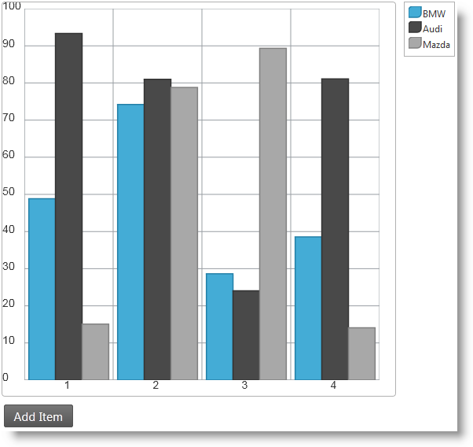

<!--
|metadata|
{
    "fileName": "igdatachart-animating-html",
    "controlName": "igDataChart",
    "tags": ["Charting","Data Presentation","How Do I"]
}
|metadata|
-->

# Animating Charts in HTML and JavaScript (igDataChart)


##Topic Overview


### Purpose

This topic explains how to create an HTML view and use JavaScript to add data dynamically to a column chart and use the Motion Framework for charts in the Ignite UI library to animate data changes.

### Required background

The following table lists the topics required as a prerequisite to understanding this topic.

-	[igDataChart Overview](igDataChart-Overview.html): Contains basic information about the `igDataChart`™ control for displaying various kinds of charts in web pages.

-	[Adding igDataChart](igDataChart-Adding.html): Shows how to implement a chart with a simple step by step example.

-	[igDataSource Overview](igDataSource-igDataSource-Overview.html): This topic is an introduction into the `igDataSource` control.

-	[Infragistics Motion Framework for Charts](igDataChart-Motion-Framework.html): This topic provides an overview of the Infragistics® Motion Framework for charts.


### In this topic

This topic contains the following sections:

-   [Create Animated Column Chart in HTML and JavaScript](#animated-column-chart)
   -   [Introduction](#introduction)
    -   [Preview](#preview)
    -   [Prerequisites](#prerequisites)
    -   [Overview](#overview)
    -   [Steps](#steps)
-   [Related Content](#related-content)
   -   [Topics](#topics)
    -   [Samples](#samples)


##<a id="animated-column-chart"></a>Animating Charts in HTML and JavaScript


### <a id="introduction"></a> Introduction

This procedure will guide you through the steps necessary to create a simple animated column chart in HTML and JavaScript.

The example described here implements a column chart with three data series with randomly generated car sales data. A button titled Add Item is placed beneath the chart. Pressing this button adds a new data item to the chart and notifies the chart about the change. When the data items on the chart become more than five, the oldest one (the one with the lowest index number) is removed from the chart.

### <a id="preview"></a> Preview

Following is a chart with an Add Item implemented in this procedure.



### <a id="prerequisites"></a> Prerequisites

To complete the procedure, you need the following:

-   A web server
-   An HTML editor

### <a id="overview"></a>Overview

This topic takes you step-by-step toward creating a simple web page with animated column chart with three data series. The following is a conceptual overview of the process:

1.  Creating an empty HTML view.
2.  Adding initial data source.
3.  Adding basic chart instantiation code.
4.  Adding chart series.
5.  Adding button to update data.
6.  Updating the data and notifying the chart about the change.
7.  (Optional) Verifying the result.

### <a id="steps"></a> Steps

The following steps demonstrate how to create an animated column chart.

1. Create an empty HTML view.

 Follow the steps in the [Adding igDataChart](igDataChart-Adding.html) topic to create a skeleton HTML/MVC view which incorporates chart. Only the first two steps, [Add references to required resources](igDataChart-Adding.html#add-references-to-required-resources) and [Add HTML markup required by the igDataChart](igDataChart-Adding.html#add-html-markup) are required for the purposes of this sample.

2. Add initial data source.

 Add a function which instantiates a single data object with random numbers to be visualized:

 **In JavaScript:**

	```js
	function createNewChartItem(label) {
        var val1 = Math.round(Math.random() * 100);
        var val2 = Math.round(Math.random() * 100);
        var val3 = Math.round(Math.random() * 100);
        if (label == undefined)
            label = 1;
        return { Label: label, Value1: val1, Value2: val2, Value3: val3 };
    }
	```

 Add single element array of objects and initialize it with data using the function defined above:

 **In JavaScript:**

	```js
	var currData, currDataSource;
    currData = [];
    currData[0] = createNewChartItem();
    currDataSource = new $.ig.DataSource({ dataSource: currData });
	```

3. Add basic chart instantiation code.

 Add the JavaScrtipt code for the general settings of the to your HTML view. This includes:

 - The `DataSource` object managing the array of data objects is assigned to the `dataSource` option.
 - The category X-axis and the numeric Y-axis are defined and the Y-axis has a fixed range from 0 to 100. It is important to have a fixed axis range because adding data dynamically to a chart can cause the axis to automatically adjust its range which disables animation effects.

 **In JavaScript:**

	```js
	$("#chart").igDataChart({
        width: "500px",
        height: "500px",
        dataSource: currDataSource,
        legend: { element: "legend" },
        windowResponse: "immediate",
        axes: [{
            name: "xAxis",
            type: "categoryX",
            label: "Label"
        },
        {
            name: "yAxis",
            type: "numericY",
            minimumValue: 0,
            maximumValue: 100
        }],
    ...
	```

4. Add chart series.

 Add the following JavaScript code to define three data series representing the data from the data array:

 **In JavaScript:**

	```js
	...
    series: [{
            name: "column",
            title: "BMW",
            type: "column",
            xAxis: "xAxis",
            yAxis: "yAxis",
            valueMemberPath: "Value1",
            transitionDuration: 400
        }, {
            name: "series2",
            title: "Audi",
            type: "column",
            xAxis: "xAxis",
            yAxis: "yAxis",
            valueMemberPath: "Value2",
            transitionDuration: 700
        }, {
            name: "series3",
            title: "Subaru",
            type: "column",
            xAxis: "xAxis",
            yAxis: "yAxis",
            valueMemberPath: "Value3",
            transitionDuration: 1000
        }],
    });
	```

 In the code snippet above the `transitionDuration` option related to the Motion Framework is set. This option governs how long the animation (transition) between two states of the chart series takes. The value of this option is measured in milliseconds. In the example we deliberately set different values for the three data series in order to achieve better visual appeal. The effect is that the first data series columns will move faster while the second will move a bit slower and the third will be slowest which will underline the animation effect.

5. Add button to update data.

 It is necessary to incorporate some mechanism to update the data behind the chart dynamically in order to activate the Motion Framework. For the purposes of this example it is chosen to have a button with a click handler which adds a single data item to the chart.

 1. Define the button in the HTML markup. The markup must be placed beneath the chart `div` element:

	**In HTML:**

    	```html
    	<input type="button" id="btnPlay" value="Add Data" />
    	```

  2. Instantiate and configure the button in JavaScript. Use the Infragistcics Script Loader syntax create an `igButton`™ control beneath the chart which invokes the `getNewChartItemFromServer()` function when clicked.

 	**In JavaScript:**

		```js
		$.ig.loader(function () {
	        $("#btnPlay").igButton({
	            labelText: $("#btnPlay").val(),
	            click: getNewChartItemFromServer
	        });
	    });
		```

  The code above creates an `igButton` control below the chart which invokes the `addNewItemToChart()` function when clicked. Proceed to the next step to add the logic in this function.

6. Update the data and notify the chart about the change.

 The following code defines the `addNewItemToChart()` function which updates the data behind the chart and calls the appropriate API method to trigger the Motion Framework behavior:

 **In JavaScript:**

	```js
	function addNewItemToChart() {
        var dataSource = $("#chart").igDataChart("option", "dataSource");
        var data = dataSource.data();
        data[data.length] = createNewChartItem(data[data.length - 1].Label + 1);
        $("#chart").igDataChart("notifyInsertItem", dataSource, data.length - 1, data[data.length - 1]);
    }
	```

 The first two lines of code in the function get the `dataSource` holding the current chart data and the array of objects from the `DataSource`. Then the third line appends a new item at the end of the array (`data[data.length]`) by filling the item with random numbers with the `createNewChartItem()` function. We provide the value of the last item label increased by 1 to the function: `data[data.length - 1].Label + 1`.

 After a new item is added to the array the `notifyInsertItem()` method of the `igDataChart` object is invoked to start the Motion Framework logic. The method arguments are the data source where the change happened, the index at which data is inserted and the actual data item inserted. Here data are inserted at the end but it is possible to insert data at an arbitrary position in the data source.

7. (Optional) Verify the result.

When the HTML view is complete, you can observe the animation effect by clicking on the Add Item button. The new column chart items should appear to the right of the existing ones and when they become five, the utmost-left item should be removed and all items should be shifted one position to the left.

You can experiment by creating a different kind of change in the data source like removing an item and calling the `notifyRemoveItem()` method or clear all the data and calling the `notifyClearItem()` method.

##<a id="related-content"></a>Related Content


###<a id="topics"></a> Topics

The following topics provide additional information related to this topic.


-	[Animating Charts in ASP.NET MVC(igDataChart)](Animating-Charts-in-ASP.NET-MVC.html): This topic explains how to create an MVC view and use jQuery to add data dynamically to a column chart by an AJAX POST request and use the Motion Framework for charts in the Ignite UI library to animate data changes.


###<a id="samples"></a> Samples

The following samples provide additional information related to this topic.

-	[Motion Framework](igDataChart-Motion-Framework.html#motion-framework-sample): This sample demonstrates how to use the Motion Framework™ with the jQuery chart to build highly engaging visualizations and provide smooth playback of changes in data over time.


 

 


