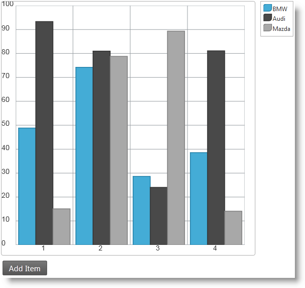

<!--
|metadata|
{
    "fileName": "animating-charts-in-asp.net-mvc",
    "controlName": "igDataChart",
    "tags": ["Charting","Data Presentation","How Do I","MVC"]
}
|metadata|
-->

# Animating Charts in ASP.NET MVC(igDataChart)


##Topic Overview


### Purpose

This topic demonstrates, with code examples, how to add a simple animated column chart in MVC using AJAX POST request for adding data dynamically.

### Required background


**Topics**

-	[igDataChart Overview](igDataChart-Overview.html): This topic provides conceptual information about the `igDataChart`™ control including its main features, minimum requirements for using charts and user functionality.

-	[Adding igDataChart](igDataChart-Adding.html): This topic demonstrates how to add the `igDataChart`™ control to a page and bind it to data.

-	[igDataSource Overview](igDataSource-igDataSource-Overview.html): Introduces the `igDataSource` control.

-	[Infragistics Motion Framework for Charts](igDataChart-Motion-Framework.html) : Introduces the Infragistics® Motion Framework™ for charts.

**External Resources**

-   [Basic knowledge of the ASP.NET MVC framework](http://www.asp.net/mvc)


### In this topic

This topic contains the following sections:

-   [Animating Charts in MVC – Code Example](#animating-charts)
   -   [Introduction](#introduction)
    -   [Preview](#preview)
    -   [Requirements](#requirements)
    -   [Overview](#overview)
    -   [Steps](#steps)
-   [Related Content](#related-content)
   -   [Topics](#topics)
    -   [Samples](#samples)


##<a id="animating-charts"></a>Animating Charts in MVC


###<a id="introduction"></a> Introduction

This procedure demonstrates how to create a simple animated column chart in an MVC application with AJAX Post request for updated data.

In order to activate the Motion Framework it is necessary **to incorporate some mechanism to** dynamically **update the data** behind the chart. In this example, we a button with a click handler is used to add a single data item to the chart.

The example implements a column chart with three data series and randomly generated car sales data. You place an Add Item button below the chart. Clicking the button adds new data to the chart. The button will make an AJAX Post request to the server to generate a new data item and return it the client as a plain JSON response. On receiving the response to the request the client will add the new data item to the chart and notify the chart about the change. When chart data items grow and exceed five, the oldest (the one with the least index number) drops from the chart.

###<a id="preview"></a> Preview

This is what the chart, visualized by the code, in this example should look like.



###<a id="requirements"></a> Requirements

To complete the procedure, you need the following:

-   Microsoft® Visual Studio® 2010 with an MVC project

###<a id="overview"></a> Overview

Step-by-step instructions for creating a simple web page with an animated column chart consisting of three data series. This is the basic procedure for completing this task:

1.  Adding the data model
2.  Adding the basic controller logic
3.  Adding an MVC view
4.  Adding a basic chart
5.  Configuring the chart series
6.  Binding the control to data and rendering it in the View
7.  Adding a button for updating data
8.  Updating the data and notifying the chart about the change
9.  (Optional) Verifying the result

###<a id="steps"></a> Steps

1. Add the data model.

 Create an empty model class in the Models folder of your MVC application with the following structure:

 **In C#:**

	```csharp
	public class ColumnChartDataItem
    {
        public int Label { get; set; }
        public double Value1 { get; set; }
        public double Value2 { get; set; }
        public double Value3 { get; set; }
    }
	```

2. Add the basic controller logic.

 1. Create a new controller and add the default action method. This code uses a method called `CreateChartItem()` to initialize a list with a single `ColumnChartDataItem` (the data model) object and pass it to the MVC view.
	
	**In C#:**

		```csharp
		public ActionResult Index()
	    {
	        return View(new List<ColumnChartDataItem> { CreateChartItem() });
	    }
		```

 2. Create helper method.
	
	**In C#:**

		```csharp
		private ColumnChartDataItem CreateChartItem(int label = 1)
		{
		    Random rnd = new Random();
		    var val1 = rnd.NextDouble() * 100;
		    var val2 = rnd.NextDouble() * 100;
		    var val3 = rnd.NextDouble() * 100;
		    return new ColumnChartDataItem 
		        { 
		            Label = label, 
		            Value1 = val1, 
		            Value2 = val2, 
		            Value3 = val3 
		        };
		}
		```

3. Add an MVC view.

 To create a new empty MVC view, **right click in the** `Index()` **method** in the controller. From the context menu, select Add View. Follow the steps in the [Adding igDataChart](igDataChart-Adding.html) topic to create a skeleton MVC view, which incorporates charts. In this example, only the first step, [Adding references to required resources](igDataChart-Adding.html#add-references-to-required-resources) is required.

4. Add a basic chart.
 
 Add code to instantiate and configure a basic chart. This includes assigning the view' data model to the chart and converting it to an `IQueryable` object` (DataChart(Model.AsQueryable()))` Next, configure the category X axis, and the numeric Y axis. The numeric Y axis has a fixed range from 0 to 100. Having a fixed axis range is important because adding data dynamically to a chart can cause the axis to automatically adjust its range, which disables the animation effects.

 **In ASPX:**

	```csharp
	<%= Html.Infragistics().DataChart(Model.AsQueryable())
            .ID("chart")
            .Width("500px")
            .Height("500px")
            .Legend(legend => legend.ID("legend"))
            .WindowResponse(WindowResponse.Immediate)
            .Axes((axes) =>
                {
                    axes.CategoryX("xAxis").Label(d => d.Label);
                    axes.NumericY("yAxis").MinimumValue(0).MaximumValue(100);
                })
    ...
	```

5. Configuring the chart series.

 Define the three data series to be visualized. In the series settings, define the transition options by setting the `transitionDuration` property.

 **In ASPX:**

	```csharp
	.Series(series =>
	{
	    series
	    .Column("series1")
	    .Title("BMW")
	    .XAxis("xAxis").YAxis("yAxis")
	    .ValueMemberPath((item) => item.Value1)
	    .TransitionDuration(400)
	    series
	    .Column("series2")
	    .Title("Audi")
	    .XAxis("xAxis").YAxis("yAxis")
	    .ValueMemberPath((item) => item.Value2)
	    .TransitionDuration(700)
	    series
	    .Column("series3")
	    .Title("Mazda")
	    .XAxis("xAxis").YAxis("yAxis")
	    .ValueMemberPath((item) => item.Value3)
	    .TransitionDuration(1000)                   
	})
	```

 In the preceding code snippet the `TransitionDuration()` calls set behavior related to the Motion Framework. This option governs how long it takes for the animation (transition) between two states of the chart series. The unit of measure associated with this option is the millisecond. In order to achieve better visual appeal we have deliberately set different values for the three data series. The effect is that the first data series columns will move faster while the second will move a bit slower and the third will be the slowest, which will emphasis the animation effect.

6. Bind the control to data and render it in the View.

 To bind the control to data and render the view, use the `DataBind()` and `Render()` calls.

 **In ASPX:**

	```csharp
	<%
        .DataBind().Render()
    %>
	```

7. Add button for updating data.

 1. Define the button in the HTML markup. The markup should be placed below the chart div element:

	**In HTML:**

		```html
		<input type="button" id="btnPlay" value="Add Data" />
		```

 2. Instantiate and configure the button in JavaScript. Use the Infragistics Script Loader syntax to create an `igButton` control beneath the chart which invokes the `getNewChartItemFromServer()` function when clicked.

	**In JavaScript:**

		$.ig.loader(function () {
		```
		$("#btnPlay").igButton({
	        labelText: $("#btnPlay").val(),
	        click: getNewChartItemFromServer
	    });
		```
		});

8. Update the data and notify the chart about the change.

 1. Add data request JavaScript function.
	
	This function serves as a click event handler to the Add Data button from the previous step.

	**In JavaScript:**

		```js
		function getNewChartItemFromServer() {
		    var chartData = $("#chart").igDataChart("option", "dataSource");
		    $.post('<%= Url.Action("CreateNewChartItem")%>', 
		        { "Label": chartData[chartData.length - 1].Label + 1 },
		        addNewItemToChart, 
		        'json');
		}
		```

 	The preceding code gets the data array bound to the chart. Then it gets the `Label` of the last item in the chart from the array and passes it to the server. Next, the code employs jQuery to make an AJAX POST request to the server and specify that when data is received the `addNewItemToChart()` function must be called and expects to see JSON formatted data. The server invokes `CreateNewChartItem`. You will need to add a controller action method to support this action.

 2. Add controller method to serve data to the chart

	The POST request from the client must be served in a controller action method. Although there are many ways to process the request, this is the preferred way for an MVC application.

	Add the following action method to the controller created in Step 2: [Add basic controller logic](#steps):

	**In C#:**

		```csharp
		[HttpPost]
		[ActionName("CreateNewChartItem")]
		public JsonResult CreateNewChartItem(int Label)
		{
		    return new JsonResult { Data = CreateChartItem(Label) };
		}
		```

	The `HttpPost` attribute instructs MVC that this action will serve POST requests and the `ActionName` attribute specifies the exact name of the action. The method receives the `Label` parameter sent from the client and passes to the already defined `CreateChartItem()` method in the controller to generate a new data item. The new item is assigned to the `Data` property of a `JsonResult` object, which is returned to the client as a result of the POST request.

 3. Add data update JavaScript function

	After the POST request finishes and the response arrives at the client the server feeds the JSON data to the `addNewItemToChart()` function specified in the jQuery `post()` call. Add the following code to process this data in the client and update the chart:

	**In JavaScript:**

		```js
		function addNewItemToChart(data, textStatus, jqXHR) {
		    var chartData = $("#chart").igDataChart("option", "dataSource");
		    var newItem = data;
		    chartData[chartData.length] = newItem;
		    $("#chart").igDataChart("notifyInsertItem", chartData, chartData.length - 1, newItem);
		}
		```

	This function gets the array of objects bound to the chart on the first line calling the `dataSource` method of the chart. The data argument to the function contains any data returned from the server and assigns this data to the last element in the array behind the chart (`chartData[chartData.length] = newItem`).

	This results in a call to the` notifyInsertItem()` method of the chart control to start the Motion Framework logic. The method arguments are the data source where the change happened, the index at which data is inserted and the actual data item inserted. Here data are inserted at the end, but it is possible to insert data at an arbitrary position in the data source.

9. (Optional) Verify the result.

 To verify the result, click the Add Item button and observe the effect. The new column chart items should appear to the right of the existing ones and when they become five, the utmost-left item should be removed and all items should be shifted one position to the left.

 Experiment by creating different changes in the data source, like removing an item, and calling the `notifyRemoveItem()` method or clearing all data and calling the `notifyClearItem()` method.

##<a id="related-content"></a>Related Content


###<a id="topics"></a> Topics

The following topics provide additional information related to this topic.

-	[Animating Charts in HTML and JavaScript](igDataChart-Animating-HTML.html) : Demonstrates how to: create an HTML view; use JavaScript to add data dynamically to a column chart; and animate data changes using the Motion Framework for charts in the Ignite UI library.


###<a id="samples"></a> Samples

The following samples provide additional information related to this topic.

-	[Motion Framework](igDataChart-Motion-Framework.html#motion-framework-sample) : This sample demonstrates how column series charts are animated with the help of the Motion Framework.


 

 


