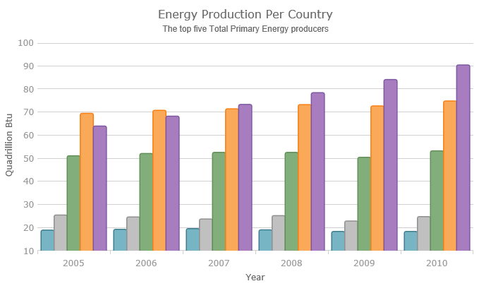
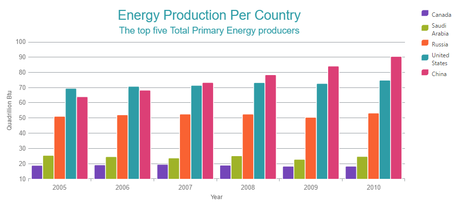

<!--
|metadata|
{
    "fileName": "igdatachart-chart-titles-and-subtitles",
    "controlName": "",
    "tags": []
}
|metadata|
-->

# Configuring the Chart Title and Subtitle (igDataChart)

##Topic Overview

### Purpose

This topic provides information on using the chart title and subtitle feature of the `igDataChart`™ control.

### Required background

The following topic is a prerequisite to understanding this topic:

-	[Adding igDataChart](igDataChart-Adding.html): This topic demonstrates how to add the `igDataChart`™ control to a page and bind it to data.

### In this topic

This topic contains the following sections:

-   [Introduction](#introduction)
    -   [Title and subtitle summary](#title-subtitle)
    -   [Configuring the Title/Subtitle](#configuring)
    -   [Property settings](#property-settings)
    -   [Example](#example)
-   [Related Content](#related-content)
    -   [Topics](#topics)
    -   [Samples](#samples)

##Introduction

###Title and subtitle summary

The title and subtitle feature of the `igDataChart` control allows you to add information to the top section of the chart control. The following screenshot demonstrates a title and subtitle added with their default settings:

When adding a title, a subtitle or both to the chart control, the content of the chart automatically resizes allowing for the title and subtitle information.

The title and subtitle are added by setting the respective optional properties (title and subtitle) of the `igDataChart` control to strings representing the title/subtitle.

###Configuring the Title/Subtitle

The title and subtitle of the `igDatachart` control is highly configurable. The title and subtitle’s font, font size, color and alignment can be styled.

### Property settings

The following table maps the desired configuration to the property settings that manage it.

<table class="table">
	<thead>
		<tr>
			<th>In order to:</th>
			<th>Use this property:</th>
			<th>And set it to:</th>
		</tr>
	</thead>
	<tbody>
		<tr>
			<td>Set the subtitle’s bottom margin.</td>
			<td>subtitleBottomMargin</td>
			<td>integer</td>
		</tr>
		<tr>
			<td>Set the subtitle’s horizontal alignment.</td>
			<td>subtitleHorizontalAlignment</td>
			<td>string</td>
		</tr>
		<tr>
			<td>Set the subtitle’s left margin</td>
			<td>subtitleLeftMargin</td>
			<td>integer</td>
		</tr>
		<tr>
			<td>Set the subtitle’s right margin</td>
			<td>subtitleRightMargin</td>
			<td>integer</td>
		</tr>
		<tr>
			<td>Set the subtitle’s text color</td>
			<td>subtitleTextColor</td>
			<td>string</td>
		</tr>
		<tr>
			<td>Set the subtitle’s font style and text size</td>
			<td>subtitleTextStyle</td>
			<td>string</td>
		</tr>
		<tr>
			<td>Set the subtitle’s left margin</td>
			<td>subtitleTopMargin</td>
			<td>integer</td>
		</tr>
		<tr>
			<td>Set the title’s bottom margin</td>
			<td>titleBottomMargin</td>
			<td>integer</td>
		</tr>
		<tr>
			<td>Set the title’s horizontal alignment</td>
			<td>titleHorizontalAlignment</td>
			<td>string</td>
		</tr>
		<tr>
			<td>Set the title’s left margin</td>
			<td>titleLeftMargin</td>
			<td>integer</td>
		</tr>
		<tr>
			<td>Set the title’s right margin</td>
			<td>titleRightMargin</td>
			<td>integer</td>
		</tr>
		<tr>
			<td>Set the title’s text color</td>
			<td>titleTextColor</td>
			<td>string</td>
		</tr>
		<tr>
			<td>Set the title’s font style and text size</td>
			<td>titleTextStyle</td>
			<td>string</td>
		</tr>
		<tr>
			<td>Set the title’s left margin</td>
			<td>titleTopMargin</td>
			<td>integer</td>
		</tr>
	</tbody>
</table>

### Example
Following are a chart title settings' table and an example that implements this configuration:

<table class="table">
	<thead>
		<tr>
			<th>Property</th>
			<th>Value</th>
		</tr>
	</thead>
	<tbody>
		<tr>
			<td>title</td>
			<td>“Energy Production Per Country”</td>
		</tr>
		<tr>
			<td>titleTextColor</td>
			<td>“#2e9ca6”</td>
		</tr>
		<tr>
			<td>titleTextStyle</td>
			<td>“20pt Arial</td>
		</tr>
		<tr>
			<td>subtitle</td>
			<td>“The top five Total Primary Energy producers”</td>
		</tr>
		<tr>
			<td>subtitleTextColor</td>
			<td>“#2e9ca6”</td>
		</tr>
		<tr>
			<td>subtitleTextStyle</td>
			<td>“14pt Arial</td>
		</tr>
	</tbody>
</table>

   [Chart Title and Subtitle](%%SamplesEmbedUrl%%/data-chart/chart-title)
   

##Related Content

### Topics

The following topic provides additional information related to this topic:

-	[Adding igDataChart](igDataChart-Adding.html):  This topic demonstrates how to add the `igDataChart` control to a page and bind it to data.

 

 

