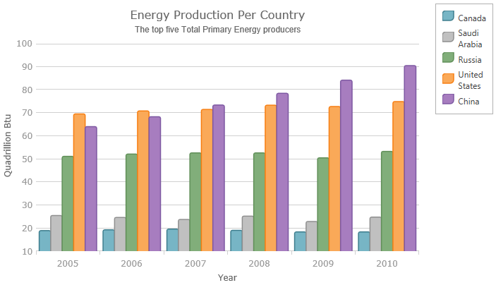
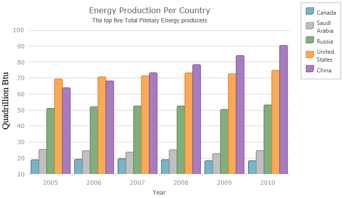

<!--
|metadata|
{
    "fileName": "igdatachart-axis-title",
    "controlName": "",
    "tags": []
}
|metadata|
-->

# Configuring the Axis Title (igDataChart)


##Topic Overview


### Purpose

This topic provides information on setting an axis title on the `igDataChart`™ control.

### Required background

The following topic is a prerequisite to understanding this topic:

-	[Adding igDataChart](igDataChart-Adding.html)

This topic demonstrates how to add the `igDataChart`™ control to a page and bind it to data.


### In this topic

This topic contains the following sections:

-   [Axis Title](#axisTitle)
    -   [Overview](#overview)
    -   [Preview](#preview)
    -   [Properties](#properties)
    -   [Example](#example)
-   [Related Content](#related-content)

##<a id="axisTitle"></a>Axis Title


###<a id="overview"></a> Overview

The axis title feature of the `igDataChart` control allows you to add contextual information to the x and y axes of the `igDataChart` control.

You can customize the axis title by specifying properties of an axis, such as the angle, font size and position.

###<a id="preview"></a> Preview

The following screenshot is a preview of the `igDataChart` control with a title set on the y-axis.



###<a id="properties"></a> Properties

The following table summarizes the properties available for configuring the axis title.

<table class="table">
	<thead>
		<tr>
			<th>Property Name</th>
			<th>Property Type</th>
			<th>Description</th>
		</tr>
	</thead>
	<tbody>
		<tr>
			<td>title</td>
			<td>string</td>
			<td>Defines the title of an axis.</td>
		</tr>
		<tr>
			<td>titlePosition</td>
			<td>string</td>
			<td>Defines the position of the title according to the position of the labels.<br> By default this property is set to Auto, which means that the axis title will always be on opposite sides of the axis stroke and the axis labels. In order words, axis labels will be always between axis title and axis stroke even if you change the location of axis labels. For example, changing location of an axis label to outsideRight will automatically position the axis title to the right side of the axis labels.</td>
		</tr>
		<tr>
			<td>titleAngle</td>
			<td>double</td>
			<td>Defines the rotation of the title around the center of axis title in degrees. For example, value of -90 will rotate title vertically and value of zero will transform title horizontally.</td>
		</tr>
		<tr>
			<td>titleTextColor</td>
			<td>string</td>
			<td>Defines the color of title’s text.</td>
		</tr>
		<tr>
			<td>titleTextStyle</td>
			<td>string</td>
			<td>Defines font name and size of title’s text.</td>
		</tr>
		<tr>
			<td>titleVerticalAlignment</td>
			<td>string</td>
			<td>Defines the title’s vertical alignment. This property applies only to y-axis.</td>
		</tr>
		<tr>
			<td>titleHorizontalAlignment</td>
			<td>string</td>
			<td>Defines the horizontal alignment of the axis title in the axis info panel. This property applies only to a title on x-axis.</td>
		</tr>
		<tr>
			<td>titleTopMargin</td>
			<td>double</td>
			<td>Defines the title’s left margin, the vertical space between the title and top edge of axis label panel.</td>
		</tr>
		<tr>
			<td>titleBottomMargin</td>
			<td>double</td>
			<td>Defines the title’s bottom margin, the vertical space between the title and bottom edge of axis label panel.</td>
		</tr>
		<tr>
			<td>titleLeftMargin</td>
			<td>double</td>
			<td>Defines the title’s left margin, the horizontal space between the title and left edge of axis label panel.</td>
		</tr>
		<tr>
			<td>titleRightMargin</td>
			<td>double</td>
			<td>Defines the title’s right margin, the horizontal space between the title and right edge of axis label panel.</td>
		</tr>
	</tbody>
</table>

###<a id="example"></a> Example

The screenshot, following the table, illustrates how the `igDataChart` control with the axis’s `title` property looks as a result of the following settings:

<table class="table">
	<thead>
		<tr>
			<th>Property</th>
			<th>Value</th>
		</tr>
	</thead>
	<tbody>
		<tr>
			<td>title</td>
			<td>“Year”</td>
		</tr>
		<tr>
			<td>titleAngle</td>
			<td>-90</td>
		</tr>
		<tr>
			<td>titleTextColor</td>
			<td>“Blue”</td>
		</tr>
		<tr>
			<td>titleTextStyle</td>
			<td>"10pt Times New"</td>
		</tr>
	</tbody>
</table>



Following is the code that implements this example:

**In JavaScript:**

```js
$("#container").igDataChart({
	…
	axes: [
	  {
	     type: "numericY",
	     name: "yAxis",
	     title: "Quadrillion Btu",
	     titleAngle: -90,
	     titleTextStyle: "14pt Times New Roman",
	     titleTextColor: "black"
	  }, …
```


##<a id="related-content"></a>Related Content


### Topics

The following topic provides additional information related to this topic:

-	[Adding igDataChart](igDataChart-Adding.html):  This topic demonstrates how to add the `igDataChart` control to a page and bind it to data.


### Samples

The following sample provides additional information related to this topic.

-	[Axis Title](%%SamplesUrl%%/data-chart/axis-title) : The axis title feature of the `igDataChart` control allows you to add information about the chart’s axis.


 

 


