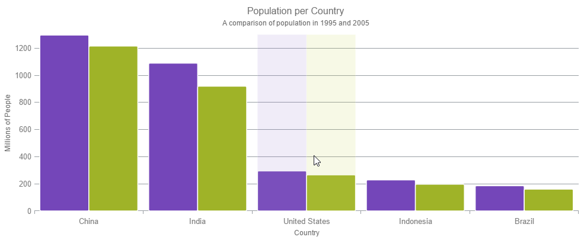

<!--
|metadata|
{
    "fileName": "hoverinteractions-category-item-highlight-layer",
    "controlName": "",
    "tags": []
}
|metadata|
-->

# Configuring the Category Item Highlight Layer (igDataChart)

## Topic Overview

### Purpose

This topic provides information about the category item highlight layer used for hover interactions. It describes the properties of the category item highlight layer and provides an example of its implementation.

### Required background

The following topics are prerequisites to understanding this topic:

- [Adding igDataChart](igDataChart-Adding.html): This topic demonstrates how to add the `igDataChart`™ control to a page and bind it to data.

- [Binding igDataChart to Data](igDataChart-DataBinding.html): This topic explains how to bind the `igDataChart`™ control to various data sources (JavaScript array, `IQueryable<T>`, web service).

### In this topic

This topic contains the following sections:

-   [Overview](#overview)
	-   [Preview](#preview)
-   [Properties](#properties)
-   [Example](#example)
-   [Related Content](#related-content)
    -   [Topics](#topics)
    -   [Samples](#samples)

##  Overview

#### Category item highlight layer overview

The `categoryItemHighlightLayer` highlights items in series using category axis by either drawing a banded shape or rendering a marker at that position.

The default highlight depends on the type of series. For example, the highlight for a `columnSeries` and a  `lineSeries` is different; for `columnSeries` it is a banded shape, for `lineSeries` it is a marker. You can override the default highlight by setting the `highlightType` property. For more information on this property, see the [Properties](#properties) section below.

###  Preview

The following image is a preview of the `igDataChart` control rendered with the `categoryItemHighlightLayer` added.

##  Properties

#### Category item highlight layer summary

The following table summarizes the properties of the `categoryItemHighlightLayer`.

Property Name | Property Type | Description
---|---|---
bandHighlightWidth | double | This property specifies the width of the highlight area for the items in a series that are aligned on gridlines. For example `lineSeries`, `areaSeries` and `splineSeries`. This property has no effect if there are series present aligned between gridlines. For example `columnSeries` and `waterfallSeries`. When this property has a value set for it, a banded shape is highlighted around the gridline.
highlightType | categoryItemHighlightType | This property specifies what the highlight should look like. The default uses a marker for series such as `lineSeries`, and a highlight band series such as `columnSeries`.
useInterpolation | bool | This property specifies if the highlight band should snap-to-cursor, instead of snap-to-gridlines. This property has no effect if there are series present aligned between gridlines. For example, `columnSeries` and `waterfallSeries` series.

##  Example

This sample demonstrates the Category Item Highlight Layer that highlights items in a series that use a category axis either by drawing a banded shape at their position or by rendering a marker at their position.The sample options pane allows you to edit the properties of the Category Item Highlight Layer, such as changing the color of the highlight, outline, thickness and more.

   [Category Item Highlight Layer](%%SamplesEmbedUrl%%/data-chart/category-item-highlight-layer)
   

## Related Content

### Topics

- [Hover Interactions Overview (igDataChart)](HoverInteractions-Hover-Interactions-Overview.html): This topic provides conceptual information about the hover interactions available on the `igDataChart` control including the different types of hover interaction layers available.

- [Hover Interactions Property Reference (igDataChart)](HoverInteractions-Common-Properties.html): This topic provides information about the properties and methods that the hover interaction feature uses for highlighting, hovering and interacting with the tooltip interactions inherited from the `series` class.

- [Configuring the Category Highlight Layer (igDataChart)](HoverInteractions-Category-Highlight-Layer.html): This topic provides information about the category highlight layer which is used for hover interactions. It describes the properties of the category highlight layer and provides an example of its implementation.

- [Configuring the Category Tooltip Layer (igDataChart)](HoverInteractions-Category-Tooltip-Layer.html):  This topic provides information about the category tooltip layer used for hover interactions. It describes the properties of the category tooltip layer and provides an example of its implementation.

- [Configuring the Item Tooltip Layer (igDataChart)](HoverInteractions-Item-Tooltip-Layer.html): This topic provides information about the item tooltip layer which is used for hover interactions. It describes the properties of the item tooltip layer and also provides an example of its implementation.

- [Configuring the Crosshair Layer (igDataChart)](HoverInteractions-Crosshair-Layer.html): This topic provides information about the crosshair layer used for hover interactions. It describes the properties of the crosshair layer and provides an implementation example.

### Samples

The following samples provide additional information related to this topic.

- [Hover Interactions – Category Highlight Layer](HoverInteractions-Category-Highlight-Layer.html#example): This sample demonstrates the Category Highlight Layer that targets a category axis, or all category axes in the `igDataChart`™ control. The sample options pane allows you to edit the properties of the Category Highlight Layer, such as changing the color of the highlight, outline, thickness and more.

- [Hover Interactions – Category Tooltip Layer](HoverInteractions-Category-Tooltip-Layer.html#example): This sample demonstrates the Category Tooltip Layer that displays grouped tooltips for series that use a category axis. The sample options pane allows you to edit the properties of the layer, such as changing the position of the tooltip.

- [Hover Interactions – Item Tooltip Layer](HoverInteractions-Item-Tooltip-Layer.html#example): This sample demonstrates the Item Tooltip Layer that displays tooltips for all target series individually. The sample options pane allows you to edit the properties of the layer, such as changing the transition duration.

- [Hover Interactions – Crosshair Layer](HoverInteractions-Crosshair-Layer.html#example): This sample demonstrates the Crosshair Layer that provides crossing lines that meet at the actual value of every series that they are targeting. The sample options pane allows you to edit the properties of the layer, such as changing the thickness of the crosshair.

- [Hover Interactions – Multiple Layers](%%SamplesUrl%%/data-chart/multiple-layers): This sample demonstrates how multiple layers interact within the `igDataChart` control. This sample displays the Item Tooltip Layer, the Crosshair layer and the Category Highlight Layer.

 

 

