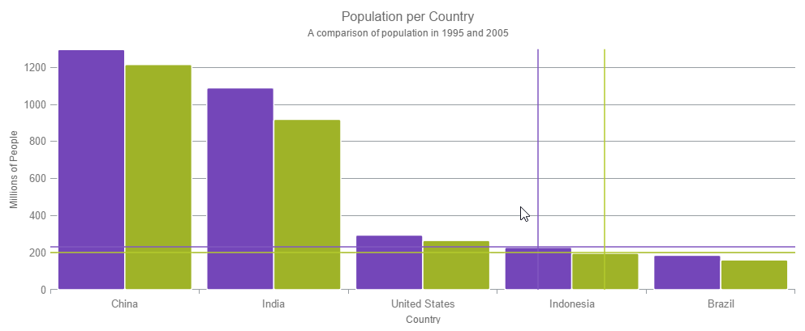

<!--
|metadata|
{
    "fileName": "hoverinteractions-crosshair-layer",
    "controlName": "",
    "tags": []
}
|metadata|
-->

# Configuring the Crosshair Layer (igDataChart)

## Topic Overview

### Purpose

This topic provides information about the crosshair layer used for hover interactions. It describes the properties of the crosshair layer and provides an implementation example.

### Required background

The following topics are prerequisites to understanding this topic:

- [Adding igDataChart](igDataChart-Adding.html): This topic demonstrates how to add the `igDataChart`™ control to a page and bind it to data.

- [Binding igDataChart to Data](igDataChart-DataBinding.html): This topic explains how to bind the `igDataChart`™ control to various data sources (JavaScript array, `IQueryable<T>`, web service).

### In this topic

This topic contains the following sections:

-   [Overview](#overview)
	-   [Preview](#preview)
-   [Properties](#properties)
-   [Example](#example)
-   [Related Content](#related-content)
    -   [Topics](#topics)
    -   [Samples](#samples)

##  Overview

#### Crosshair layer overview

The `crosshairLayer` renders as crossing lines intersecting at the actual value of every series that they are configured to target with each series rendering a separate set of lines.

You can configure the `crosshairLayer` so that the layer will only display one specific series as by default they target all series on the `igDataChart` control. To achieve this, set the `targetSeries` property. For more information on this property, see the [Properties](#properties) section below.

By default, the color of the crosshair lines is a lighter color than the series that it is interacting with. However, this default setting can be overridden so that you can select a color that will be used for the crosshair lines. This is done by setting the `brush` property. For more information on this property see the [Hover Interactions Property Reference (igDataChart)](HoverInteractions-Common-Properties.html) topic.

####  Preview

The following image is a preview of the `igDataChart` control rendered with the `crosshairLayer` added.

##  Properties

#### Crosshair layer properties

The following table summarizes the properties of the crosshair layer.

Property Name | Property Type | Description
---|---|---
horizontalLineVisibility | visibility | This property specifies if the horizontal line of the crosshair layer should be visible. If this is set to `collapsed`, only the vertical line will display.
verticalLineVisibilty | visibility | This property specifies if the vertical line of the crosshair layer should be visible. If this is set to `collapsed`, only the horizontal line will display.
targetSeries | series | This property specifies which series should have an enabled crosshair layer. It is possible to create a separate crosshair layer for each series and configure them individually.
useInterpolation | bool | This property specifies if the vertical crosshair should cross the series at an interpolated position between data points. Usually the crosshair layer finds the closest point in a series and ensures that the crosshairs meet at that point, however if the points are sparse then you should enable this property.

##  Example

This sample demonstrates the Crosshair Layer that provides crossing lines that meet at the actual value of every series that they are targeting.
The sample options pane allows you to edit the properties of the layer, such as changing the thickness of the crosshair.

   [Crosshair Layer](%%SamplesEmbedUrl%%/data-chart/crosshair-layer)
   

## Related Content

### Topics

- [Hover Interactions Overview (igDataChart)](HoverInteractions-Hover-Interactions-Overview.html): This topic provides conceptual information about the hover interactions available on the `igDataChart` control including the different types of hover interaction layers available.

- [Hover Interactions Property Reference (igDataChart)](HoverInteractions-Common-Properties.html): This topic provides information about the properties and methods that the hover interaction feature uses for highlighting, hovering and interacting with the tooltip interactions inherited from the `series` class.

- [Configuring the Category Highlight Layer (igDataChart)](HoverInteractions-Category-Highlight-Layer.html): This topic provides information about the category highlight layer which is used for hover interactions. It describes the properties of the category highlight layer and provides an example of its implementation.

- [Configuring the Category Item Highlight Layer (igDataChart)](HoverInteractions-Category-Item-Highlight-Layer.html): This topic provides information about the category item highlight layer used for hover interactions. It describes the properties of the category item highlight layer and provides an example of its implementation.

- [Configuring the Category Tooltip Layer (igDataChart)](HoverInteractions-Category-Tooltip-Layer.html):  This topic provides information about the category tooltip layer used for hover interactions. It describes the properties of the category tooltip layer and provides an example of its implementation.

- [Configuring the Item Tooltip Layer (igDataChart)](HoverInteractions-Item-Tooltip-Layer.html): This topic provides information about the item tooltip layer which is used for hover interactions. It describes the properties of the item tooltip layer and also provides an example of its implementation.

### Samples

The following samples provide additional information related to this topic.

- [Hover Interactions – Category Highlight Layer](HoverInteractions-Category-Highlight-Layer.html#example): This sample demonstrates the Category Highlight Layer that targets a category axis, or all category axes in the `igDataChart`™ control. The sample options pane allows you to edit the properties of the Category Highlight Layer, such as changing the color of the highlight, outline, thickness and more.

- [Hover Interactions – Category Item Highlight Layer](HoverInteractions-Category-Item-Highlight-Layer.html#example): This sample demonstrates the Category Item Highlight Layer that highlights items in a series that use a category axis either by drawing a banded shape at their position or by rendering a marker at their position.The sample options pane allows you to edit the properties of the Category Item Highlight Layer, such as changing the color of the highlight, outline, thickness and more.

- [Hover Interactions – Category Tooltip Layer](HoverInteractions-Category-Tooltip-Layer.html#example): This sample demonstrates the Category Tooltip Layer that displays grouped tooltips for series that use a category axis. The sample options pane allows you to edit the properties of the layer, such as changing the position of the tooltip.

- [Hover Interactions – Item Tooltip Layer](HoverInteractions-Item-Tooltip-Layer.html#example): This sample demonstrates the Item Tooltip Layer that displays tooltips for all target series individually. The sample options pane allows you to edit the properties of the layer, such as changing the transition duration.

- [Hover Interactions – Multiple Layers](%%SamplesUrl%%/data-chart/multiple-layers): This sample demonstrates how multiple layers interact within the `igDataChart` control. This sample displays the Item Tooltip Layer, the Crosshair layer and the Category Highlight Layer.

 

 

