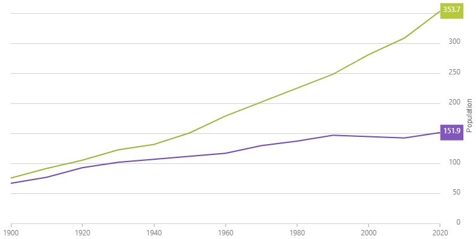

<!--
|metadata|
{
    "fileName": "hoverinteractions-final-value-layer",
    "controlName": "",
    "tags": []
}
|metadata|
-->

# Configuring the Final Value Layer (igDataChart)


## Topic Overview

### Purpose


This topic provides information about the final value layer annotations. It describes the properties of the final value layer and also provides an example of its implementation.

### Required background

The following topics are prerequisites to understanding this topic:

- [Adding igDataChart](igDataChart-Adding.html): This topic demonstrates how to add the `igDataChart`™ control to a page and bind it to data.

- [Binding igDataChart to Data](igDataChart-DataBinding.html): This topic explains how to bind the `igDataChart`™ control to various data sources (JavaScript array, `IQueryable<T>`, web service).


### In this topic

This topic contains the following sections:

-   [Overview](#overview)
	-   [Preview](#preview)
-   [Properties](#properties)
-   [Example](#example)
-   [Related Content](#related-content)
    -   [Topics](#topics)
    -   [Samples](#samples)


## <a id="overview"></a> Overview

#### Item tooltip layer overview

The `finalValueLayer` displays annotations based on the final value of data in the chart.

### <a id="preview"></a> Preview

The following image is a preview of how the `igDataChart` control renders with the `finalValueLayer` added.




## <a id="properties"></a> Properties

#### Item tooltip layer summary

The following table summarizes the properties of the `finalValueLayer` layer.

Property Name | Property Type | Description
---|---|---
finalValueSelectionMode | `enumeration` | Specifies method for how the final value is identified.

## <a id="example"></a> Example

The code snippet below demonstrates how to enable the final value layer.

*In HTML:*

```html
$(function () {
    $("#chart1").igDataChart({
        series: [
            {
                name: "finalValueSeries",
                type: "finalValueLayer"
            }
        ]
    });
});
```


## <a id="related-content"></a>Related Content

### <a id="topics"></a>Topics

- [Hover Interactions Overview (igDataChart)](HoverInteractions-Hover-Interactions-Overview.html): This topic provides conceptual information about the hover interactions available on the `igDataChart` control including the different types of hover interaction layers available.


### <a id="samples"></a>Samples

The following samples provide additional information related to this topic.

- [Hover Interactions – Multiple Layers](%%SamplesUrl%%/data-chart/final-value-layer): This sample demonstrates using the Final Value annotation layer in the `igDataChart`.
