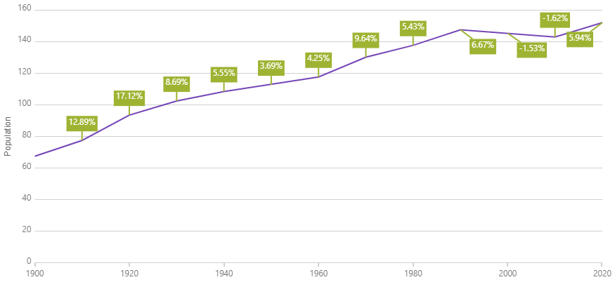

<!--
|metadata|
{
    "fileName": "hoverinteractions-callout-layer",
    "controlName": "",
    "tags": []
}
|metadata|
-->

# Configuring the Callout Layer (igDataChart)

## Topic Overview

### Purpose

This topic provides information about the callout layer annotations. It describes the properties of the callout layer and also provides an example of its implementation.

### Required background

The following topics are prerequisites to understanding this topic:

- [Adding igDataChart](igDataChart-Adding.html): This topic demonstrates how to add the `igDataChart`™ control to a page and bind it to data.

- [Binding igDataChart to Data](igDataChart-DataBinding.html): This topic explains how to bind the `igDataChart`™ control to various data sources (JavaScript array, `IQueryable<T>`, web service).

### In this topic

This topic contains the following sections:

-   [Overview](#overview)
	-   [Preview](#preview)
-   [Properties](#properties)
-   [Example](#example)
-   [Related Content](#related-content)
    -   [Topics](#topics)
    -   [Samples](#samples)

##  Overview

#### Callout Layer Overview

The `calloutLayer` displays annotations from existing or new data on the chart.

###  Preview

The following image is a preview of how the `igDataChart` control renders with the `calloutLayer` added.

##  Properties

#### Callout Layer Summary

The following table summarizes the properties of the `calloutLayer` layer.

Property Name | Property Type | Description
---|---|---
dataSource | `Array` | The data to be used for callout information.
labelMemberPath | `String` | The path for your data that will be used as the annotation label.
xMemberPath | `String` | The path for your data that will be used as the annotation's x position.
yMemberPath | `String` | The path for your data that will be used as the annotation's y position.
isCalloutOffsettingEnabled | `Boolean` | True if callout positions will be adjusted from collision resolution.

##  Example

This sample demonstrates the Callout Layer that displays tooltips for all target series individually.

   [Callout Layer](%%SamplesEmbedUrl%%/data-chart/callout-layer)
   

## Related Content

### Topics

- [Hover Interactions Overview (igDataChart)](HoverInteractions-Hover-Interactions-Overview.html): This topic provides conceptual information about the hover interactions available on the `igDataChart` control including the different types of hover interaction layers available.

### Samples

The following samples provide additional information related to this topic.

- [Hover Interactions – Multiple Layers](%%SamplesUrl%%/data-chart/callout-layer): This sample demonstrates using the Callout annotation layer in the `igDataChart`
