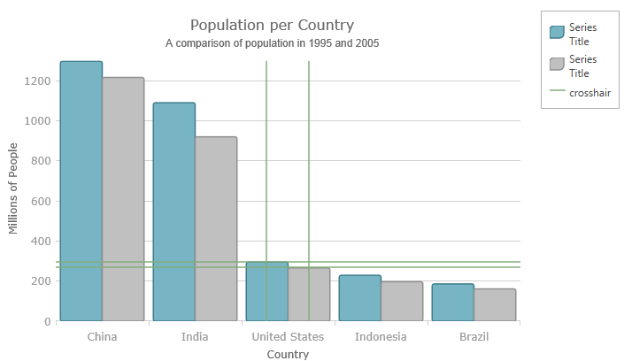

<!--
|metadata|
{
    "fileName": "hoverinteractions-common-properties",
    "controlName": "",
    "tags": []
}
|metadata|
-->

# Hover Interactions Property Reference (igDataChart)

## Topic Overview

### Purpose

This topic provides information about the properties and methods that the hover interaction feature uses for highlighting, hovering and interacting with the tooltip interactions inherited from the series class.

### Required background

The following topics are prerequisites to understanding this topic:

- [Adding igDataChart](igDataChart-Adding.html): This topic demonstrates how to add the `igDataChart`™ control to a page and bind it to data.

- [Binding igDataChart to Data](igDataChart-DataBinding.html): This topic explains how to bind the `igDataChart`™ control to various data sources (JavaScript array, `IQueryable<T>`, web service).


### In this topic

This topic contains the following sections:

-   [Overview](#overview)
-   [Common Properties](#common-properties)
-   [Setting the Inherited Properties on a Crosshair Layer](#inherited-properties-crosshair-layer)
-   [Related Content](#related-content)


## <a id="overview"></a> Overview

The hover interactions layers inherit those `series` base class properties and methods that are relevant in the context of hover interactions. For example, hover interactions, by design do not interact with the mouse, so they do not raise the mouse events. Also, the hover interaction layers do not display data directly, so methods such as `scrollIntoView` are not applicable for this feature.


## <a id="common-properties"></a> Common Properties

The following table summarizes the series class properties inherited by the hover interaction classes.

Property Name | Property Type | Description
---|---|---
brush | brush | The hover interaction layers inherit their `brush` from the series with whom they are interacting.  However, this can be overridden by setting the `brush` property directly.
outline | brush | This property follows the same guidelines as the `brush` property, listed above.
cursorPosition | point | This property specifies the world position to use instead of the default mouse position (NaN, NaN). When this property is set, it fixes the particular layer on the provided world position. <blockquote> **Note:** A world position contains x and y values which range from 0 to 1 representing the global position of the cursor relative to the entire ranges of the axes.</blockquote>
isDefaultCrosshairBehaviorDisabled | bool | This property specifies if the series default crosshair should be disabled when there is a hover interactions layer on the chart. The default value is True.
useIndex | bool | This property specifies if the hover interactions layer should use a series index and reserve a color in the Brushes collection that is assigned to the `igDataChart` control. The default value is False.
useLegend | bool | This property specifies if the hover interactions layer should appear in the legend. When this property is set to true, it also indexes the series as it is required to appear in the legend. In order be recognized in the ledgend you must assign a single color to the series. The default value is False.

<br/>

Method Name | Method Parameter | Description
---|---|---
moveCursorPoint | point | This property allows you to simulate a cursor move.


## <a id="inherited-properties-crosshair-layer"></a> Setting the Inherited Properties on a Crosshair Layer 

### Example

The following screenshot illustrates how the `igDataChart` control’s `crosshairLayer` looks using the following  settings:

Property | Value
---|---
cursorPosition | 0.55, 0.55
useLegend | True




Following is the code used in this implementation

**In Javascript:**

```js
<script type="text/javascript">    $(function () {
        $("#chart").igDataChart({
            dataSource: data,
            axes: [{
                type: "categoryX",
                name: "NameAxis",
                label: "CountryName",
            }, {
                type: "numericY",
                name: "PopulationAxis",
            }],
            series: [            
			{
                type: "column",
                name: "2005Population",
                xAxis: "NameAxis",
                yAxis: "PopulationAxis",
                valueMemberPath: "Pop2005"
            },            
			{
                type: "line",
                name: "1995Population",
                xAxis: "NameAxis",
                yAxis: "PopulationAxis",
                valueMemberPath: "Pop1995"
            },            
			{
                type: "crosshairLayer",
                name: "crosshairLayer",
                title: "crosshair",
                useInterpolation: false,
                transitionDuration: 500,                
				useLegend: "true",                
				cursorPosition: {x:0.5 , y:0.5}
            }]
        });
    });
</script>
```

## <a id="related-content"></a>Related Content

### <a id="topics"></a>Topics

- [Hover Interactions Overview (igDataChart)](HoverInteractions-Hover-Interactions-Overview.html): This topic provides conceptual information about the hover interactions available on the `igDataChart` control including the different types of hover interaction layers available.

- [Hover Interactions Property Reference (igDataChart)](HoverInteractions-Common-Properties.html): This topic provides information about the properties and methods that the hover interaction feature uses for highlighting, hovering and interacting with the tooltip interactions inherited from the `series` class.

- [Configuring the Crosshair Layer (igDataChart)](HoverInteractions-Crosshair-Layer.html): This topic provides information about the crosshair layer used for hover interactions. It describes the properties of the crosshair layer and provides an implementation example.

- [Configuring the Category Highlight Layer (igDataChart)](HoverInteractions-Category-Highlight-Layer.html): This topic provides information about the category highlight layer which is used for hover interactions. It describes the properties of the category highlight layer and provides an example of its implementation.

- [Configuring the Category Item Highlight Layer (igDataChart)](HoverInteractions-Category-Item-Highlight-Layer.html): This topic provides information about the category item highlight layer used for hover interactions. It describes the properties of the category item highlight layer and provides an example of its implementation.

- [Configuring the Category Tooltip Layer (igDataChart)](HoverInteractions-Category-Tooltip-Layer.html):  This topic provides information about the category tooltip layer used for hover interactions. It describes the properties of the category tooltip layer and provides an example of its implementation.

- [Configuring the Item Tooltip Layer (igDataChart)](HoverInteractions-Item-Tooltip-Layer.html): This topic provides information about the item tooltip layer which is used for hover interactions. It describes the properties of the item tooltip layer and also provides an example of its implementation.


### <a id="samples"></a>Samples

The following samples provide additional information related to this topic.

- [Hover Interactions – Category Highlight Layer](%%SamplesUrl%%/data-chart/category-highlight-layer): This sample demonstrates the Category Highlight Layer that targets a category axis, or all category axes in the `igDataChart`™ control. The sample options pane allows you to edit the properties of the Category Highlight Layer, such as changing the color of the highlight, outline, thickness and more.

- [Hover Interactions – Category Item Highlight Layer](%%SamplesUrl%%/data-chart/category-item-highlight-layer): This sample demonstrates the Category Item Highlight Layer that highlights items in a series that use a category axis either by drawing a banded shape at their position or by rendering a marker at their position.The sample options pane allows you to edit the properties of the Category Item Highlight Layer, such as changing the color of the highlight, outline, thickness and more.

- [Hover Interactions – Category Tooltip Layer](%%SamplesUrl%%/data-chart/category-tooltip-layer): This sample demonstrates the Category Tooltip Layer that displays grouped tooltips for series that use a category axis. The sample options pane allows you to edit the properties of the layer, such as changing the position of the tooltip.

- [Hover Interactions – Crosshair Layer](%%SamplesUrl%%/data-chart/crosshair-layer): This sample demonstrates the Crosshair Layer that provides crossing lines that meet at the actual value of every series that they are targeting. The sample options pane allows you to edit the properties of the layer, such as changing the thickness of the crosshair.

- [Hover Interactions – Item Tooltip Layer](%%SamplesUrl%%/data-chart/item-tooltip-layer): This sample demonstrates the Item Tooltip Layer that displays tooltips for all target series individually. The sample options pane allows you to edit the properties of the layer, such as changing the transition duration.

- [Hover Interactions – Multiple Layers](%%SamplesUrl%%/data-chart/multiple-layers): This sample demonstrates how multiple layers interact within the `igDataChart` control. This sample displays the Item Tooltip Layer, the Crosshair layer and the Category Highlight Layer.
