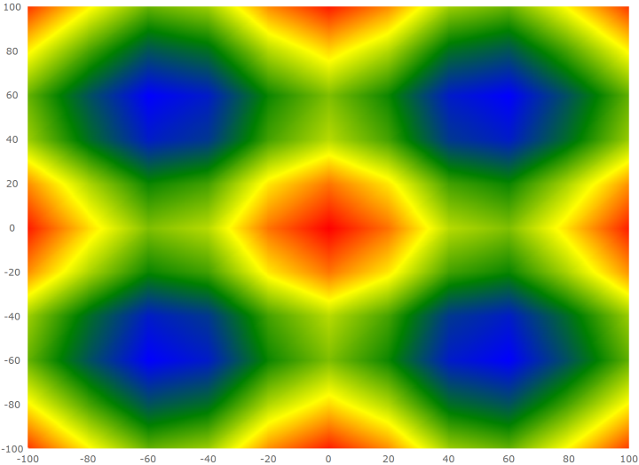

<!--
|metadata|
{
    "fileName": "triangulationseries-area-series",
    "controlName": "",
    "tags": []
}
|metadata|
-->

# Configuring the Scatter Area Series (igDataChart)

## Topic Overview

### Purpose

This topic provides information on how to use the Scatter Area Series element in the `igDataChart` control.

### Required background

You should be familiar with the following topics before continuing:

- [Adding igDataChart](igDataChart-Adding.html): This topic demonstrates how to add the `igDataChart`™ control to a page and bind it to data.

- [Binding igDataChart to Data](igDataChart-DataBinding.html): This topic explains how to bind the `igDataChart`™ control to various data sources (JavaScript array, `IQueryable<T>`, web service).

### In this topic

This topic contains the following sections:

-   [Overview](#overview)
	-   [Preview](#preview)
-   [Data Requirements](#data-requirements)
-   [Data Binding](#data-binding)
-   [Color Scale](#color-scale)
-   [Example](#example)
-   [Related Content](#related-content)
    -   [Topics](#topics)

## <a id="overview"></a> Overview

In the `igDataChart` control, the Scatter Area Series draws a colored surface based on a triangulation of X and Y data with a numeric value assigned to each point.

This type of series is useful for rendering heat maps, magnetic field strength or wifi strength in an office. The Scatter Area Series works a lot like the Scatter Contour Series except that it represents data as interpolated and colored surface instead of contour lines connecting data points with the same values.

### <a id="preview"></a> Preview

The following is a preview of the `igDataChart`_ control with a Scatter Area Series that is plotting 3D surface data where the Z axis is rendered as color changes across the surface.  Lower Z values are in blue and higher values are in red.



## <a id="data-requirements"></a> Data Requirements

Similar to other types of series in the `igDataChart` control, the Scatter Area Series has the `dataSource` option for the purpose of data binding. This option can be set to an array and each item in this array must have two data columns that store point locations (one for X and one for Y). These data columns are then mapped to the `xMemberPath` and `yMemberPath` options.  The data must also have one data column that stores a value for each point.  This value is used by the series to color the surface. This value column is mapped to the `colorMemberPath` option.

## <a id="data-binding"></a> Data Binding

The following table summarizes options of Scatter Area Series used for data binding.

Property Name | Property Type | Description
---|---|---
`datasource` | array | The source of items to perform triangulation on.
`xMemberPath` | string | The name of the property containing the X location for each item in the `dataSource`.
`yMemberPath` | string | The name of the property containing the Y location for each item in the `dataSource`.
`colorMemberPath` | string | The name of the property on each item containing a numeric value, which can be converted to a color by a color scale, set to the `colorScale` option.
`colorScale` | object | The color scale to apply to each item based on the value of the property in `colorMemberPath`.

## <a id="color-scale"></a> Color Scale

Use the `colorScale` option of the Scatter Area Series to resolve values of points and thus fill the surface of the series. The colors are smoothly interpolated around the shape of the surface by applying a pixel-wise triangle rasterizer to triangulation data. Because rendering of the surface is pixel-wise, the color scale uses colors instead of brushes.

The following table list properties of the `colorScale` affecting surface coloring of the Scatter Area Series.

Property Name | Property Type | Description
---|---|---
`palette` | array | An array of colors to select from or to interpolate between.
`interpolationMode` | string | The type of interpolation that is used for selecting colors.  The options available are `"interpolateRGB"`, `"interpolateHSV"` and `"select"`. `"interpolateRGB"` will use RGB interpolation.  `"interpolateHSV"` will use HSV interpolation. `"select"` will select one of the colors in the `palette`.
`minimumValue` | string | The highest value to assign a color. Any item value greater than this value will be made transparent. 
`maximumValue` | string | The lowest value to assign a color. Any item value less than this value will be made transparent.

## <a id="example"></a> Example

The following code shows how to bind the Scatter Area Series to data.

```js
var data = [
    { x: 0, y: 0, z: 2 },
    { x: 10, y: 0, z: 3 },
    { x: 10, y: 10, z: 5 },
    { x: 0, y: 10, z: 1 }];

$("#chart").igDataChart({
    width: "400px",
    height: "400px",
    axes: [{
        name: "xAxis",
        type: "numericX",
    }, {
        name: "yAxis",
        type: "numericY",
    }],
    series: [{
        name: "polygonSeries",
        type: "scatterArea",
        dataSource: data,
        xAxis: "xAxis",
        yAxis: "yAxis",
        xMemberPath: "x",
        yMemberPath: "y",
        colorMemberPath: "z",
        colorScale: {
            palette: [ "green", "yellow", "red" ],
            interpolationMode: "interpolateRGB",
        }
    }],
});
```
This code generates the following result:


## <a id="related-content"></a>Related Content

### <a id="topics"></a>Topics

- [Configuring Triangulation Series](triangulationseries-triangulation-series.html): This topic provides an overview for configuring the scatter area and contour series in the `igDataChart` control.

- [Configuring the Scatter Contour Series](triangulationseries-contour-series.html): This topic explains how to configure the Scatter Contour Series for the `igDataChart` control.