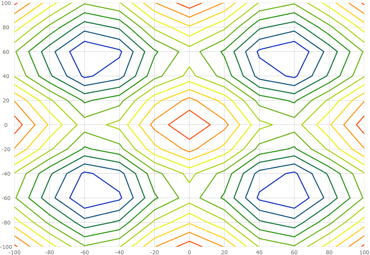

<!--
|metadata|
{
    "fileName": "triangulationseries-contour-series",
    "controlName": "",
    "tags": []
}
|metadata|
-->

# Configuring the Scatter Contour Series (igDataChart)

## Topic Overview

### Purpose

This topic provides information on how to use the Scatter Contour Series element in the `igDataChart` control.

### Required background

You should be familiar with the following topics before continuing:

- [Adding igDataChart](igDataChart-Adding.html): This topic demonstrates how to add the `igDataChart`™ control to a page and bind it to data.

- [Binding igDataChart to Data](igDataChart-DataBinding.html): This topic explains how to bind the `igDataChart`™ control to various data sources (JavaScript array, `IQueryable<T>`, web service).

### In this topic

This topic contains the following sections:

-   [Overview](#overview)
	-   [Preview](#preview)
-   [Data Requirements](#data-requirements)
-   [Data Binding](#data-binding)
-   [Fill Scale](#fill-scale)
-   [Value Resolver](#value-resolver)
-   [Example](#example)
-   [Related Content](#related-content)
    -   [Topics](#topics)

## <a id="overview"></a> Overview

In the `igDataChart` control, the Scatter Contour Series draws colored contour lines based on a triangulation of X and Y data with a numeric value assigned to each point.

This type of series is useful for rendering heat maps, magnetic field strength or wifi strength in an office. The Scatter Contour Series works a lot like the Scatter Area Series except that it represents data as contour lines colored using a fill scale and the scatter area series represents data as a surface interpolated using a color scale.

### <a id="preview"></a> Preview

The following is a preview of the `igDataChart`_ control with a Scatter Contour Series that is plotting 3D surface data where the Z axis is rendered as color changes across the surface.  Lower Z values are in blue and higher values are in red.



## <a id="data-requirements"></a> Data Requirements

Similar to other types of series in the `igDataChart` control, the Scatter Contour Series has the `dataSource` option for the purpose of data binding. This option can be set to an array and each item in this array must have two data columns that store point locations (one for X and one for Y). These data columns are then mapped to the `xMemberPath` and `yMemberPath` options.  The data must also have one data column that stores a value for each point.  This value is used by the series to color the surface. This value column is mapped to the `valueMemberPath` option.

## <a id="data-binding"></a> Data Binding

The following table summarizes options of Scatter Contour Series used for data binding.

Property Name | Property Type | Description
---|---|---
`datasource` | array | The source of items to perform triangulation on.
`xMemberPath` | string | The name of the property containing the X location for each item in the `dataSource`.
`yMemberPath` | string | The name of the property containing the Y location for each item in the `dataSource`.
`valueMemberPath` | string | The name of the property on each item containing a numeric value.  This value is used to generate contour lines grouping together points that contain similar numeric values.
`fillScale` | object | Used for determining which colors are used for each contour line.

## <a id="fill-scale"></a> Fill Scale

Use the `fillScale` option of the Scatter Contour Series to resolve fill brushes of the contour lines.

The following table list properties of the `fillScale` affecting surface coloring of the Scatter Contour Series.

Property Name | Property Type | Description
---|---|---
`brushes` | array | An array of brushes for filling contours.
`minimumValue` | numeric | The lowest value to assign a brush in a fill scale. If not assigned the series will use the lowest value contained in the data.
`maximumValue` | numeric | The highest value to assign a brush in a fill scale. If not assigned the series will use the highest value contained in the data.

## <a id="value-resolver"></a> Value Resolver

The Scatter Contour Series renders using exactly 10 contour lines at even intervals between the minimum and maximum values of the items mapped to the `valueMemberPath` option. If you desire more or fewer contours, you can assign the `valueResolver` option with an object and setting the `valueCount` property with a number of desired contours.

The following code shows how to configure the number of contour lines in the Scatter Contour Series.

```js
valueResolver: {
    type: "linear",
    valueCount: 15,
}
```

## <a id="example"></a> Example

The following code shows how to bind the Scatter Contour Series to data.  This example is increasing the contour line count from the default 10 up to 15.

```js
var data = [
    { x: 0, y: 0, z: 2 },
    { x: 10, y: 0, z: 3 },
    { x: 10, y: 10, z: 5 },
    { x: 0, y: 10, z: 1 }];

$("#chart").igDataChart({
    width: "400px",
    height: "400px",
    axes: [{
        name: "xAxis",
        type: "numericX",
    }, {
        name: "yAxis",
        type: "numericY",
    }],
    series: [{
        name: "series1",
        type: "scatterContour",
        dataSource: data,
        xAxis: "xAxis",
        yAxis: "yAxis",
        xMemberPath: "x",
        yMemberPath: "y",
        valueMemberPath: "z",
        fillScale: {
            brushes: [ "green", "yellow", "red" ],
        },
        valueResolver: {
            type: "linear",
            valueCount: 15
        }
    }],
});
```
This code generates the following result:


## <a id="related-content"></a>Related Content

### <a id="topics"></a>Topics

- [Configuring Triangulation Series](triangulationseries-triangulation-series.html): This topic provides an overview for configuring the scatter area and contour series in the `igDataChart` control.

- [Configuring the Scatter Area Series](triangulationseries-area-series.html): This topic explains how to configure the Scatter Area Series for the `igDataChart` control.