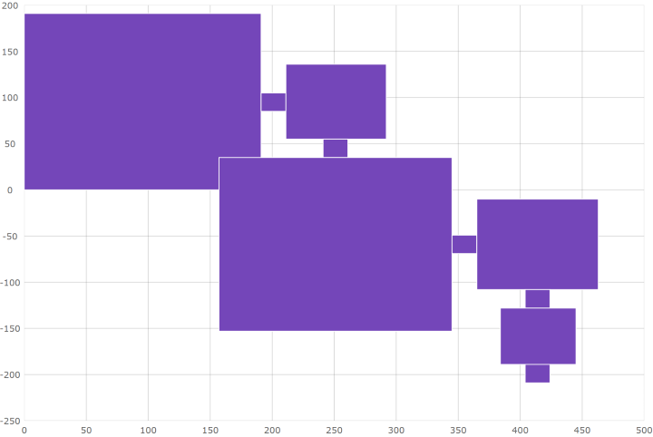

<!--
|metadata|
{
    "fileName": "shapeseries-polygon-series",
    "controlName": "",
    "tags": []
}
|metadata|
-->

# Configuring the Scatter Polygon Series (igDataChart)

## Topic Overview

### Purpose

This topic provides information on how to use the scatter polygon series element in the `igDataChart` control.

### Required background

You should be familiar with the following topics before continuing:

- [Adding igDataChart](igDataChart-Adding.html): This topic demonstrates how to add the `igDataChart`™ control to a page and bind it to data.

- [Binding igDataChart to Data](igDataChart-DataBinding.html): This topic explains how to bind the `igDataChart`™ control to various data sources (JavaScript array, `IQueryable<T>`, web service).


### In this topic

This topic contains the following sections:

-   [Overview](#overview)
	-   [Preview](#preview)
-   [Data Requirements](#data-requirements)
-   [Example](#example)
-   [Related Content](#related-content)
    -   [Topics](#topics)

## <a id="overview"></a> Overview

In the `igDataChart` control, scatter polygon series is a visual element that displays data using polygons. This type of series can render any shape that is desired. The scatter polygon series works a lot like the scatter polyline series except that data is rendered with polygons instead of polylines.

### <a id="preview"></a> Preview

The following is a preview of the `igDataChart` control with a scatter polygon series drawing a floor plan for a building.



## <a id="data-requirements"></a> Data Requirements

Similar to other types of series in the `igDataChart` control, the scatter polygon series has the `dataSource` option for the purpose of data binding. This option is provided an array of items where each item must have one data column that stores point locations (X and Y values) of a shape as another array.  This data column is mapped to the `shapeMemberPath` option. The scatter polygon series uses points of this mapped data column to plot polygons in the `igDataChart` control.

## <a id="example"></a> Example

Based on the above data requirements, an example of how your data must be structured is as follows:

**In JavaScript:**

```js
var data = [
    { Points: [
        [{x: 0, y: 0}, {x: 0.5, y: 1}, {x: -0.5, y:1}],
        [{x: 2, y: 0}, {x: 2.5, y: 1}, {x: 1.5, y:1}]]}]
```

Once your data is ready you can provide it to the chart:

**In JavaScript:**

```js
$("#chart").igDataChart({
    width: "400px",
    height: "400px",
    axes: [{
        name: "xAxis",
        type: "numericX",
    }, {
        name: "yAxis",
        type: "numericY",
    }],
    series: [{
        name: "series1",
        type: "scatterPolygon",
        dataSource: data,
        xAxis: "xAxis",
        yAxis: "yAxis",
        shapeMemberPath: "Points",
    }],
});
```

With the above data and chart, the following result is generated:


## <a id="related-content"></a>Related Content

### <a id="topics"></a>Topics

- [Configuring Shape Series](shapeseries-shape-series.html): This topic provides an overview of the scatter polygon and polyline series for the `igDataChart` control.

- [Configuring the Scatter Polyline Series](shapeseries-polyline-series.html): This topic explains how to configure the scatter polyline series for the `igDataChart` control.