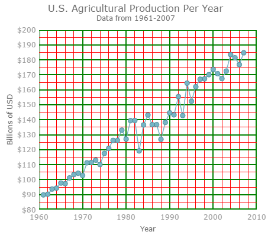
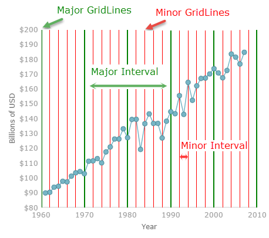
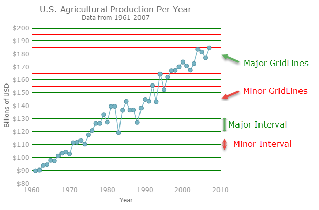
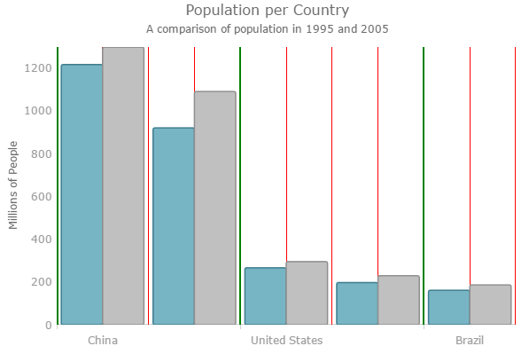

<!--
|metadata|
{
    "fileName": "igdatachart-configuring-axis-intervals",
    "controlName": "",
    "tags": []
}
|metadata|
-->

# Configuring Axis Intervals (igDataChart)


##Topic Overview


### Purpose

This topic provides information on configuring the major and minor axis intervals on the `igDataChart`™ control.

### Required background

The following topic is a prerequisite to understanding this topic:

-	[Adding igDataChart](igDataChart-Adding.html)

This topic demonstrates how to add the `igDataChart`™ control to a page and bind it to data.


### In this topic

This topic contains the following sections:

-   [Configuring the Major and Minor Intervals](#axisintervals)
    -   [Overview](#overview)
    -   [Preview](#preview)
    -   [Properties](#properties)
    -   [NumericXExample](#numericxexample)
    -   [NumericYExample](#numericyexample)
    -   [CategoryXExample](#categoryxexample)
-   [Related Content](#related-content)

##<a id="axisintervals"></a>Axis Intervals


###<a id="overview"></a> Overview

The Major and Minor intervals feature of the `igDataChart` control allows you to apply intervals with the specified color and thickness to the x and y axes of the `igDataChart` control.

###<a id="preview"></a> Preview

The following example is configurable `igDataChart` control, using NumericX and Y axes, where the following options can be set - Interval, MinorInterval, MajorStroke and MinorStroke.

<div class="embed-sample">
   [NumericXAxis Intervals](%%SamplesEmbedUrl%%/data-chart/numeric-xaxis-intervals)
   
</div>

Axis major and minor intervals are implemented by setting the Interval and MinorInterval properties on an axis to a value greater than zero. In order to display minor gridlines that correspond to minor interval, one needs to set MinorStroke and MinorStrokeThickness properties on the axis, (as minor gridlines do not have a default color or thickness, and they will not be displayed without first assigning them).

###<a id="properties"></a> Properties

The following table summarizes the properties available for configuring the major and minor axis intervals

<table class="table">
	<thead>
		<tr>
			<th>Property Name</th>
			<th>Property Type</th>
			<th>Description</th>
		</tr>
	</thead>
	<tbody>
		<tr>
			<td>Interval</td>
			<td>double</td>
			<td>This value provides adequate spacing for axis labels and major gridlines, if used. Note that the interval for axis labels will also be set by this value, displaying one label at the point on the axis associated with the interval.

On category axes, this value is represented as index between first item and last category item. Generally, this value should equal to 10-20% of total numbers of category items so that all axis labels fit on axis so that they are not clipped by other axis labels.

On numeric axes, this value is represented as double between axis minimum value and axis maximum value. By default, numeric axes will automatically calculate and find a nice and round interval based on axis minimum values and maximum value.

On date time axes, this value is represented as time span between axis minimum value and axis maximum value.</td>
		</tr>
		<tr>
			<td>MajorStroke</td>
			<td>brush</td>
			<td>A color of axis major gridlines.</td>
		</tr>
		<tr>
			<td>MajorStrokeThickness</td>
			<td>double</td>
			<td>A thickness in pixels of the axis major gridlines set as a double value</td>
		</tr>
		<tr>
			<td>MinorInterval</td>
			<td>double</td>
			<td>This value provides adequate spacing for minor gridlines, which are always rendered between major gridlines. As result, a value of MinorInterval property should always be much smaller (usually 2-5 time smaller) than the value of major Interval property of an axis.

On category axes, this value is represented as fraction of major Interval property. Generally, this value should equal to between 0.25 and 0.5

On numeric axes, this value is represented as double between axis minimum value and axis maximum value. By default, numeric axes will not automatically calculate minor interval based on axis minimum values and maximum value.

On date time axes, this value is represented as time span between axis minimum value and axis maximum value.</td>
		</tr>
		<tr>
			<td>MinorStroke</td>
			<td>brush</td>
			<td>A color of axis minor gridlines.</td>
		</tr>
		<tr>
			<td>MinorStrokeThickness</td>
			<td>double</td>
			<td>A thickness in pixels of the axis minor gridlines set as a double value.</td>
		</tr>
	</tbody>
</table>

###<a id="numericxexample"></a> NumericXExample

The screenshot, following the table, illustrates how the `igDataChart` control with the axis major and minor interval properties configured on the NumericXAxis will be displayed as a result of the following settings, (using the LineSeries):

<table class="table">
	<thead>
		<tr>
			<th>Property</th>
			<th>Value</th>
		</tr>
	</thead>
	<tbody>
		<tr>
			<td>MinorInterval</td>
			<td>2</td>
		</tr>
		<tr>
			<td>MinorStroke</td>
			<td>"Red"</td>
		</tr>
		<tr>
			<td>MinorStrokeThickness</td>
			<td>1</td>
		</tr>
		<tr>
			<td>Interval</td>
			<td>10</td>
		</tr>
		<tr>
			<td>MajorStroke</td>
			<td>“Green”</td>
		</tr>
		<tr>
			<td>MajorStrokeThickness</td>
			<td>2</td>
		</tr>
		
	</tbody>
</table>



Following is the code that implements this example:

**In JavaScript:**

```js
$("#container").igDataChart({
	…
	axes: [{
                    name: "xAxis",
                    type: "numericX",
                    title: "Year",
                    majorStroke: "Green",
                    minorStroke: 'Red',
                    minorInterval: 2,
                    interval: 10,
                    majorStrokeThickness: 2,

                }, …
```

###<a id="numericYexample"></a> NumericYExample

The screenshot, following the table, illustrates how the `igDataChart` control with the axis major and minor interval properties configured on the NumericYAxis will be displayed as a result of the following settings, (using the LineSeries):

<table class="table">
	<thead>
		<tr>
			<th>Property</th>
			<th>Value</th>
		</tr>
	</thead>
	<tbody>
		<tr>
			<td>MinorInterval</td>
			<td>5000</td>
		</tr>
		<tr>
			<td>MinorStroke</td>
			<td>"Red"</td>
		</tr>
		<tr>
			<td>MinorStrokeThickness</td>
			<td>1</td>
		</tr>
		<tr>
			<td>Interval</td>
			<td>10000</td>
		</tr>
		<tr>
			<td>MajorStroke</td>
			<td>“Green”</td>
		</tr>
		<tr>
			<td>MajorStrokeThickness</td>
			<td>2</td>
		</tr>
	</tbody>
</table>



Following is the code that implements this example:

**In JavaScript:**

```js
$("#container").igDataChart({
	…
	axes: [{
		    name: "yAxis",
                    type: "numericY",
                    majorStroke: "Green",
                    minorStroke: 'Red',
                    minorInterval: 5000,
                    interval: 10000,
                    }, …
```

###<a id="categoryxexample"></a> CategoryXExample

This sample illustrates how the `igDataChart` control, with the axis major and minor interval properties configured on the CategoryXAxis,
will be displayed as a result of the usage of the following settings - MinorInterval, MinorStroke, MinorStrokeThickness, Interval, MajorStroke and MajorStrokeThickness.

<div class="embed-sample">
   [CategoryXAxis Intervals](%%SamplesEmbedUrl%%/data-chart/category-xaxis-intervals)
   
</div>


##<a id="related-content"></a>Related Content


### Topics

The following topic provides additional information related to this topic:

-	[Adding igDataChart](igDataChart-Adding.html):  This topic demonstrates how to add the `igDataChart` control to a page and bind it to data.