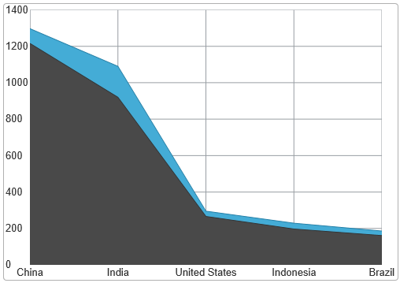

<!--
|metadata|
{
    "fileName": "igdatachart-new-default-style",
    "controlName": "igDataChart",
    "tags": ["Charting","Styling","Theming"]
}
|metadata|
-->

# New Default Style (igDataChart)


## Topic Overview


### Purpose

This topic provides information on the new default style that was applied to the `igDataChart` control in the 2014.1 release. The topic explains the visual areas that were changed and also how to revert to the previous style using the legacy CSS file.

### Required background

The following topics are prerequisites to understanding this topic:

-	[Styling and Theming in Ignite UI](Deployment-Guide-Styling-and-Theming.html): This topic provides instructions on setting up your application for design time, options for using CSS in production and an overview on creating or customizing a theme.

-	[Adding igDataChart](igDataChart-Adding.html): This topic demonstrates how to add the `igDataChart`™ control to a page and bind it to data.

##New Default Style
### Overview

The new default style applies various settings aimed at giving the chart a more streamline appearance. The following screenshots compare the previous style with the new default style.


##### Previous Style



##### New Default Style


### New Default Changes

The following table summarizes how the new default style is different from the previous %%ProductName%% style.

<table class="table">
	<tbody>
	    <tr>
	        <th>Change</th>
	        <th>Details</th>
	    </tr>
	    <tr>
	        <td>Axis lines visibility enhancements</td>
	        <td>
	            All axis (grid) lines use an auto behavior such that if the brush stroke is not set , the chart’s decision logic determines which lines to display based on the series types in use. Thus improving the chart’s performance rendering charts.
	            <ul>
	                <li>All axis (grid) lines, with the 										exception of minor lines, always 										remain visible</li>
	
	            <li>All horizontal category series’ lines, Column, Line, Area, are constantly visible</li>
	
	            <li>All vertical category series’ (Bar) only displays vertical lines while scatter, polar and radial series display all gridlines</li>
	            </ul>
	        </td>
	    </tr>
	    <tr>
	        <td>Axis ticks length</td>
	        <td>For all category axes, the default ticks length is 5 pixels. (In the previous style, the length was 0.)</td>
	    </tr>
	    <tr>
	        <td>Axis lines snapped to the nearest pixel</td>
	        <td>Horizontal and vertical gridlines are now snapped to the nearest round pixel number for a crisper look, e.g. a line set to be at y=2.213 will be drawn at y=2.000. (In the previous template, there was no gridline snapping.)
	        </td>
	    </tr>
	    <tr>
	        <td>Axis labels have margin</td>
	        <td>A default margin of 5 pixels is added for all axis labels.</td>
	    </tr>
	    <tr>
	        <td>Area series opacity</td>
	        <td>All area-like series (Area, Spline Area, Polar Area, etc.), now use a semi-transparent brush for their area visual. (In the previous style, these are fully opaque.)</td>
	    </tr>
	    <tr>
	        <td>Colors improvements</td>
	        <td>Made changes to the axis lines’ color palette changing the available colors used in the chart, in order to make the chart look better. These changes to the axis colors including (but not limited to) used:
	            <ul>
	                <li>Labels font</li>
	
	                <li>Series brushes</li>
	
	                <li>Outlines</li>
	            </ul>
	        </td>
	    </tr>
	</tbody>
</table>

For information on how to configure each these aspects of the chart, refer to [Configuring the style](#_Style_config) section below.

###<a id="_Style_config"></a> Configuring the new default style

The following table gives an overview of the configurable aspects applies by the new default style and maps them to the respective property settings.

<table class="table table-bordered">
    <thead>
        <tr>
            <th colspan="2">
In order to configure the:
            </th>
            <th>
Use this property:
            </th>
            <th>
And set it to the desired:
            </th>
        </tr>
    </thead>
    <tbody>
        <tr>
            <td rowspan="2">
Axis lines
            </td>
            <td>
Axis stroke line
            </td>
            <td>
[axes[0].stroke](%%jQueryApiUrl%%/ui.igDataChart#options:axes.stroke)
            </td>
            <td rowspan="2">
color
            </td>
        </tr>
        <tr>
            <td>
Axis major lines
            </td>
            <td>
[axes[0].majorStroke](%%jQueryApiUrl%%/ui.igDataChart#options:axes.majorStroke)
            </td>
        </tr>
        <tr>
            <td colspan="2">
Axis lines alignment
            </td>
            <td>
[alignsGridLinesToPixels](%%jQueryApiUrl%%/ui.igDataChart#options:alignsGridLinesToPixels)
            </td>
            <td>
value
            </td>
        </tr>
        <tr>
            <td>
Axis ticks
            </td>
            <td>
The length of the ticks
            </td>
            <td>
[axes[0].tickLength](%%jQueryApiUrl%%/ui.igDataChart#options:axes.tickLength)
            </td>
            <td>
length
            </td>
        </tr>
        <tr>
            <td colspan="2">
Axis labels’ margin
            </td>
            <td>
[axes[0].labelMargin](%%jQueryApiUrl%%/ui.igDataChart#options:axes.labelMargin)
                <br />
[axes[0].labelTopMargin](%%jQueryApiUrl%%/ui.igDataChart#options:axes.labelTopMargin)
                <br />
[axes[0].labelRightMargin](%%jQueryApiUrl%%/ui.igDataChart#options:axes.labelRightMargin)
                <br />
[axes[0].labelBottomMargin](%%jQueryApiUrl%%/ui.igDataChart#options:axes.labelBottomMargin)
                <br />
[axes[0].labelLeftMargin](%%jQueryApiUrl%%/ui.igDataChart#options:axes.labelLeftMargin)
            </td>
            <td>
margin
            </td>
        </tr>
        <tr>
            <td colspan="2">
Area series opacity
            </td>
            <td>
[series[0].areaFillOpacity](%%jQueryApiUrl%%/ui.igDataChart#options:series.areaFillOpacity)
            </td>
            <td>
opacity value
            </td>
        </tr>
        <tr>
            <td rowspan="2">
Chart colors
            </td>
            <td>
Series
            </td>
            <td>
[brushes](%%jQueryApiUrl%%/ui.igDataChart#options:brushes)
                <br />
[outlines](%%jQueryApiUrl%%/ui.igDataChart#options:outlines)
            </td>

            <td rowspan="2">
color
            </td>
        </tr>
        <tr>
            <td>
Label font color
            </td>
            <td>
[axes[0].labelTextColor](%%jQueryApiUrl%%/ui.igDataChart#options:axes.labelTextColor)
            </td>
        </tr>
    </tbody>
</table>


##Reverting to Previous Style


### Legacy style file location

The legacy chart style resides in the following location:

```
%%InstallPath%%\css\structure\modules\infragistics.ui.chart.legacy.css
```

### Applying the legacy CSS file

In order to apply the legacy style, include a link to it in the *HEAD* section of the page where the `igDataChart` is used. If using the `igLoader`, include the CSS file in the resources of the loader:

**In JavaScript:**

```js
$.ig.loader({
    scriptPath: '{IG Resources root}/js/',
    cssPath: '{IG Resources root}/css/',
    resources: 'igDataChart.Category, {IG Resources root}/css/structure/modules/infragistics.ui.chart.legacy.css'
});
```


## Related Content


### Topics

The following topics provide additional information related to this topic.

-	[Series Types (igDataChart)](igDataChart-Series-Types.html):  This topic explains conceptually the kinds of chart series that can be produced with the `igDataChart` control.

-	[Configurable Visual Elements (igDataChart)](igDataChart-Visual-Elements.html):  This topic lists all configurable visual elements of the `igDataChart` control and the properties that manage them.

### Samples

The following samples provide additional information related to this topic.

-	[Category Series](%%SamplesUrl%%/data-chart/category-series): This sample demonstrates the various Category Series available in the `igDataChart` control.


 

 


