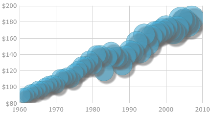

<!--
|metadata|
{
    "fileName": "igdatachart-styling-the-chart-series",
    "controlName": "igDataChart",
    "tags": ["Charting","Styling"]
}
|metadata|
-->

# Styling the Chart Series (igDataChart)


##Topic Overview

### Purpose

This topic provides a brief overview on how to style the series of the `igDataChart`™ control and demonstrates, as an example, how to apply drop-shadow effect to the series.

### Required background

The following topics are prerequisites to understanding this topic:


-   [Adding igDataChart](igDataChart-Adding.html)

This topic demonstrates how to add the `igDataChart` control to a page and bind it to data.


### In this topic

This topic contains the following sections:

-   [Introduction](#introduction)
-   [Styling the Chart Series by Applying Drop-Shadow Effect](#drop-shadow-effect)
    -   [Drop-shadow effect configuration summary](#drop-shadow-effect-config)
    -   [Shadow types](#shadow-types)
    -   [Drop-shadow effect configuration summary chart](#drop-shadow-effect-chart)
    -   [Property settings](#property-settings)
    -   [Example – drop-shadow effect with Monolith shadow](#example)
    -   [Example – drop-shadow effect with Compound shadow](#example-drop-shadow-effect)
-   [Related Content](#related-content)
    -   [Topics](#topics)
    -   [Samples](#samples)


##<a id="introduction"></a>Introduction


### Chart series styling summary

The igDataChart's series can be styled in many aspects, the main of which are applying different fill and outline brushes to the series. This is managed by the [`brush`](%%jQueryApiUrl%%/ui.igDataChart#options:series.brush) and [`outline`](%%jQueryApiUrl%%/ui.igDataChart#options:series.outline) properties of the series. Some other aspects of the series’ look-and-fill, such as the thickness of the outline and the opacity of the series, are configurable, too through the [`thickness`](%%jQueryApiUrl%%/ui.igDataChart#options:series.thickness) and [`areaFillOpacity`](%%jQueryApiUrl%%/ui.igDataChart#options:series.areaFillOpacity) properties of the series.

In addition to managing the styling described above, [drop-shadow effect can be applied to the chart series](#drop-shadow-effect) by setting the [`isDropShadowEnabled`](%%jQueryApiUrl%%/ui.igDataChart#options:series.isDropShadowEnabled) property.


##<a id="drop-shadow-effect"></a>Styling the Chart Series by Applying Drop-Shadow Effect

###<a id="drop-shadow-effect-config"></a> Drop-shadow effect configuration summary

With the drop-shadow effect, the series appear as if casting a shadow.



Applying the drop-shadow effect to the series is done by setting the [`isDropShadowEnabled`](%%jQueryApiUrl%%/ui.igDataChart#options:series.isDropShadowEnabled) property of the series to “true”. Customization of the effect in terms of [configurable shadow type](#shadow-types), blur radius, color, direction, and opacity is supported through the respective shadow-related properties of the [series](igDataChart-Series-Types.html) (See [Drop-shadow effect configuration summary chart](#drop-shadow-effect-chart), [Property settings](#property-settings), and the examples.).

###<a id="shadow-types"></a> Shadow types

Two types of shadows are available for the drop-shadow effect depending on whether the fill shape and the outline shape of a series cast separate shadows each or the series cast single monolith shadow:

-   Monolith shadow – one shadow is displayed for the visual of the series
-   Compound shadow – the fill part and outline part of the series each cast a separate shadow

The default schedule type is Monolith. The benefit of using the Compound shadow type is in the capability to visually fine-tune the drop-shadow effect.

>**Note:** Currently, [blur](#blur) can be applied only to Compound shadows. For details on this limitation, see [this note](#GoogleBug).

The shadow type is controlled by the [`useSingleShadow`](%%jQueryApiUrl%%/ui.igDataChart#options:series.useSingleShadow) property. When this property is set to *“true”* (default), Monolith shadow is applied; when set to “false”, the shadow will be Compound.

### <a id="drop-shadow-effect-chart"></a> Drop-shadow effect configuration summary chart

The following table explains briefly the configurable aspects of the chart drop-shadow effect and maps them to properties that configure them. The default drop-shadow effect styling differs depending on the series type. Further details and examples about configuring the shadow type after the table.

<table class="table table-striped">
    <thead>
        <tr>
            <th>
Configurable aspect
            </th>
            <th>
Details
            </th>
            <th>
Properties
            </th>
        </tr>
    </thead>
    <tbody>
        <tr>
            <td>
Configurable type of the shadow
            </td>
            <td>
Specifies whether the shadow can be configured (styled) individually for each series or only for the series visual as whole
            </td>
            <td>
                <ul>
                    <li>
[useSingleShadow](%%jQueryApiUrl%%/ui.igDataChart#options:series.useSingleShadow)
                    </li>
                </ul>
            </td>
        </tr>
        <tr>
            <td>
Direction and offset
            </td>
            <td>
The direction at which the shadow is cast as well as the horizontal and vertical offset from the series specified as X,Y offset co-ordinates relative to the top-left edge of the series’ bounds rectangle.
            </td>
            <td>
                <ul>
                    <li>
[shadowOffsetX](%%jQueryApiUrl%%/ui.igDataChart#options:series.shadowOffsetX)
                    </li>
                    <br>
                    <li>
[shadowOffsetY](%%jQueryApiUrl%%/ui.igDataChart#options:series.shadowOffsetY)
                    </li>
                </ul>
            </td>
        </tr>
        <tr>
            <td>
Color / Opacity
            </td>
            <td>
The color of the shadow. If a semi-transparent color is specified, a semi-transparent shadow is rendered.
            </td>
            <td>
                <ul>
                    <li>
[shadowColor](%%jQueryApiUrl%%/ui.igDataChart#options:series.shadowColor)
                    </li>
                </ul>
            </td>
        </tr>
        <tr>
            <td><a id="blur"></a>
Blur
            </td>
            <td>
The definition level of the edges of the shadow (sharp/blurry). The blur level is defined by the number of pixels throughout which the contour spreads and fades out. The higher the value, the blurrier the shadow.
            </td>
            <td>
                <ul>
                    <li>
[shadowBlur](%%jQueryApiUrl%%/ui.igDataChart#options:series.shadowBlur)
                    </li>
                </ul>
            </td>
        </tr>
    </tbody>
</table>


### <a id="property-settings"></a>Property settings

The following table lists the configurable aspects of the drop-shadow effect to their respective property settings.

<table class="table table-bordered">
    <thead>
        <tr>
            <th colspan="2">
In order to configure:
            </th>
            <th>
Use this property:
            </th>
            <th>
And set it to:
            </th>
        </tr>
    </thead>
    <tbody>
        <tr>
            <td colspan="2">
Drop-shadow effect to be used
            </td>
            <td>
[isDropShadowEnabled](%%jQueryApiUrl%%/ui.igDataChart#options:series.isDropShadowEnabled)
            </td>
            <td>
*“true”*
            </td>
        </tr>
        <tr>
            <td colspan="2">
The type of the shadow
            </td>
            <td>
[useSingleShadow](%%jQueryApiUrl%%/ui.igDataChart#options:series.useSingleShadow)
            </td>
            <td>
“true” or “false”
            </td>
        </tr>
        <tr>
            <td colspan="2">
The color/opacity of the shadow
            </td>
            <td>
[shadowColor](%%jQueryApiUrl%%/ui.igDataChart#options:series.shadowColor)
            </td>
            <td>
The desired color HTML name, HEX color code or RGBA color definition
            </td>
        </tr>
        <tr>
            <td rowspan="2">
The direction and offset
            </td>
            <td>
The horizontal offset of the shadow from the series visual
            </td>
            <td>
[shadowOffsetX](%%jQueryApiUrl%%/ui.igDataChart#options:series.shadowOffsetX)
            </td>
            <td>
A double value indicating the offset in pixels
            </td>
        </tr>
        <tr>
            <td>
The vertical offset of the shadow from the series visual
            </td>
            <td>
[shadowOffsetY](%%jQueryApiUrl%%/ui.igDataChart#options:series.shadowOffsetY)
            </td>
            <td>
A double value indicating the offset in pixels
            </td>
        </tr>
        <tr>
            <td colspan="2">
The blur level
            </td>
            <td>
[shadowBlur](%%jQueryApiUrl%%/ui.igDataChart#options:series.shadowBlur)
            </td>
            <td>
The desired pixel double value representing the blur level. The higher the value, the blurrier the shadow.

                 <blockquote>
                    <a id="GoogleBug" name="GoogleBug"></a>

                    **Note:** Monolith shadows do not allow for the blur effect to be applied to them: when the useSingleShadow property is set to “true”, the shadowBlur setting is disregarded and no blur is applied to the shadow. This is a deliberate limitation due to a [Google® Chrome™ bug](https://code.google.com/p/chromium/issues/detail?id=100703) and extended to all major browsers thus ensuring consistent behavior across all of them. This behavior is subject to change once the aforementioned Chrome issue is resolved.
                    In the meantime, if you need to apply blur to the shadow, use the Compound type of shadow (useSingleShadow:"true").
                </blockquote>
            </td>
        </tr>
    </tbody>
</table>

### <a id="example"></a> Example – drop-shadow effect with Monolith shadow

This example demonstrates applying and styling a [Monolith](#shadow-types) drop-shadow. Since the [`useSingleShadow`](%%jQueryApiUrl%%/ui.igDataChart#options:series.useSingleShadow) property is "true" by default, setting it explicitly in the code is not necessary.

The screenshot below demonstrates how a line series in an `igDataChart` control looks as a result of the following shadow-related settings:

Property | Value
---|---
[isDropShadowEnabled](%%jQueryApiUrl%%/ui.igDataChart#options:series.isDropShadowEnabled) | true
[shadowBlur](%%jQueryApiUrl%%/ui.igDataChart#options:series.shadowBlur) | 20
[shadowColor](%%jQueryApiUrl%%/ui.igDataChart#options:series.shadowColor) | "darkBlue"
[shadowOffsetX](%%jQueryApiUrl%%/ui.igDataChart#options:series.shadowOffsetX) | 10
[shadowOffsetY](%%jQueryApiUrl%%/ui.igDataChart#options:series.shadowOffsetY) | -15


Following is the code that implements this example.

**In JavaScript:**

```js
series: [
    {
        type: "column",
        isDropShadowEnabled: true,
        shadowBlur: 20,
        shadowColor: "darkBlue",
        shadowOffsetX: 10,
        shadowOffsetY: -15
    }
```

### <a id="example-drop-shadow-effect"></a> Example – drop-shadow effect with Compound shadow

This example demonstrates applying a [Compound](#shadow-types) drop-shadow with a blur.

The screenshot below demonstrates how a column series in a `igDataChart` control looks as a result of the following shadow-related settings:

Property | Value
---|---
[isDropShadowEnabled](%%jQueryApiUrl%%/ui.igDataChart#options:series.isDropShadowEnabled) | true
[useSingleShadow](%%jQueryApiUrl%%/ui.igDataChart#options:series.useSingleShadow) | false
[shadowBlur](%%jQueryApiUrl%%/ui.igDataChart#options:series.shadowBlur) | 20
[shadowColor](%%jQueryApiUrl%%/ui.igDataChart#options:series.shadowColor) | “darkBlue”
[shadowOffsetX](%%jQueryApiUrl%%/ui.igDataChart#options:series.shadowOffsetX) | 10
[shadowOffsetY](%%jQueryApiUrl%%/ui.igDataChart#options:series.shadowOffsetY) | -15


Following is the code that implements this example.

**In JavaScript:**

```js
series: [
    {
        type: "column",
        isDropShadowEnabled: true,
        useSingleShadow: false,
        shadowBlur: 20,
        shadowColor: "darkBlue",
        shadowOffsetX: 10,
        shadowOffsetY: -15,
      }
```


##<a id="related-content"></a>Related Content


###<a id="topics"></a> Topics

The following topics provide additional information related to this topic.


-   [Styling igDataChart](igDataChart-Styling-Themes.html): This topic demonstrates how to apply styles and themes to the `igDataChart` control.

-   [Styling and Theming in %%ProductName%%](Deployment-Guide-Styling-and-Theming.html)

General information and a procedure for updating styles and themes in %%ProductName%%™ library.


### <a id="samples"></a>Samples

The following samples provide additional information related to this topic.

-   [Drop Shadows](%%SamplesUrl%%/data-chart/drop-shadows): This sample demonstrates applying a drop-shadow effect to the data series in the `igDataChart` control.


 

 


