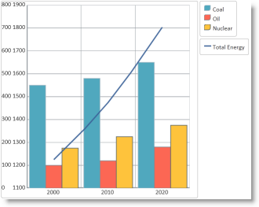
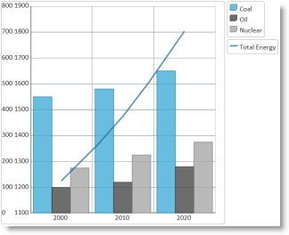

<!--
|metadata|
{
    "fileName": "igdatachart-styling-themes",
    "controlName": "igDataChart",
    "tags": ["Charting","How Do I","Styling"]
}
|metadata|
-->

# Styling igDataChart


##Topic Overview


### Purpose

This topic demonstrates how to apply styles and themes to the `igDataChart`™ control.

### Required Background

**Concepts**

-   Cascading Style Sheets
-   Applying themes by changing linked CSS files

**Topics**

-	[Styling and Theming in Ignite UI](Deployment-Guide-Styling-and-Theming.html): General information and a procedure for updating styles and themes in Ignite UI™ library.

**External Resources**


-	[jQuery UI](http://jqueryui.com/):  General information about the jQuery UI library.

-	[Theming jQuery UI](http://docs.jquery.com/UI/Theming):  Provides information on using themes with jQuery UI library.

-	[jQuery UI CSS Framework](http://docs.jquery.com/UI/Theming/API):  Provides information in the jQuery UI styling framework.

### In This Topic

This topic contains the following sections:

-   [Introduction](#topic-introduction)
-   [Themes Summary](#themes-summary)
-   [Required Cascading Style Sheets (CSS)](#required-css)
  -   [Required CSS summary](#required-css-summary)
    -   [Required CSS code: HTML](#required-css-html)
    -   [Required CSS code: ASPX](#required-css-aspx)
-   [Chart Styles Reference](#chart-style-reference)
-   [igDataChart Styling Options](#igDataChart-styling-options)
   -   [Introduction](#style-options-introduction)
    -   [igDataChart property-configurable styling aspects](#igDataChart-property-config)
-   [Modifying the Chart-Specific Visual Elements Using Themes](#modify-chart-specific)
   -   [Introduction](#modify-chart-introduction)
    -   [Preview](#preview)
    -   [Overview](#overview)
    -   [Steps](#steps)
-   [Related Content](#related-content)
   -   [Topics](#topics)
    -   [Resources](#resources)


##<a id="topic-introduction"></a>Introduction


### Introduction to themes

The `igDataChart` uses the jQuery UI CSS Framework for the purposes of applying styles and themes. By default, the `igDataChart` uses the IG Theme, which is a jQuery UI theme provided by Infragistics for use in your application. Additionally, the IG Theme has some additional chart specific styles. That means in order to customize the looks of charts a general jQuery UI theme is not sufficient. You will need to provide additional style classes that alter chart specific elements like data series and axes.

To customize a theme, you can use the ThemeRoller tool. This jQuery UI tool facilitates the creation of custom themes that are compatible with the jQuery UI widgets. Many prebuilt themes are available for download and use in your website. The `igDataChart` control supports the use of ThemeRoller themes.

Detailed information for using themes with Ignite UI library is available in the [Styling and Theming in Ignite UI](Deployment-Guide-Styling-and-Theming.html) topic.

Note: The base theme of Ignite UI is not necessary for charts and you may safely omit it on pages only containing charts.


##<a id="themes-summary"></a>Themes Summary

A summary of the `igDataChart` control’s available themes.

<table class="table table-bordered">
    <tbody>
        <tr>
            <th colspan="2">
                Theme
            </th>

            <th>
                Description
            </th>
        </tr>

        <tr>
            <td>
                IG Theme
            </td>

            <td>
                <p>Path: `{IG CSS root}/themes/Infragistics/`</p>

                <p>File: `infragistics.theme.css`</p>
            </td>

            <td>
                This theme defines general visual features for all Ignite UI controls. Detailed information for using the IG theme is available in the <a class="ig-topic-link" href="Deployment-Guide-Styling-and-Theming.html" data-auto-update-caption="true">Styling and Theming in Ignite UI</a> topic.
            </td>
        </tr>

        <tr>
            <td>
                Chart Structure
            </td>

            <td>
                <p>Path: `{IG CSS root}/structure/modules/`</p>

                <p>File: `infragistics.ui.chart.css`</p>
            </td>

            <td>
                This theme defines visual elements specific for charts.
            </td>
        </tr>
    </tbody>
</table>

##<a id="required-css"></a>Required Cascading Style Sheets (CSS)

###<a id="required-css-summary"></a>Required CSS summary

The following CSS resources are necessary to correctly render charts:

-   `infragistics.theme.css` – Contains the IG Theme
-   `infragistics.ui.chart.css` – Contains the Chart Structure classes

In the code snippets that follow, it is assumed that the CSS resources are located in the `Content/ig` folder below the website or application root.

>**Note:** The following blocks provide information on manually including required CSS files but the recommended way to load these files into your page it to use the Infragistics Loader control.

###<a id="required-css-html"></a>Required CSS code: HTML

**In HTML:**

```html
<link href="Content/ig/themes/Infragistics/infragistics.theme.css" rel="Stylesheet" />
<link href="Content/ig/structure/modules/infragistics.ui.chart.css" rel="Stylesheet" />
```

###<a id="required-css-aspx"></a>Required CSS code: ASPX

**In ASPX:**

```csharp
<link href='<%= Url.Content("~/Content/ig/themes/Infragistics/infragistics.theme.css")%>' rel="stylesheet" type="text/css" />
<link href='<%= Url.Content("~/Content/ig/structure/modules/infragistics.ui.chart.css")%>' rel="stylesheet" type="text/css" />
```


##<a id="chart-style-reference"></a>Chart Styles Reference


###Style reference summary

A summary of the `igDataChart` style’s purpose and functionality.

<table class="table table-striped">
	<tbody>
		<tr>
			<th>
				Property
			</th>

			<th>
				Description
			</th>
		</tr>

		<tr>
			<td>
				.ui-chart-palette-1 to

				.ui-chart-palette-N
			</td>

			<td>
				Sets border and background color for data series 1 to data series N. You can have as many ui-chart-palette classes as needed by your application.
			</td>
		</tr>

		<tr>
			<td>
				.ui-chart-axis
			</td>

			<td>
				Sets border and background color for chart axes.
			</td>
		</tr>

		<tr>
			<td>
				.ui-chart-legend-items-list
			</td>

			<td>
				Sets all styling options for chart legends.
			</td>
		</tr>

		<tr>
			<td>
				.ui-chart-legend-item-text
			</td>

			<td>
				Sets all styling options for legend item text.
			</td>
		</tr>

		<tr>
			<td>
				.ui-chart-legend-item-badge
			</td>

			<td>
				Sets all styling options for legend item icon.
			</td>
		</tr>

		<tr>
			<td>
				.ui-chart-tooltip
			</td>

			<td>
				Sets all styling options for chart tooltips.
			</td>
		</tr>
	</tbody>
</table>


>**Note:** In all style classes, the border-color setting determines the outline of the corresponding element and the background-color settings determines the background or fill color of the element.


##<a id="igDataChart-styling-options"></a>igDataChart Styling Options


###<a id="style-options-introduction"></a>Introduction

The `igDataChart` control is all about visual content and it has a lot of properties and styling options for changing the layout and colors of charts. With CSS you can define:

-   colors for data series,
-   colors for trend lines,
-   colors for legend list items, both text and icons and
-   colors, shades, fonts and other CSS properties for tooltip formatting.

With individual chart control options you can define:

-   marker color and shape,
-   color and thickness for axis stroke, major and minor stroke and
-   colors for data series and trend lines.

When set, the chart properties have precedence over style classes defined in CSS files. These properties provide for programmatically changing the looks of charts at runtime.

###<a id="igDataChart-property-config"></a>igDataChart property-configurable styling aspects

The property configurable styling aspects of the `igDataChart` control and map them the respective properties that manage them.

<table class="table table-striped">
	<tbody>
		<tr>
			<th>Configurable aspect</th>
			<th>Property</th>
		</tr>
		<tr>
			<td>Color for main axis line of the axis with name key.</td>
			<td>axes[“key”].stroke</td>
		</tr>

		<tr>
			<td>Color for major stroke of the axis with name  key.</td>
			<td>axes[“key”].majorStroke</td>
		</tr>

		<tr>
			<td>Color for minor stroke of the axis with name  key.</td>

			<td>
				axes[“key”].minorStroke
			</td>
		</tr>

		<tr>
			<td>
				Color for negative values of the data series with name key.
			</td>

			<td>
				series[“key”].negativeBrush
			</td>
		</tr>

		<tr>
			<td>
				Color for the data series with name key.
			</td>

			<td>
				series[“key”].brush
			</td>
		</tr>

		<tr>
			<td>
				Color for the marker of the data series with name key.
			</td>

			<td>
				series[“key”].markerBrush
			</td>
		</tr>

		<tr>
			<td>
				Color for the outline of the data series with name key.
			</td>

			<td>
				series[“key”].markerOutline
			</td>
		</tr>

		<tr>
			<td>
				Color for the trend line of the data series with name key.
			</td>

			<td>
				series[“key”].trendLineBrush
			</td>
		</tr>

		<tr>
			<td>
				List of colors for data series
			</td>

			<td>
				brushes
			</td>
		</tr>

		<tr>
			<td>
				List of colors for marker outline
			</td>

			<td>
				markerOutlines
			</td>
		</tr>

		<tr>
			<td>
				List of colors for markers
			</td>

			<td>
				markerBrushes
			</td>
		</tr>

		<tr>
			<td>
				Thickness of the main axis line of the axis with name key.
			</td>

			<td>
				axes[“key”].strokeThickness
			</td>
		</tr>

		<tr>
			<td>
				Thickness of the major stroke of the axis with name key.
			</td>

			<td>
				axes[“key”].majorStrokeThickness
			</td>
		</tr>

		<tr>
			<td>
				Thickness of the minor stroke of the axis with name key.
			</td>

			<td>
				axes[“key”].minorStrokeThickness
			</td>
		</tr>

		<tr>
			<td>
				Thickness of the trend line of data series with name key.
			</td>

			<td>
				series[“key”].trendLineThickness
			</td>
		</tr>
	</tbody>
</table>


##<a id="modify-chart-specific"></a>Modifying the Chart-Specific Visual Elements Using Themes


###<a id="modify-chart-introduction"></a>Introduction

Demonstrates how to alter the default settings for various visual elements of the `igDataChart` control by changing the `infragistics.ui.chart.css` chart-specific styles.

Use an existing page with a chart, since the procedure for creating a chart is not included for this example. The example shows you how to modify the chart styles.

In this example, we change the colors of data series.

###<a id="preview"></a>Preview

The following screenshots show the default and updated view of a sample chart.

Default chart colors|Updated chart colors
---|---
|


###Prerequisites

To complete the procedure, you need the following:

-   An HTML5 web page with an existing `igDataChart` control

###<a id="overview"></a>Overview

A high level overview of the process:

1.  [Copy the default chart CSS file](#copy-default-css)
2.  [Modify the styles for the chart visual elements](#modify-sryles)
3.  [Change the link from the default chart CSS file to the modified file](#change-css-links)
4.  [Verify the result](#final-result)

###<a id="steps"></a>Steps

Demonstrate how to modify the default IG Chart styles with your preferred settings.

1.  <a id="copy-default-css"></a>Copy the default chart CSS file.

 	**Copy the CSS file, with the default chart styles (`infragistics.ui.chart.css`), from the Ignite UI installation folder to the themes folder of your web site or application.**

 	For instance, if you have a folder `Content/themes` in your web site or application where keep the CSS files used by the application, then make a copy of the default chart CSS file mentioned above in `Content/themes/MyChartTheme/ig.ui.chart.custom.css`. 

2. <a id="modify-sryles"></a>Modify the styles for chart visual elements

 	Open the copy of the CSS file and make the desired changes to the styles. (Refer to the [Chart Styles Reference](#chart-style-reference) section for details about the individual `igDataChart` styles.)

	**In CSS:**

	```css
	.ui-chart-palette-1
    {
        border-color: rgb(35, 128, 168);
        border-color: rgba(35, 128, 168, .8);
        background-color: rgb(68, 172, 214);
        background-color: rgba(68, 172, 214, .8);
    }
    .ui-chart-palette-2
    {
        border-color: rgb(51, 51, 51);
        border-color: rgba(51, 51, 51, .8);
        background-color: rgb(73, 73, 73);
        background-color: rgba(73, 73, 73, .8);
    }
    .ui-chart-palette-3
    {
        border-color: rgb(128, 128, 128);
        border-color: rgba(128, 128, 128, .8);
        background-color: rgb(168, 168, 168);
        background-color: rgba(168, 168, 168, .8);
    }
    .ui-chart-palette-4
    {
        border-color: rgb(24, 81, 112);
        border-color: rgba(24, 81, 112, .8);
        background-color: rgb(33, 110, 153);
        background-color: rgba(33, 110, 153, .8);
    }
    .ui-chart-palette-5
    {
        border-color: rgb(135, 153, 34);
        border-color: rgba(135, 153, 34, .8);
        background-color: rgb(164, 186, 41);
        background-color: rgba(164, 186, 41, .8);
    }
    .ui-chart-axis
    {
        border-color: #989EA3;
        background-color: #989EA3;
    }
    .ui-chart-legend-items-list
    {
        padding: 10;
        margin: 5px;
    }
    .ui-chart-legend-item-text
    {
        vertical-align: text-bottom;
    }
    .ui-chart-legend-item-badge
    {
        vertical-align: baseline;   
    }
    .ui-chart-tooltip
    {
        -moz-box-shadow: 5px 5px rgba(0,0,0,0.5);
        -webkit-box-shadow: 5px 5px rgba(0,0,0,0.5);
        box-shadow: 5px 5px rgba(0,0,0,0.5);
    }
	```

3. <a id="change-css-links"></a>Change the link from the default chart CSS file to the modified file.

	Update the link to the default chart CSS file to point to the CSS file modified in the previous step.

	**In HTML:**

    ```html
    <link href="/Content/themes/MyChartTheme/ig.ui.chart.custom.css" rel="Stylesheet" type="text/css" />
    ```

	**In ASPX:**

    ```csharp
    <link href='<%= Url.Content("~/Content/themes/MyChartTheme/ig.ui.chart.custom.css")%>' rel="stylesheet" type="text/css" />
    ```

4. <a id="final-result"></a>Verify the result.

	To verify that the chart colors and styles changed, save the web page and open it in your browser.


##<a id="related-content"></a>Related Content

###<a id="topics"></a>Topics

The following topics provide additional information related to this topic.


-	[igDataChart Overview](igDataChart-Overview.html):  Conceptual information about the `igDataChart` control including its main features, minimum requirements for using charts and user functionality.

-	[Adding igDataChart](igDataChart-Adding.html):  Demonstrates how to create the `igDataChart` control and bind it to data.

###<a id="resources"></a>Resources

The following third party material provides additional information related to this topic.

-	[jQuery Themeroller](http://jqueryui.com/themeroller/):  Provides jQuery UI themes for preview and download.

-	[Applying the New Style (igDataChart)](igDataChart-New-Default-Style.html):  This topic explains how to apply the new chart style and provides an overview of the changes it makes to the chart look.

-	[Styling the Chart Series (igDataChart)](igDataChart-Styling-the-Chart-Series.html):  This topic provides a brief overview on how to style the series of the `igDataChart`™ control and demonstrates, as an example, how to apply drop-shadow effect to the series.


 

 


