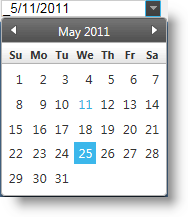

<!--
|metadata|
{
    "fileName": "igdatepicker-overview",
    "controlName": "igDatePicker",
    "tags": ["Editing","Getting Started"]
}
|metadata|
-->

# igDatePicker Overview


The igDatePicker, allows you to have input field with dropdown calendar and specified by developer display date format. The igDatePicker control supports localization, by recognizing different regional options exposed from the browser.

> **Note on localization:** The `igDatePicker` control depends on `jQuery.datepicker` and thus also requires its localization files to be referenced on the page.

The `igDatePicker` control exposes a rich client-side API, which may be configured the work with any server technology. While the Ignite UI™ controls are server-agnostic, the editor control does feature wrappers specific for the Microsoft® ASP.NET MVC Framework to configure the control with the .NET™ language of your choice.

The `igDatePicker` control may be extensively styled giving you an opportunity to provide a completely different look and feel for the control as opposed to the default style. Styling options include using your own styles as well as styles from jQuery UI’s ThemeRoller.

> **Note:** The `igDatePicker` control reuses the drop-down calendar from `jQuery.datepicker` as it doesn’t implement its own drop-down.

Figure 1: The `igDatePicker` control during date selection



[igDatePicker Sample](%%SamplesUrl%%/date-picker/basic-usage)

## Features

The `igDatePicker` includes the following characteristics:

-   Overall theme support
-   Validation
-   Defining custom display format
-   Set Min/Max value
-   Localization
-   JavaScript Client API
-   ASP.NET MVC wrapper
-   All features supported by the jquery.ui.datepicker


## Adding igDatePicker to a Web Page

1.  To get started, include the required and localized resources for your application. Details on which resources to include can be found in the [Using JavaScript Resources in Ignite UI](Deployment-Guide-JavaScript-Resources.html) help topic.
2.  On your HTML page or ASP.NET MVC View, reference the required JavaScript files, CSS files, and ASP.NET MVC assemblies.

    **In HTML:**

    ```html
    <link type="text/css" href="/css/themes/infragistics/infragistics.theme.css" rel="stylesheet" />
    <link type="text/css" href="/css/structure/infragistics.css" rel="stylesheet" />
    <script type="text/javascript" src="/Scripts/jquery.min.js"></script>
    <script type="text/javascript" src="/Scripts/jquery-ui.min.js"></script>
    <script type="text/javascript" src="/Scripts/Samples/infragistics.core.js"></script>
	<script type="text/javascript" src="/Scripts/Samples/infragistics.lob.js"></script>
    ```

    **In ASPX:**

    ```csharp
    <%@ Import Namespace="Infragistics.Web.Mvc" %>

    <link type="text/css" href="<%= Url.Content("~/css/themes/infragistics/infragistics.theme.css") %>" rel="stylesheet" />
    <link type="text/css" href="<%= Url.Content("~/css/structure/infragistics.css") %>" rel="stylesheet" />

    <script type="text/javascript" src="<%= Url.Content("~/Scripts/jquery.min.js")%>"></script>
    <script type="text/javascript" src="<%= Url.Content("~/Scripts/jquery-ui.min.js")%>"></script>
    <script type="text/javascript" src="<%= Url.Content("~/Scripts/Samples/infragistics.core.js")%>"></script>
	<script type="text/javascript" src="<%= Url.Content("~/Scripts/Samples/infragistics.lob.js")%>"></script>
    <script type="text/javascript" src="<%= Url.Content("~/Scripts/Samples/modules/i18n/regional/infragistics.ui.regional-en.js")%>"></script>
    ```

    **In Razor:**

    ```csharp
    @using Infragistics.Web.Mvc;

    <link type="text/css" href="@Url.Content("~/css/themes/infragistics/infragistics.theme.css")" rel="stylesheet" />
    <link type="text/css" href="@Url.Content("~/css/structure/infragistics.css")" rel="stylesheet" />

    <script type="text/javascript" src="@Url.Content("~/Scripts/jquery.min.js")"></script>
    <script type="text/javascript" src="@Url.Content("~/Scripts/jquery-ui.min.js")"></script>
    <script type="text/javascript" src="@Url.Content("~/Scripts/Samples/infragistics.core.js")"></script>
	<script type="text/javascript" src="@Url.Content("~/Scripts/Samples/infragistics.lob.js")"></script>
    <script type="text/javascript" src="@Url.Content("~/Scripts/Samples/modules/i18n/regional/infragistics.ui.regional-en.js")"></script>
    ```

3.  For jQuery implementations create an INPUT, TD, DIV or SPAN as the target element in HTML. This step is optional for ASP.NET MVC implementations as the MVC wrapper creates the containing element for you.

    **In HTML:**

    ```html
    <input id="datePicker" type="text" />
    ```

4.  Once the above setup is complete, initialize the date editor and set needed options, such as `width`, `nullText`, `mask` etc.

    > **Note:** For the ASP.NET MVC Views, the Render method must be called after all other options are set.

    **In Javascript:**

    ```js
    <script type="text/javascript">
          $("#datePicker").igDatePicker({
             button: "dropdown",         
			 nullText: "Enter date"
          });
     </script>
    ```

    **In ASPX:**

     ```csharp
     <%= Html.Infragistics().DatePicker()
         .ID("datePicker")
         .ButtonType(TextEditorButtonType.DropDown)
         .NullText("Enter date")
         .Render()%>
     ```

    **In Razor:**

    ```csharp
    @(Html.Infragistics().DatePicker()
         .ID("datePicker")
         .ButtonType(TextEditorButtonType.DropDown)
         .NullText("Enter date")
         .Render())
    ```

5.  Run the web page to view the basic setup of the `igDatePicker` control.

## Related Links

-   [Ignite UI Overview](NetAdvantage-for-jQuery-Overview.html)  
-   [Using JavaScript Resources in Ignite UI](Deployment-Guide-JavaScript-Resources.html)

 

 


