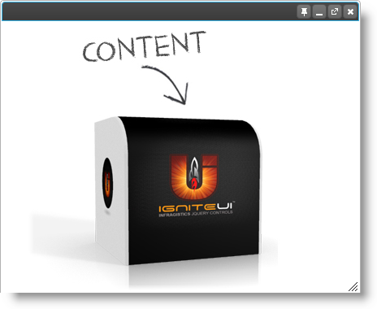

<!--
|metadata|
{
    "fileName": "igdialog-overview",
    "controlName": "igDialog",
    "tags": ["Getting Started"]
}
|metadata|
-->

# igDialog Overview

## Topic Overview

### Purpose

The topic introduces the user to the `igDialog`™ control’s main features.

### In this topic

This topic contains the following sections:

-   [**Introduction**](#introduction)
	-   [Introduction to the igDialog](#introduction-html)
    -   [States](#states)
    -   [Example](#example)
-   [**Features**](#features)
    -   [Show and Hide](#show-hide)
    -   [Maximize and Minimize](#maximize-minimize)
    -   [Pin](#pin)
    -   [Drag](#drag)
    -   [Resize](#resize)
    -   [Position](#position)
    -   [Header and Footer](#header-footer)
    -   [Keyboard support](#keyboard-support)
    -   [Modal state](#modal-state)
    -   [Multiple dialogs](#multiple-dialogs)
    -   [External Page](#external-page)
    -   [Animations](#animations)
    -   [Focus on child](#focus-child)
    -   [Persistence](#persistence)
-   [**Related Content**](#related-content)
    -   [Topics](#topics)
    -   [Samples](#samples)


##  <a id="introduction"></a> Introduction

###  <a id="introduction-html"></a> Introduction to the igDialog

**In HTML:**

```html
<div id="dialog">
    igDialog Content
</div>
```

### <a id="states"></a> States 

The following table summarizes the all possible states of the control. Additional details are available within the related topics:

State | Description | Related Topic | 
--- | --- | ---
Opened | *In this state, igDialog is opened. This is the default state of the control.* | [Show and Hide](igDialog-Show-and-Hide.html)
Closed | *In this state igDialog is closed.* | [Show and Hide](igDialog-Show-and-Hide.html)
Minimized | *In this state igDialog is minimized.* | [Maximize and Minimize Window](igDialog-Maximize-and-Minimize.html)
Maximized | *In this state igDialog is maximized.* | [Maximize and Minimize Window](igDialog-Maximize-and-Minimize.html)

### <a id="example"></a> Example

The following image shows the `igDialog`, which has an image as content. The control is in an open state.




## <a id="features"></a> Features

#### Features Overview

The following table summarizes the features of the `igDialog` control. Additional details are available after the summary table:

Feature | Description
--- | ---
[Show and Hide](#show-hide) | This is the ability to show and hide the dialog window using special buttons and control API.
[Maximize and Minimize](#maximize-minimize) | This is the ability to minimize and maximize the dialog window using special buttons and the control API.
[Pin](#pin) | This is the ability to pin the dialog window to the parent container at the top left edge.
[Position](#position) | This is the ability to put the dialog window at any place at the page, independent of his parent’s position.
[Drag](#drag) | The ability to move the dialog across the page.
[Resize](#resize) | The ability to resize the dialog.
[Header and Footer](#header-footer) | The `igDialog` control proposes properties for modifying the footer and header as well as for modifying the buttons and their images.
[Keyboard support](#keyboard-support) | The ability to close the dialog window using Esc key.
[Modal state](#modal-state) | The ability to disable the page behind the modal dialog.
[Multiple dialogs](#multiple-dialogs) | The ability to build in *igDialogs* one inside another.
[External Page](#external-page) | This is the ability to load an external page as content of the `igDialog`.
[Animations](#animations) | The ability to select, open, and close animations.
[Focus on child](#focus-child) | Sets and retrieves the ability to process focus and blur events of child elements located in dialog, in order to maintain focused state.
[Persistence](#persistence) | This feature allows saving the state of the `igDialog`, after a postback to the server is executed.

### <a id="show-hide"></a> Show and Hide

The main functionality is that a window has the ability to show and hide itself. For closing the `igDialog`, you can use its user-interface button, use the “Esc” keyboard button, or use the control API. To open a hidden button again, you can only use the control API. For more information on the usage of the properties and methods for achieving this functionality, you can check the topic and sample links below.

**Related Topics:**

-   [Showing and hiding igDialog](igDialog-Show-and-Hide.html)

**Related Samples:**

-   [Basic Usage](%%SamplesUrl%%/dialog-window/basic-usage)

### <a id="maximize-minimize"></a> Maximize and Minimize

You can maximize and minimize the `igDialog` by using the appropriate buttons. The control API proposes properties and methods to modify this behavior. You can also double click in the header to achieve behavior similar to the Windows OS window. For more information on the usage of the properties and methods for achieving this  functionality, you can check the topic and sample links below.

**Related Topics:**

-   [Maximize and Minimize igDialog](igDialog-Maximize-and-Minimize.html)

**Related Samples:**

-   [Icons](%%SamplesUrl%%/dialog-window/icons)

### <a id="pin"></a> Pin

The `igDialog` can be pinned the to the parent container at its top left edge. This will make the window unmovable, but it will be possible to resize it. For more information on how to configure this feature you can review the topic and sample below.

**Related Topics:**

-   [Pin igDialog](igDialog-Pin.html)

**Related Samples:**

-   [Icons](%%SamplesUrl%%/dialog-window/icons)

### <a id="drag"></a> Drag

You can drag and drop the `igDialog`. The only property that needs to be modified to support this behavior is [`draggable`](%%jQueryApiUrl%%/ui.igDialog#options:draggable), which is set to true as its default.

**Related Samples:**

-   [**Basic Usage**](%%SamplesUrl%%/dialog-window/basic-usage)

### <a id="resize"></a> Resize

You can drag and drop the `igDialog`. The only property that needs to be modified to support this behavior is [`resizable`](%%jQueryApiUrl%%/ui.igDialog#options:resizable), which is set to true as its default.

**Related Samples:**

-   [Basic Usage](%%SamplesUrl%%/dialog-window/basic-usage)

### <a id="position"></a> Position

You can set the position of the `igDialog` using coordinates and also using the jQuery position method. For more information on how to configure this feature you can review the next topic and sample.

**Related Topics:**

-   [Positioning igDialog](igDialog-Position.html)

**Related Samples:**

-   [API and Events](igdialog-event-reference.html#attaching-handlers-jquery)

### <a id="header-footer"></a> Header and Footer

The `igDialog` control proposes properties for modifying the footer and header as well as modifying the buttons and their images. For more information on how to configure this feature you can review the next topic and sample.

**Related Topics:**

-   [igDialog Header and Footer](igDialog-Header-and-Footer.html)

**Related Samples:**

-   [Icons](%%SamplesUrl%%/dialog-window/icons)

### <a id="keyboard-support"></a> Keyboard support

You can close the `igDialog` using the “ESC” key. The only property that needs to be modified to support this behavior is [`closeOnEscape`](%%jQueryApiUrl%%/ui.igDialog#options:closeOnEscape), which is set to true by default.

**Related Topics:**

-   [Showing and hiding Dialog Window](igDialog-Show-and-Hide.html)

**Related Samples:**

-   [Basic Usage](%%SamplesUrl%%/dialog-window/basic-usage)

### <a id="modal-state"></a> Modal state

When `igDialog` is in modal state, the page in the background is hidden and disabled. You can only interact with the `igDialog` control. For more information on how to configure this feature you can review the next topic and sample.

**Related Topics:**

-   [Modal igDialog](igDialog-Modal-State.html)

**Related Samples:**

-   [Modal Dialog](%%SamplesUrl%%/dialog-window/modal-dialog)

### <a id="multiple-dialogs"></a> Multiple dialogs

You can show multiple `igDialog` widgets on a page and they will appear properly, without being required to define any relationship between them. You can use a combination of normal `igDialog` and modal dialogs. You can find more information about this in the following sample and topic.

**Related Topics:**

-   [Multiple igDialogs](igDialog-Multiple-Dialogs.html)

### <a id="external-page"></a> External Page

The `igDialog` can have an entire page as content. For more information on how to configure this feature you can review the next topic and sample.

**Related Topics:**

-   [External igDialogs](igDialog-External-Page.html)

**Related Samples:**

-   [Loading External Page](%%SamplesUrl%%/dialog-window/loading-external-page)

### <a id="animations"></a> Animations

The `igDialog` lets you choose opening and closing animations. For more information of how to configure this feature you can review the next topic and sample.

**Related Topics:**

-   [Animate igDialogs](igDialog-Animations.html)

### <a id="focus-child"></a> Focus

Sets and retrieves the ability to process focus and blur events of the control itself, as well as its child elements located in the dialog. The only property that needs to be modified to support this behavior is [`trackFocus`](%%jQueryApiUrl%%/ui.igDialog#options:trackFocus), which is set to true by default.

### <a id="persistence"></a> Persistence

The feature allows saving the state of the `igDialog`, after a postback to the server is executed. If Persistence is enabled, you will have the ability to save the `igDialog` width, height, position, zIndex, pinned position and state. This feature is enabled when one of the overload Dialog() constructors is used. In this constructor, you need to pass, as a second parameter, a string name which will be the name of the hidden input that will hold the setting of the `igDialog`. The control will use this hidden field to persist the `igDialog` state during the calls to the server. For more information about Dialog() overloads, check the API documentation for the Dialog wrapper.

To enable `igDialog` persistence please use the following code:

**In C#:**

```csharp
@Html.Infragistics()
    .Dialog("igDialog1", "hdnPersistnceInput")
    .Render()
```


## <a id="related-content"></a> Related Content

### <a id="topics"></a> Topics

The following topics provide additional information related to this topic:

- [Adding *igDialog*](Adding-igDialog.html): This topic demonstrates how to add the `igDialog` control to a web page.

- [Configuring *igDialog*](Configuring-igDialog.html): This topic references all of the main `igDialog` features, their configuration, and usage.

- [*igDialog* API Reference](igDialog-API-Reference.html): This topic introduces `igDialog` API categories. You can find all of the references to the control properties, methods, events and CSS classes, as well as some specific cases when the API is used.

- [*igDialog* Known Issues and Limitations](igDialog-Known-Issues.html): This topic demonstrates the known issues for the `igDialog` control.

### <a id="samples"></a> Samples

The following samples provide additional information related to this topic:

- [Basic Usage](%%SamplesUrl%%/dialog-window/basic-usage): This sample shows you how to configure the `igDialog` height, width and state.


 

 


