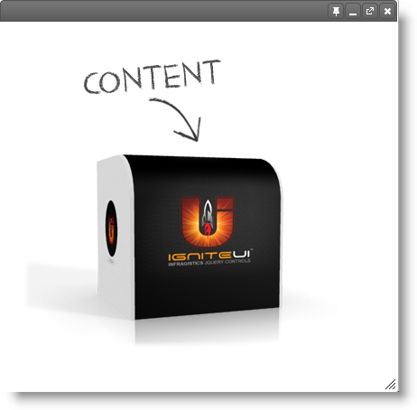

<!--
|metadata|
{
    "fileName": "adding-igdialog",
    "controlName": "igDialog",
    "tags": ["Getting Started", "TypeScript", "AngularJS"]
}
|metadata|
-->

# Adding igDialog

## Introduction

This procedure guides you through the process of adding an `igDialog` control to a web page. The `igDialog` is configured so that all of the header buttons are enabled – such as buttons for minimize, maximize, pin and close.

You have the option of instantiating the control in several ways. This topic demonstrates the typical jQuery UI method, the jQuery method (by using attributes) and instantiating the control using the MVC Dialog wrapper.

### Preview

The following screenshot is a preview of the final result:



## Steps

The following steps demonstrate how to add the `igDialog` control to a web page:

### 1. Reference the required JavaScript and CSS files

You can add the required files in two ways, one is by using individual scripts and the other is by using the [Infragistics loader component](Using-Infragistics-Loader.html).

The recommended approach to instantiating the `igDialog` control is to use the loader. The following code listings will demonstrate how to work with the loader manually as well as interfacing with the loader component.

- **Reference using individual files**

	**In HTML:**

	```html
	<script src="js/jquery.min.js"></script>
    <script src="js/jquery-ui.min.js"></script>
    <script src="js/modules/infragistics.ui.dialog.js"></script>
	```

- **Reference using the Infragistics loader**

	**In HTML:**

	```html
	<script src="js/jquery.min.js"></script>
    <script src="js/jquery-ui.min.js"></script>
    <script src="js/infragistics.loader.js"></script>
	```

	**In JavaScript:**

	```js
	<script type="text/javascript">
        $.ig.loader({
            scriptPath: "../js/",
            cssPath: "../css/",
            resources: "igDialog",
        });
    </script>
	```

> **Note:** If you are using MVC Dialog wrapper, remember to reference the ***Infragistics.Web.Mvc*** dll into your project.


### 2. Instantiate igDialog

The following code demonstrates how to initialize `igDialog` control, with full control, in the header. As you will notice, the only properties that are defined are those that need to override their default values. Properties like [`showCloseButton`](%%jQueryApiUrl%%/ui.igDialog#options:showCloseButton) are `true` by default, that’s why you don’t need to configure it.

- **Instantiate in JavaScript**

	- ​Define `DIV` HTML placeholder
	
		**In HTML:**
		
		```html
		<div id="igDialog1">
		    igDialog Content
		</div>
		```

	- JavaScript initialization code

		If you are using the Infragistics loader component then you can put code from the following inside the loader’s callback function:

		**In JavaScript:**

		```js
		$.ig.loader(function () {
	    	/* Initialization code here */
	    });
		```

		If you are referencing individual files then you can bind to jQuery ready event as demonstrated by the following code listing:

		**In JavaScript:**

		```js
		$(function () {
	        $("#igDialog1").igDialog({
	            showMinimizeButton: true,
	            showMaximizeButton: true,
	            showPinButton: true,
	            width: "400px",
	            height: "500px"    
	        });
	    });
		```
		
If you want to use the `igDialog` with TypeScript, you can instantiate it using the code above. You just need to include the reference paths to the Ignite UI and jQuery type definitions for TypeScript:

    **In TypeScript:**
    ```typescript
    /// <reference path="jqueryui.d.ts" />
    /// <reference path="jquery.d.ts" />
    /// <reference path="igniteui.d.ts" />
    ```
    
>**Note:** This is needed for TypeScript versions prior to 1.5 so the compiler could include the dependencies in the program during compilation. In 1.5 and newer versions they can be defined in a separate tsconfig.json file. For more information see the [tsconfig.json wiki page](https://github.com/Microsoft/TypeScript/wiki/tsconfig.json)
		
> More information on how to use the Ignite UI definitions for TypeScript can be found in ["Using Ignite UI with TypeScript" topic](using-ignite-ui-with-typescript.html).

- **Razor Initialization**
	
	It’s important to know that the Dialog MVC wrapper is not like the other MVC wrappers where it is expected that it will render the HTML,  along with the JavaScript code that initializes the control. Because the `igDialog` content can be any HTML markup, you need to define the markup first, and then the MVC wrapper will define all the configurations of the control.

	- Define `DIV` HTML placeholder

		**In HTML:**
		
		```html
		<div id="igDialog1">
	        igDialog Content
	    </div>
		```

		MVC wrapper code:
		
		**In C#:**
		
		```csharp
		@(Html
	        .Infragistics()
	        .Dialog()
	        .ContentID("igDialog1")
	        .ShowMinimizeButton(true)
	        .ShowMaximizeButton(true)
	        .ShowPinButton(true)
	        .Width("400px")
	        .Height("500px")    
	        .Render()
	    )
		```

> **Note**: When you want to set identifier of the MVC Dialog wrappers you have three different options. For more information see the [Property Reference](igDialog-Property-Reference.html) topic. If the defined HTML placeholder has the same ID as in the sample above – `igDialog1`, then you can use one of the following:

> `Dialog.ContentJquerySelector("#igDialog1")` – defines the selector – the same as it is supposed  to be in the jQuery.

> `Dialog.ContentID("igDialog1")` – defines the selector without the #, which will be rendered automatically by the MVC wrapper.

> `Dialog.ID(“igDialog1”)` – the same as the `ContentID(“igDialog1”)`

> **Note**: If you want to define the HTML DIV Placeholder code using the MVC wrapper, then the Dialog Helper suggests the following method. Assume that you want to achieve the same effect as defining an DIV HTML placeholder, then use:  `Dialog.ContentHTML("<div id="igDialog1"> igDialog Content </div>")`

- **Instantiate in AngularJS**

The following example demonstrates how to declare a Dialog Window with an AngularJS directive:

<div class="embed-sample">
   [%%SamplesEmbedUrl%%/dialog-window/angular](%%SamplesEmbedUrl%%/dialog-window/angular)
</div>

> More information on how to use the Ignite UI directives for AngularJS can be found in ["Using Ignite UI with AngularJS" topic](using-ignite-ui-with-angularjs.html).

## Destroy igDialog

### Introduction

When the igDialog is added into the browser DOM tree, then the target igDialog HTML element is removed from its original parent and is inserted into the dynamically created one. This allows absolute positioning of the igDialog. If you want to remove the control from your page dynamically, the most painless way is to use the [`destroy`](%%jQueryApiUrl%%/ui.igDialog#methods:destroy) method. This will ensure that the element is removed from the DOM tree, as well as will ensure that the target igDialog element is moved back to its original parent.

The usage of the [`destroy`](%%jQueryApiUrl%%/ui.igDialog#methods:destroy) method can be appropriate when you want to recreate a widget. An example of this would be if you want to dynamically change the value of a property which doesn’t allow any alternate removal operation. For example [`temporaryURL`](%%jQueryApiUrl%%/ui.igDialog#options:temporaryURL) is one of the properties that cannot be changed dynamically.

### Code

The following JavaScript snippet demonstrates how to invoke `igDialog` [`destroy`](%%jQueryApiUrl%%/ui.igDialog#methods:destroy) method:

**In JavaScript:**

```js
$('#igDialog).igDialog("destroy");
```

## Related Content

### Topics

The following topics provide additional information related to this topic:

- [igDialog Overview](igDialog-Overview.html): Introduction to `igDialog` control’s main features
- [Configuring igDialog](Configuring-igDialog.html): `igDialog` features and their configuration and usage
- [API Refernce](igDialog-API-Reference.html): This topic introduces `igDialog` API categories. Within the topic you can find all the references to the control properties, methods, events and CSS classes, as well as some specific cases when the API is used.

### Samples

The following sample provide additional information related to this topic:

- [Icons](%%SamplesUrl%%/dialog-window/icons): This sample demonstrates you how to show `igDialog` icons.
