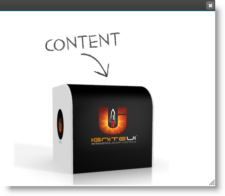
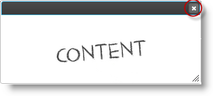

<!--
|metadata|
{
    "fileName": "igdialog-show-and-hide",
    "controlName": "igDialog",
    "tags": ["API","How Do I"]
}
|metadata|
-->

# igDialog Show and Hide 

## Topic Overview

### Purpose

This topic demonstrates how to configure the `igDialog`™ so that it can be opened and closed and how to perform these actions.

### Required background

The following topics are prerequisites to understanding this topic:

- [**igDialog Overview**](igDialog-Overview.html): The topic introduces the user to the `igDialog` control’s main features.

- [**Adding igDialog**](Adding-igDialog.html): This topic demonstrates how to add the `igDialog` control to a web page.


### In this topic

-   [**Control Configuration Summary**](#configuration-summary)
-   [**Configure igDialog to Allow Closing**](#allow-closing)
    -   [Property and Method Settings](#closing-properties-methods)
    -   [Example](#closing-example)
-   [**Hide igDialog**](#hide)
    -   [Code](#hide-code)
    -   [Example](#hide-example)
-   [**Show igDialog**](#show)
    -   [Code](#show-code)
-   [**Related Content**](#related-content)
    -   [Topics](#topics)
    -   [Samples](#samples)


## <a id="configuration-summary"></a> Control Configuration Summary


The following table lists the configurable aspects of the `igDialog` control. Additional details are available after the table.
<table class="table">
	<tbody>
		<tr>
			<th>
				Configurable aspects
			</th>

			<th>
				Details
			</th>

			<th>
				Properties and Methods
			</th>
		</tr>

		<tr>
			<td>
				Configure *igDialog* to allow closing
			</td>

			<td>
				The properties that needs to be configured to allow the closing of the *igDialog using the control UI.*
			</td>

			<td>
				<ul>
					<li><a href="%%jQueryApiUrl%%/ui.igDialog#options:showCloseButton" target="_blank">showCloseButton</a></li>

					<li><a href="%%jQueryApiUrl%%/ui.igDialog#options:closeOnEscape" target="_blank">closeOnEscape</a></li>
				</ul>
			</td>
		</tr>
		<tr>
			<td>
				Hide *igDialog*
			</td>

			<td>
				Method from *igDialog API that allows it to be closed.*
			</td>

			<td>
				<ul>
					<li><a href="%%jQueryApiUrl%%/ui.igDialog#methods:close" target="_blank">close()</a></li>
				</ul>
			</td>
		</tr>
		<tr>
			<td>
				Show *igDialog*
			</td>

			<td>
				Method from *igDialog API that allows it to be opened.*
			</td>

			<td>
				<ul>
					<li><a href="%%jQueryApiUrl%%/ui.igDialog#methods:open" target="_blank">open()</a></li>
				</ul>
			</td>
		</tr>
	</tbody>
</table>
</table>


## <a id="allow-closing"></a> Configure igDialog to Allow Closing

The table below demonstrates which properties need to be configured in order to be able close the `igDialog`  control using the control UI. Note that both of them are set with the desired values by default.

### <a id="closing-properties-methods"></a> Property and Method Settings

The following table maps the desired hiding feature to property settings:

In order to: | Use this property: | And set it to:
--- | --- | ---
Show the close button | [showCloseButton](%%jQueryApiUrl%%/ui.igDialog#options:showCloseButton) | true
Close the *igDialog* using the keyboard | [closeOnEscape](%%jQueryApiUrl%%/ui.igDialog#options:closeOnEscape) | true


#### <a id="closing-example"></a> Example

The screenshot below demonstrates how the `igDialog` looks as a result of the settings above:




## <a id="hide"></a> Hide igDialog

As a result of the configuration from the previous paragraph, you will be able to close the dialog window using the button at the top right corner of the header. Using the Esc key is the other option that can be configured for the control, using the directions in the table below.

If you have both [`showCloseButton`](%%jQueryApiUrl%%/ui.igDialog#options:showCloseButton) and [`closeOnEscape`](%%jQueryApiUrl%%/ui.igDialog#options:closeOnEscape) disabled, then you can hide the control using its API.

#### <a id="hide-code"></a> Code

The following code demonstrates how to close the `igDialog` using its API:

**In JavaScript:**

```js
$('#igDialog).igDialog("close");
```

#### <a id="hide-example"></a> Example

The screenshot below shows you the position of the close button:




## <a id="show"></a> Show igDialog

The only possible way to show the `igDialog` is using its API.

#### <a id="show-code"></a> Code

The following code demonstrates how to show the `igDialog` using its API:

**In JavaScript:**

```js
$('#igDialog).igDialog("open");
```


## <a id="related-content"></a> Related Content

### <a id="topics"></a>Topics

The following topics provide additional information related to this topic:

- [igDialog Overview](igDialog-Overview.html): The topic introduces the user to the `igDialog` control’s main features.

- [Adding *igDialog*](Adding-igDialog.html): This topic demonstrates how to add the `igDialog` control to a web page.


### <a id="samples"></a>Samples

The following samples provide additional information related to this topic:

- [Basic Usage](%%SamplesUrl%%/dialog-window/basic-usage): This sample shows you how to configure the `igDialog` height, width and state.


 

 


