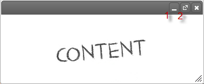
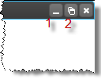
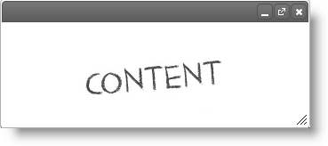
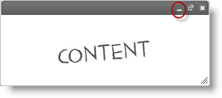
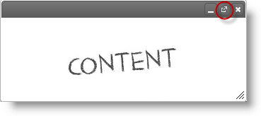

<!--
|metadata|
{
    "fileName": "igdialog-maximize-and-minimize",
    "controlName": "igDialog",
    "tags": ["API","How Do I"]
}
|metadata|
-->

# igDialog Maximize and Minimize

## Topic Overview

### Purpose

This topic demonstrates how to configure the `igDialog` so that it can be minimized and maximized, and explains how to perform these actions.

### Required background

The following topics are prerequisites to understanding this topic:

- [***igDialog* Overview**](igDialog-Overview.html): This topic introduces the user to the `igDialog` control’s main features.

- [**Adding *igDialog***](Adding-igDialog.html): This topic demonstrates how to add the `igDialog` control to a web page.


### In this topic

This topic contains the following sections:

-   [**Control states**](#control-states)
	-   [States](#states)
    -   [Preview in Normal State](#normal-state)
    -   [Preview in Maximized State](#maximized-state)
    -   [Preview in Minimized State](#minimized-state)
-   [**Control Configuration Summary**](#configuration-summary)
-   [**Configuring Minimize and Maximize Icons**](#minimize-maximize)
    -   [Property Settings](#minimize-maximize-properties)
    -   [Example](#minimize-maximize-example)
-   [**Maximize and Minimize on Double Mouse Click**](#double-click)
	-[Property settings](#property-settings)   
-   [**Minimize igDialog**](#minimize)
    -   [Code](#minimize-code)
    -   [Example](#minimize-example)
-   [**Maximize igDialog**](#maximize)
    -   [Code](#maximize-code)
    -   [Example](#maximize-example)
-   [**Related Content**](#related-content)
    -   [Topics](#topics)
    -   [Samples](#samples)


## <a id="control-states"></a> Control states

### <a id="states"></a> States

As you already know, the `igDialog` has four states – opened, closed, minimized and maximized. In the context of this topic, when we talk about maximizing and minimizing, let us call the opened state normal. This will be the state when the window is neither minimized nor maximized.

The following table summarizes all of the possible states of the control. Additional details are available in the sections below.

State | Description 
--- | --- 
Normal | This is the state when the window is neither minimized nor maximized.
Minimized | In this state the `igDialog` is minimized.
Maximized | In this state the `igDialog` is maximized.

### <a id="normal-state"></a> Preview in Normal State

The picture below demonstrates the `igDialog` in its normal state. You can resize and move the window while in this state.



The buttons in the picture above are:

1.  Minimize button
2.  Maximize button

### <a id="maximized-state"></a> Preview in Maximized State

The picture below demonstrates the part of the `igDialog` in the maximized state. In maximized state the `igDialog` takes the full area of its parent. You cannot resize and move the window while in this state.



The buttons at the picture above are:

1.  Minimize button
2.  Restore button

### <a id="minimized-state"></a> Preview in Minimized State

The picture below demonstrates the `igDialog` in the minimized state. You cannot resize window while in this state.


The buttons at the picture above are:

1.  Restore button
2.  Maximize button


## <a id="configuration-summary"></a> Control Configuration Summary

The following table lists the configurable aspects of the `igDialog` control. Additional details are available after the table.

<table class="table">
	<tbody>
		<tr>
			<th>
				Configurable aspects
			</th>

			<th>
				Details
			</th>

			<th>
				Properties and Methods
			</th>
		</tr>

		<tr>
			<td>
				Configuring minimize and maximize icons
			</td>

			<td>
				The properties that need to be configured to allow minimizing and maximizing of the *igDialog* using control UI.
			</td>

			<td>
				<ul>
					<li><a href="%%jQueryApiUrl%%/ui.igDialog#options:showMaximizeButton" target="_blank">showMaximizeButton</a></li>

					<li><a href="%%jQueryApiUrl%%/ui.igDialog#options:showMinimizeButton" target="_blank">showMinimizeButton</a></li>
				</ul>
			</td>
		</tr>

		<tr>
			<td>
				Maximize and minimize on double mouse click
			</td>

			<td>
				The property that allows you to configure the *igDialog* so that it will maximize or minimize when its header is double clicked.
			</td>

			<td>
				<a href="%%jQueryApiUrl%%/ui.igDialog#options:enableDblclick"  target="_blank">enableDblclick</a>
			</td>
		</tr>

		<tr>
			<td>
				Maximize *igDialog*
			</td>

			<td>
				Method from *igDialog* API that allows maximization.
			</td>

			<td>
				<a href="%%jQueryApiUrl%%/ui.igDialog#methods:maximize" target="_blank">maximize()</a>
			</td>
		</tr>

		<tr>
			<td>
				Minimize *igDialog*
			</td>

			<td>
				Method from *igDialog* API that allows minimization.
			</td>

			<td>
				<a href="%%jQueryApiUrl%%/ui.igDialog#methods:minimize" target="_blank">minimize()</a>
			</td>
		</tr>
	</tbody>
</table>

## <a id="minimize-maximize"></a> Configuring Minimize and Maximize Icons

The table below demonstrates which properties need to be configured in order to be able to minimize and maximize the `igDialog` control. By setting these properties, maximize and minimize buttons will appear in the `igDialog` header.

### <a id="minimize-maximize-properties"></a> Property Settings

The following table maps the desired functionality to property settings:

In order to: | Use this property: | And set it to:
--- | --- | ---
Show maximize button | [showMaximizeButton ](%%jQueryApiUrl%%/ui.igDialog#options:showMaximizeButton) | true
Show minimize button | [showMinimizeButton ](%%jQueryApiUrl%%/ui.igDialog#options:showMinimizeButton) | true


### <a id="minimize-maximize-example"></a> Example

The screenshot below demonstrates how the `igDialog` looks as a result of the settings above:




## <a id="double-click"></a> Maximize and Minimize on Double Mouse Click

If `igDialog` is configured, it can react when it is double clicked in the header. It will minimize or maximize depending on its current state.

### <a id="property-settings"></a> Property Settings

The following table describes the behavior of the `igDialog` depending on the value of the [`enableDblclick`](%%jQueryApiUrl%%/ui.igDialog#options:enableDblclick) property:

Value | Use this property:
--- | ---
true | If the window was minimized, it will change its state to normal. <br />If the window was normal, it will change its state to maximized. <br />If the window was in the maximized state, then it will be restored to normal.
false | The `igDialog` will no react on mouse double-click.
“auto” | If the [`showMaximizeButton`](%%jQueryApiUrl%%/ui.igDialog#options:showMaximizeButton) property is set to true, which means igDialog window has a maximize button, the control will react the same way it would if the value of [`enableDblclick`](%%jQueryApiUrl%%/ui.igDialog#options:enableDblclick) was set to true. <br />If the [`showMaximizeButton`](%%jQueryApiUrl%%/ui.igDialog#options:showMaximizeButton) property is set to false, which means the `igDialog` window does not have a maximize button, the control will not be affected by a mouse double click.


## <a id="minimize"></a> Minimize igDialog

As a result of the configuration from the previous paragraph, you will be able to minimize the dialog window using the button at the top right corner of the header. If you have the [`showMinimizeButton`](%%jQueryApiUrl%%/ui.igDialog#options:showMinimizeButton) option disabled, then you can minimize the control using its API.

### <a id="minimize-code"></a> Code

The following code demonstrates how to close the `igDialog` using its API:

**In JavaScript:**

```js
$('#igDialog).igDialog("minimize");
```

### <a id="minimize-example"></a> Example

The screenshot below shows you the position of the minimize button:




##  <a id="maximize"></a> Maximize igDialog

As a result of the configuration from the previous paragraph, you will be able to maximize the dialog window using the button at the top right corner of the header or by double clicking on the dialog header. If you have the [`showMaximizeButton`](%%jQueryApiUrl%%/ui.igDialog#options:showMaximizeButton) option disabled, then you can maximize the control using its API.

### <a id="maximize-code"></a> Code

The following code demonstrates how to show the `igDialog` using its API:

**In JavaScript:**

```js
$('#igDialog).igDialog("maximize");
```

### <a id="maximize-example"></a> Example

The screenshot below shows you the position of the maximize button:




## <a id="related-content"></a> Related Content

### <a id="topics"></a> Topics

The following topics provide additional information related to this topic:

- [***igDialog* Overview**](igDialog-Overview.html): The topic introduces the user to the `igDialog` control’s main features.

- [Adding *igDialog*](Adding-igDialog.html): This topic demonstrates how to add the `igDialog` control to a web page.


### <a id="samples"></a> Samples

The following samples provide additional information related to this topic:

- [Icons](%%SamplesUrl%%/dialog-window/icons): The sample that shows you how to show `igDialog` icons.


 

 


