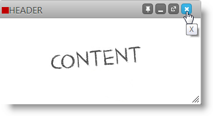

<!--
|metadata|
{
    "fileName": "igdialog-header-and-footer",
    "controlName": "igDialog",
    "tags": ["API","How Do I"]
}
|metadata|
-->

# igDialog Header and Footer

## Topic Overview

### Purpose

This topic demonstrates how to enable the `igDialog`™ footer and header and how to customize them.

### Required background

The following topics are prerequisites to understanding this topic:

- [***igDialog* Overview**](igDialog-Overview.html): The topic introduces the user to the `igDialog` control’s main features.

- [**Adding *igDialog***](Adding-igDialog.html): This topic demonstrates how to add the `igDialog` control to a web page.

### In this topic

This topic contains the following sections:

-   [**Control Configuration Summary**](#configuration-summary)
-   [**Enable and Configure igDialog Header**](#header)
    -   [Property Settings](#header-property-settings)
    -   [Example](#header-example)
-   [**Enable and Configure igDialog Footer**](#footer)
    -   [Property Settings](#footer-property-settings)
    -   [Example](#footer-example)
-   [**Related Content**](#related-content)
    -   [Topics](#topics)
    -   [Samples](#samples)

##  Control Configuration Summary

The following table lists the configurable aspects of the `igDialog` *header and footer* control modules. Additional details are available after the table.

<table class="table">
	<tbody>
		<tr>
			<th>
				Configurable aspects
			</th>

			<th>
				Details
			</th>

			<th>
				Properties
			</th>
		</tr>

		<tr>
			<td>
				Enable and configure `igDialog` header
			</td>

			<td>
				The properties that need to be configured to enable `igDialog` and customize its elements.
			</td>

			<td>
				<ul>
					<li><a href="%%jQueryApiUrl%%/ui.igDialog#options:showHeader" target="_blank">showHeader</a></li>

					<li><a href="%%jQueryApiUrl%%/ui.igDialog#options:headerText" target="_blank">headerText</a></li>

					<li><a href="%%jQueryApiUrl%%/ui.igDialog#options:closeButtonTitle" target="_blank">closeButtonTitle</a></li>

					<li><a href="%%jQueryApiUrl%%/ui.igDialog#options:minimizeButtonTitle" target="_blank">minimizeButtonTitle</a></li>

					<li><a href="%%jQueryApiUrl%%/ui.igDialog#options:maximizeButtonTitle" target="_blank">maximizeButtonTitle</a></li>

					<li><a href="%%jQueryApiUrl%%/ui.igDialog#options:pinButtonTitle" target="_blank">pinButtonTitle</a></li>

					<li><a href="%%jQueryApiUrl%%/ui.igDialog#options:unpinButtonTitle" target="_blank">unpinButtonTitle</a></li>

					<li><a href="%%jQueryApiUrl%%/ui.igDialog#options:restoreButtonTitle" target="_blank">restoreButtonTitle</a></li>

					<li><a href="%%jQueryApiUrl%%/ui.igDialog#options:imageClass" target="_blank">imageClass</a></li>
				</ul>
			</td>
		</tr>

		<tr>
			<td>
				Enable and configure `igDialog` footer
			</td>

			<td>
				The properties that need to be configured to enable `igDialog` and customize its elements.
			</td>

			<td>
				<ul>
					<li><a href="%%jQueryApiUrl%%/ui.igDialog#options:showFooter" target="_blank">showFooter</a></li>

					<li><a href="%%jQueryApiUrl%%/ui.igDialog#options:footerText" target="_blank">footerText</a></li>
				</ul>
			</td>
		</tr>
	</tbody>
</table>

If you want to see how to enable and disable header buttons please review the [**Minimize and Maximize and Pin**](igDialog-Maximize-and-Minimize.html) topic.

##  Enable and Configure igDialog Header

The `igDialog` API proposes several API properties for modifying its header.

###  Property Settings

The following table maps the desired header features to property settings:

In order to: | Use this property: | And set it to:
--- | --- | ---
Show the igDialog header | [showHeader](%%jQueryApiUrl%%/ui.igDialog#options:showHeader) | true
Set the igDialog header title | [headerText](%%jQueryApiUrl%%/ui.igDialog#options:headerText) | “HEADER”
Set the igDialog header image | [imageClass](%%jQueryApiUrl%%/ui.igDialog#options:imageClass) | “clsImage”
Set the igDialog close button title | [closeButtonTitle](%%jQueryApiUrl%%/ui.igDialog#options:closeButtonTitle) | “X”
Set the igDialog minimize button title | [minimizeButtonTitle](%%jQueryApiUrl%%/ui.igDialog#options:minimizeButtonTitle) | “MIN”
Set the igDialog maximize button title | [maximizeButtonTitle](%%jQueryApiUrl%%/ui.igDialog#options:maximizeButtonTitle) | “MAX”
Set the igDialog pin button title | [pinButtonTitle](%%jQueryApiUrl%%/ui.igDialog#options:pinButtonTitle) | “PIN”
Set the igDialog unpin button title | [unpinButtonTitle](%%jQueryApiUrl%%/ui.igDialog#options:unpinButtonTitle) | “UNPIN”
Set the igDialog restore button title | [restoreButtonTitle](%%jQueryApiUrl%%/ui.igDialog#options:restoreButtonTitle) | “RESTORE”

###  Example

The screenshot below demonstrates how the `igDialog` looks as a result of the settings above:

> **Note:** The red square at the top is there because of the `clsImage` defined in CSS:
> `.clsImage { background-color: red; width: 5px; height: 5px; }`

##  Enable and Configure igDialog Footer

The `igDialog` API proposes two API properties for modifying its footer.

###  Property Settings

The following table maps the desired header features to property
settings:

In order to: | Use this property: | And set it to:
--- | --- | ---
Show the `igDialog` footer | [showFooter](%%jQueryApiUrl%%/ui.igDialog#options:showFooter) | true
Set the `igDialog` footer title | [footerText](%%jQueryApiUrl%%/ui.igDialog#options:footerText) | “FOOTER”

###  Example

The screenshot below demonstrates how the `igDialog` looks as a result of the settings above, plus the header setting from the previous paragraph:

##  Related Content

###  Topics

The following topics provide additional information related to this topic:

- [***igDialog* Overview**](igDialog-Overview.html): The topic introduces the user to the `igDialog` control’s main features.

- [**Adding *igDialog***](Adding-igDialog.html): This topic demonstrates how to add the `igDialog` control to a web page.

###  Samples

The following samples provide additional information related to this topic:

- [Icons](%%SamplesUrl%%/dialog-window/icons): The sample that shows you how to show `igDialog` icons.

 

 

