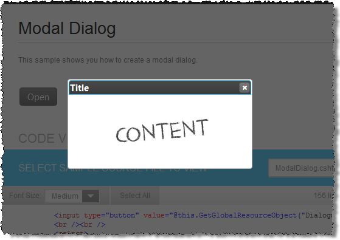

<!--
|metadata|
{
    "fileName": "igdialog-modal-state",
    "controlName": "igDialog",
    "tags": ["API","How Do I"]
}
|metadata|
-->

# igDialog Modal State

## Topic Overview

### Purpose

This topic demonstrates how to make `igDialog`™ *modal*.

### Required background

The following topics are prerequisites to understanding this topic:

- [***igDialog* Overview**](igDialog-Overview.html): The topic introduces the user to the `igDialog` control’s main features.

- [**Adding *igDialog***](Adding-igDialog.html): This topic demonstrates how to add the `igDialog` control to a web page.

### In this topic

This topic contains the following sections:

-   [**Introduction**](#introduction)
-   [**Control Configuration Summary**](#configuration-summary)
-   [**Configuring Modal igDialog**](#configuring)
    -   [Property Settings](#configuring-properties)
    -   [Example](#configuring-example)
-   [**Related Content**](#related-content)
    -   [Topics](#topics)
    -   [Samples](#samples)

##  Introduction to the Modal igDialog

The `igDialog` can be modal, which means that all of the content behind it will be disabled and hidden. You can show more than one modal dialog. If you have more than one modal dialog instance, then the dialog that is opened last will be at the top of the page. For handling more than one modal dialog per page, you can check out the [Multiple Dialogs](igDialog-Multiple-Dialogs.html) topic. The following example will only show you how to configure one modal dialog.

> **Note:** Modal state of the `igDialog` window is not supported when dialog is minimized or pinned.

##  Control Configuration Summary

The following table lists the configurable aspects of the `igDialog` control. Additional details are available after the table.

Configurable aspects | Details | Properties
--- | --- | ---
Configuring modal `igDialog` | The properties that need to be configured to make an `igDialog` modal. | [modal](%%jQueryApiUrl%%/ui.igDialog#options:modal)

##  Configuring Modal igDialog

The `igDialog` can be modal, which means all of the content behind it is to be disabled and hidden.

> **Note:** Modal state of `igDialog` window is not supported when dialog is minimized or pinned.

###  Property Settings

The following table maps the desired header features to property settings. The state of the dialog should be different from minimized and pinned.

In order to: | Use this property: | And set it to:
--- | --- | ---
Make the igDialog modal | [modal](%%jQueryApiUrl%%/ui.igDialog#options:modal) | true
Set the igDialog footer title | [pinned](%%jQueryApiUrl%%/ui.igDialog#options:pinned) | false
Set the igDialog state | [state](%%jQueryApiUrl%%/ui.igDialog#options:state) | “opened”

###  Example

The screenshot below demonstrates how the `igDialog` looks as a result of the settings above:

##  Related Content

###  Topics

The following topics provide additional information related to this topic:

- [***igDialog* Overview**](igDialog-Overview.html): The topic introduces the user to the `igDialog` control’s main features.

- [Adding *igDialog*](Adding-igDialog.html): This topic demonstrates how to add the `igDialog` control to a web page.

###  Samples

The following samples provide additional information related to this topic:

- [Modal Dialog](%%SamplesUrl%%/dialog-window/modal-dialog) : This sample shows you how to create a modal `igDialog`.

 

 

