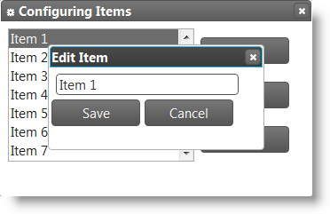

<!--
|metadata|
{
    "fileName": "igdialog-multiple-dialogs",
    "controlName": "igDialog",
    "tags": ["Tips and Tricks"]
}
|metadata|
-->

# igDialog Multiple Dialogs

## Topic Overview

### Purpose

This topic demonstrates how to build `igDialog`™ windows one into another.

### Required background

The following topics are prerequisites to understanding this topic:

- [***igDialog* Overview**](igDialog-Overview.html): The topic introduces the user to the `igDialog` control’s main features.

- [**Adding *igDialog***](Adding-igDialog.html): This topic demonstrates how to add the `igDialog` control to a web page.


### In this topic

This topic contains the following sections:

-   [**Configuring Multiple igDialogs**](#configuring)
	-   [Overview](#configuring-overview)
    -   [Code](#configuring-code)
    -   [Example](#configuring-example)
-   [**Multiple igDialogs API**](#api)
    -   [Method Settings](#api-methods)
    -   [Code](#api-code)
-   [**Related Content**](#related-content)
    -   [Topics](#topics)
    -   [Samples](#samples)


## <a id="configuring"></a> Configuring Multiple igDialogs

### <a id="configuring-overview"></a> Overview

You can show multiple `igDialog` widgets on a single page and they will appear properly, without the requirement of defining a relationship between them. All you need is to create a script that will close and open those dialogs. You can use a combination of normal `igDialog` and modal dialogs.

What the control does automatically is it detects the first HTML placeholder and initializes the first dialog widget at the bottom. Respectively, the last `igDialog` HTML placeholder will be for the top widget. The `igDialog` exposes API methods that grant access to the top dialogs and the ability to move dialogs to the top level if they are not there already.

> **Note:** You cannot achieve this functionality using Dialog MVC wrappers.

### <a id="configuring-code"></a> Code

The following code demonstrates how to define your markup so that the second dialog will be shown on the top of the first:

**In HTML:**

```html
<div id="dialogBottom”>
    Parent HTML markup
</div>
<div id="dialogTop">
    Child HTML markup            
</div>
```

### <a id="configuring-example"></a> Example

If you use the code above and define some additional HTML content, you can achieve the effect shown in the screenshot below. For more detailed information about the source of the image, please refer to the related sample at the bottom of the topic.




## <a id="api"></a> Multiple igDialogs API

The `igDialog` exposes API methods that grant access to the top modal and not modal dialogs and enables the ability to move them to the top level if they are not there already.

### <a id="api-methods"></a> Method Settings

The following table maps the desired functionality to the method that proposes it:

In order to: | Use this method: | Parameters | Return type
--- | --- | --- | ---
Get reference to the top modal dialog | [getTopModal()](%%jQueryApiUrl%%/ui.igDialog#methods:getTopModal) | None | object – reference to the `igDialog`
Check if dialog is modal and it is currently active | [isTopModal()](%%jQueryApiUrl%%/ui.igDialog#methods:isTopModal) | None | boolean
Moves not a modal dialog to the top | [moveToTop(e)](%%jQueryApiUrl%%/ui.igDialog#methods:moveToTop) | *e* – browser event | object – reference to the moved `igDialog`


### <a id="api-code"></a> Code

The code below demonstrates how to call one the above `igDialog` methods:

```
$(“#dialog”).igDialog(“moveToTop”, e);
```


## <a id="related-content"></a> Related Content

### <a id="topics"></a> Topics

The following topics provide additional information related to this topic:

- [***igDialog* Overview**](igDialog-Overview.html): The topic introduces the user to the `igDialog` control’s main features.

- [Adding *igDialog*](Adding-igDialog.html): This topic demonstrates how to add the `igDialog` control to a web page.


### <a id="samples"></a> Samples

The following samples provide additional information related to this topic:

- [API and Events](igdialog-event-reference.html#attaching-handlers-jquery) : This sample demonstrates how to handle events in the Dialog Window control and API usage.


 

 


