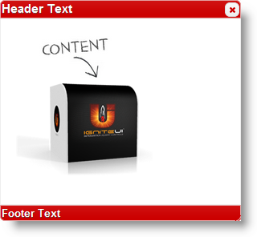

<!--
|metadata|
{
    "fileName": "igdialog-styling-and-theming",
    "controlName": "igDialog",
    "tags": ["How Do I","Styling"]
}
|metadata|
-->

# Styling and Theming (igDialog)

## Topic Overview

### Purpose

This topic demonstrates the different approaches of styling the `igDialog`™.

### Required background

The following topics are prerequisites to understanding this topic:

- [***igDialog* Overview**](igDialog-Overview.html): The topic introduces the user to the `igDialog` control’s main features.

- [**Adding *igDialog***](Adding-igDialog.html): This topic demonstrates how to add the `igDialog` control to a web page.


### In this topic

This topic contains the following sections:

-   [**Style Configuration Summary**](#configuration-summary)
-   [**Style igDialog Using jQuery Theme Switcher**](#jquery-theme-switcher)
    -   [Code](#theme-switcher-code)
    -   [Example](#theme-switcher-example)
-   [**Related Content**](#related-content)
    -   [Topics](#topics)
    -   [Samples](#samples)


## <a id="configuration-summary"></a> Style Configuration Summary

The following table lists the configurable aspects of the `igDialog` control that will allow style modification. Additional details are available after the table.

Configurable aspects | Details | Related topics or sections
---- | ---- | -----
Style the `igDialog` through control properties | The properties that need to be configured so that the `igDialog` changes its appearance. | [***igDialog*** **Header and Footer**](igDialog-Header-and-Footer.html)
Style and theme the `igDialog` through CSS Classes | Override the basic `igDialog` classes and create your own theme for the dialog. | [**CSS Class Reference (*igDialog*)**](igDialog-Css-Classes-Reference.html)
Style the `igDialog` using the jQuery Theme Switcher | Use the jQuery Theme Switcher to easily customize the `igDialog` control. | [**Style using jQuery Theme Switcher**](Deployment-Guide-Styling-and-Theming.html)


## <a id="jquery-theme-switcher"></a> Style igDialog Using jQuery Theme Switcher

Using the jQuery Theme Switcher is an easy way to style the `igDialog` control. This is possible because the `igDialog` CSS class naming follows the jQuery UI CSS Framework naming convention.

### <a id="theme-switcher-code"></a> Code

The following code shows you how to initialize the jQuery Theme Switcher. You do not need to make additional configurations on the `igDialog`; the Theme Switcher will replace CSS rules automatically.

```
$("#themeSwitcher").themeswitcher();

<div id="themeSwitcher"></div>
```


### <a id="theme-switcher-example"></a> Example

The screenshot below demonstrates the `igDialog` styled with *Blitzer* theme.




## <a id="related-content"></a> Related Content

### <a id="topics"></a> Topics

The following topics provide additional information related to this topic:

- [*igDialog* Overview](igDialog-Overview.html): The topic introduces the user to the `igDialog` control’s main features.
- [Adding *igDialog*](Adding-igDialog.html): This topic demonstrates how to add the `igDialog` control to a web page.
- [*igDialog* Header and Footer](igDialog-Header-and-Footer.html): This topic demonstrates how to enable the `igDialog` footer and header and how to customize them.
- [CSS Class Reference (*igDialog*)](igDialog-Css-Classes-Reference.html): The topic that introduces the user to the `igDialog`™ control’s CSS classes.


### <a id="samples"></a> Samples

The following samples provide additional information related to this topic:

- [Icons](%%SamplesUrl%%/dialog-window/icons): This sample demonstrates you how to show `igDialog` icons.


 

 


