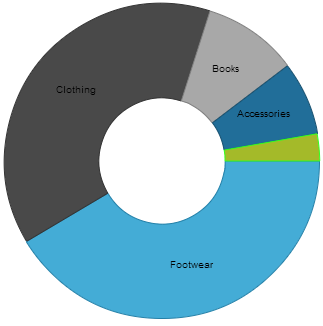
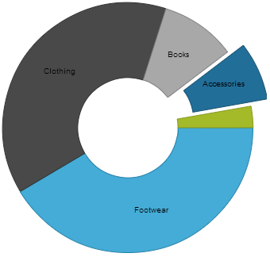

<!--
|metadata|
{
    "fileName": "igdoughnutchart-overview",
    "controlName": "Doughnut Chart",
    "tags": ["API","Charting","Data Presentation","Getting Started","How Do I"]
}
|metadata|
-->

# igDoughnutChart Overview

## Topic Overview

### Purpose

This topic provides an overall look at the [igDoughnutChart](%%jQueryApiUrl%%/ui.igDoughnutChart#options)™ control.

### In this topic

This topic contains the following sections:

-   [**Introduction**](#introduction)
-   [**Main Features**](#features)
-   [**User Interactions and Usability**](#interactions-usability)
-   [**Related Content**](#related-content)
    -   [Topics](#topics)
    -   [Samples](#samples)

##  Introduction

The `igDoughnutChart` control allows for proportionally illustrating the occurrences of a variable. The inner radius of the control is configurable, and the Doughnut Chart’s series provides a built-in support for selecting and exploding its slices. 

Visualizing the occurrence of multiple variables (adding multiple series) is possible, using concentric rings. The chart can be styled by configuring its properties or applying themes.

The following screenshot illustrates an `igDoughnutChart` with two series.

##  Main Features

The following table summarizes the main features of the `igDoughnutChart` control.

Feature |Description
--------|------------
Configurable rings| Each series of the `igDoughnutChart` control can be configured in a variety of aspects such as: slices color, labels, tooltips, start angle for slices rendering etc. 

Multiple rings support| The `igDoughnutChart` can display multiple rings at the same time with each of the rings capable of being bound to a different collection, or they can share a common data source. 

Slice selection | The `igDoughnutChart` exposes the API for setting the state of one or more slices to selected. Optionally, you may apply a single custom visual style to the selected slices. 

Slice explosion | The `igDoughnutChart` slices explode either programmatically or by user interaction. 

##  User Interactions and Usability

The following table summarizes the user interaction capabilities of the `igDoughnutChart` control.

The user can… | Using… | Details | Configurable?
--------------|--------|---------|-------------
Click slices  |Mouse-clicks | The `igDoughnutChart` exposes a [`sliceClick`](%%jQueryApiUrl%%/ui.igDoughnutChart#options:sliceClick) event, raised when the user clicks on a slice.   Enabling slice selection or slice explosion allows you to modify the slice’s selection and explosion state upon click. |  [Configuring Selection and Explosion (*igDoughnutChart*)](igDoughnutChart-Configuring-Selection-and-Explosion.html)

##  Related Content

###  Topics

The following topics provide additional information related to this topic.

- [Adding *igDoughnutChart*](igDoughnutChart-Adding.html): This topic explains how to add the `igDoughnutChart` to an HTML page.

- [Configuring Selection and Explosion (*igDoughnutChart*)](igDoughnutChart-Configuring-Selection-and-Explosion.html): This topic explains how to configure the slice selection and explosion on `igDoughnutChart`.

- [jQuery and ASP.NET MVC Helper API Links (*igDoughnutChart*)](igDoughnutChart-API-Links.html): This topic provides links to the API documentation about the `igDoughnutChart` control and the ASP.NET MVC Helper for it.

###  Samples

The following samples provide additional information related to this topic.

- [Bind to Collection](%%SamplesUrl%%/doughnut-chart/bind-to-collection): This sample demonstrates how to render `igDoughnutChart` using the ASP.NET MVC helper and bind it to a collection of objects on the server.

- [Bind to JSON](%%SamplesUrl%%/doughnut-chart/bind-json): This sample demonstrates how to bind doughnut chart to JSON data.

- [Labels and Tooltips](%%SamplesUrl%%/doughnut-chart/labels-tooltips): This sample demonstrates how to configure labels, tooltips and other options on `igDoughnutChart`.

- [Configure Legend](%%SamplesUrl%%/doughnut-chart/configure-legend): This sample demonstrates how to configure `igDoughnutChart`'s legend.
