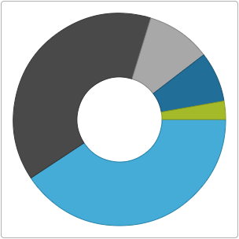

<!--
|metadata|
{
    "fileName": "igdoughnutchart-adding-to-an-html-page",
    "controlName": "Doughnut Chart",
    "tags": ["Charting","Data Binding","Getting Started","How Do I"]
}
|metadata|
-->

# Adding igDoughnutChart to an HTML Page

## Topic Overview

### Purpose

This topic explains how to add the `igDoughnutChart`™ to an HTML page.

### Required background

The following topics are prerequisites to understanding this topic:

- [Adding Required Resources Manually](Adding-the-Required-Resources-for-NetAdvantage-for-jQuery.html): This topic provides general guidance on adding required JavaScript resources to use controls from the %%ProductName%% library.

- [*igDoughnutChart* Overview](igDoughnutChart-Overview.html): This topic provides an overall look at the `igDoughnutChart` control.


### In this topic

This topic contains the following sections:

-   [**Adding *igDoughnutChart* to an HTML Page – Conceptual Overview**](#overview)
    -   [Requirements](#overview-requirements)
    -   [Steps](#overview-steps)
-   [**Adding *igDoughnutChart* to an HTML Page**](#adding)
	-   [Preview](#adding-preview)
    -   [Prerequisites](#prerequisites)
    -   [Overview](#adding-overview)
    -   [Steps](#adding-steps)
-   [**Related Content**](#related-content)
    -   [Topics](#topics)
    -   [Samples](#samples)


## <a id="overview"></a> Adding igDoughnutChart to an HTML Page – Conceptual Overview

Use the Doughnut Chart to show categorical statistics expressed in percentages. Consisting of a hollowed out circle, the inner radius of which is configurable, and using concentric rings the Doughnut Chart is able to display multiple series. Styling the chart is possible by configuring its properties or applying themes.

### <a id="overview-requirements"></a> Requirements

The following table summarizes the requirements for using the `igDoughnutChart` control.

<table class="table table-bordered">
	<tbody>
		<tr>
			<th>
				Required Resources
			</th>

			<th>
				Description
			</th>

			<th>
				What you need to do…
			</th>
		</tr>

		<tr>
			<td>
				jQuery and jQuery UI JavaScript resources
			</td>

			<td>
				%%ProductName%%™ is built on top of the following frameworks:

				<ul>
                    <li>
                    [jQuery](http://jquery.com/)
                    </li>

                    <li>
                    [jQuery UI](http://jqueryui.com/)
                    </li>
				</ul>
			</td>

			<td>
				Add script references to both libraries in the `<head>` section of your page.
			</td>
		</tr>

		<tr>
			<td>
				igDoughnutChart CSS resource files
			</td>

			<td>
				Uses the styles from the following CSS file for rendering various elements of the control:<br>
				&lt;IG CSS root&gt;/structure/modules/infragistics.ui.html5.css<br>
				&lt;IG CSS root&gt;/structure/modules/infragistics.ui.shared.css<br>
				&lt;IG CSS root&gt;/structure/modules/infragistics.ui.chart.css
			</td>

			<td></td>
		</tr>

		<tr>
			<td>
				General `igDoughnutChart` JavaScript Resources
			</td>

			<td>
				The igDoughnutChart control depends on functionality distributed across several files in the %%ProductName%% Library. Load the required resources in one of the following ways:

				<ul>
					<li>Using the Infragistics® Loader (igLoader™). You only need to include a script reference to igLoader on your page.</li>

					<li>Loading the required resources manually. You need to use the dependencies listed in the table below.</li>

					<li>Loading the two combined files, containing the logic for all data visualization controls from the %%ProductName%% package: infragistics.core.js and infragistics.dv.js.</li>
				</ul>

				The following table lists the %%ProductName%% library dependences related to the igDoughnutChart control. Refer to these resources explicitly if not to using igLoader or the combined files.

				<table class="table">
					<tbody>
						<tr>
							<th>
								JS Resource
							</th>

							<th>
								Description
							</th>
						</tr>

						<tr>
							<td>
								infragistics.util.js<br>
								infragistics.util.jquery.js
							</td>

							<td>
								%%ProductName%% utilities
							</td>
						</tr>

						<tr>
							<td>
								infragistics.datasource.js
							</td>

							<td>
								Data source framework
							</td>
						</tr>

						<tr>
							<td>
								infragistics.templating.js
							</td>

							<td>
								Template engine (igTemplate™)
							</td>
						</tr>

						<tr>
							<td>
								infragistics.ui.widget.js
                            </td>
							<td>
								Base igWidget for all Ignite UI widgets.
							</td>
						</tr>

						<tr>
							<td>
								infragistics.ext_core.js,<br>
								infragistics.ext_collections.js,<br>
								infragistics.ext_ui.js,<br>
								infragistics.dv_jquerydom.js,<br>
								infragistics.dv_core.js,<br>
								infragistics.dv_geometry.js
							<td>
								Data visualization core functionality
							</td>
						</tr>

						<tr>
							<td>
								infragistics.datachart_core.js
							<td>
								Common chart visualization functionality
							</td>
						</tr>

						<tr>
							<td>
								infragistics.dv_interactivity.js
                            </td>
							<td>
								Provides support for user interaction such as panning, zooming, dragging, etc.
							</td>
						</tr>

						<tr>
							<td>
								infragistics.piechart.js
							</td>

							<td>
								Pie chart visualization logic
							</td>
						</tr>

						<tr>
							<td>
								infragistics.doughnutchart.js
							</td>

							<td>
								Doughnut chart visualization logic
							</td>
						</tr>

						<tr>
							<td>
								infragistics.legend.js
							</td>

							<td>
								Common chart code for legend functionality
							</td>
						</tr>

						<tr>
							<td>
								infragistics.dvcommonwidget.js
							</td>

							<td>
								Chart and map common widget
							</td>
						</tr>

						<tr>
							<td>
								infragistics.ui.chartlegend.js
							</td>

							<td>
								The igChartLegend™ control is common to all %%ProductName%% chart controls
							</td>
						</tr>

						<tr>
							<td>
								infragistics.ui.basechart.js
							</td>

							<td>
								Common code for chart widgets
							</td>
						</tr>

						<tr>
							<td>
								infragistics.ui.chart.js
							</td>

							<td>
								`igDataChart` widget UI code
							</td>
						</tr>

						<tr>
							<td>
								infragistics.ui.doughnutchart.js
							</td>

							<td>
								The `igDoughnutChart` widget UI code
							</td>
						</tr>
					</tbody>
				</table><br>
			</td>

			<td>
				Add one of the following:

				<ul>
					<li>A reference to igLoader</li>

					<li>A reference to all the required JavaScript files (listed in the table on the left).</li>
				</ul>
			</td>
		</tr>

		<tr>
			<td>
				IG Theme(Optional)
			</td>

			<td>
				This theme contains the visual styles for the %%ProductName%% library. The theme file is:&lt;IG CSS root&gt;/themes/Infragistics/infragistics.theme.css
			</td>

			<td></td>
		</tr>
	</tbody>
</table>

### <a id="overview-steps"></a>Steps
Following are the general conceptual steps for Adding `igDoughnutChart` to an HTML Page.

1. Referencing the required JavaScript and CSS files
2. Adding sample data
3. Creating `igDoughnutChart` target element
4. Instantiating the `igDoughnutChart` in document ready
5. Configuring the series

## <a id="adding"></a> Adding igDoughnutChart to an HTML Page

This procedure adds an instance of `igDoughnutChart` to an HTML page configures the control’s basic options- dimensions and defines one series with a `name`, `dataSource` and `valueMemberPath`.

### <a id="adding-preview"></a> Preview

The following screenshot is a preview of the result.



### <a id="prerequisites"></a>Prerequisites

A blank HTML page.

### <a id="adding-overview"></a> Overview

1.  Referencing the required JavaScript and CSS files
2.  Adding sample data
3.  Creating a target element for the `igDoughnutChart`
4.  Instantiating the `igDoughnutChart` in document ready
5.  Configuring the series

### <a id="adding-steps"></a> Steps

Follow these steps to add an `igDoughnutChart` to an HTML page.

1. **Reference the required JavaScript and CSS files**

	**In HTML:**
	
	```html
	<!DOCTYPE html>
    <html>
    <head>
	<!-- %%ProductName%% IG Theme CSS File -->
	<link href="../../igniteui/css/themes/infragistics/infragistics.theme.css" rel="stylesheet" />
	<!-- %%ProductName%% Required CSS File -->
	<link rel="stylesheet" type="text/css" href="../../igniteui/css/structure/modules/infragistics.ui.html5.css"/>
	<link rel="stylesheet" type="text/css" href="../../igniteui/css/structure/modules/infragistics.ui.shared.css"/>
	<link rel="stylesheet" type="text/css" href="../../igniteui/css/structure/modules/infragistics.ui.chart.css"/>
	<!-- jQuery Files -->
	<script src="../../js/jquery.min.js"></script>
	<script src="../../js/jquery-ui.min.js"></script>
	<!-- %%ProductName%% Required JavaScript Files -->
	<script src="../../igniteui/js/modules/infragistics.util.js" type="text/javascript"></script>
	<script src="../../igniteui/js/modules/infragistics.util.jquery.js" type="text/javascript"></script>
	<script src="../../igniteui/js/modules/infragistics.ui.widget.js" type="text/javascript"></script>
	<script src="../../igniteui/js/modules/infragistics.datasource.js" type="text/javascript"></script>
	<script src="../../igniteui/js/modules/infragistics.templating.js" type="text/javascript"></script>
	<script src="../../igniteui/js/modules/infragistics.ext_core.js" type="text/javascript"></script>
	<script src="../../igniteui/js/modules/infragistics.ext_collections.js" type="text/javascript"></script>
	<script src="../../igniteui/js/modules/infragistics.ext_ui.js" type="text/javascript"></script>
	<script src="../../igniteui/js/modules/infragistics.dv_jquerydom.js" type="text/javascript"></script>
	<script src="../../igniteui/js/modules/infragistics.dv_core.js" type="text/javascript"></script>
	<script src="../../igniteui/js/modules/infragistics.legend.js" type="text/javascript"></script>
	<script src="../../igniteui/js/modules/infragistics.dv_geometry.js" type="text/javascript"></script>
	<script src="../../igniteui/js/modules/infragistics.dv_interactivity.js" type="text/javascript"></script>
	<script src="../../igniteui/js/modules/infragistics.datachart_core.js" type="text/javascript"></script>
	<script src="../../igniteui/js/modules/infragistics.dvcommonwidget.js" type="text/javascript"></script>
	<script src="../../igniteui/js/modules/infragistics.ui.chartlegend.js" type="text/javascript"></script>
	<script src="../../igniteui/js/modules/infragistics.ui.chart.js" type="text/javascript"></script>
	<script src="../../igniteui/js/modules/infragistics.piechart.js" type="text/javascript"></script>
	<script src="../../igniteui/js/modules/infragistics.doughnutchart.js" type="text/javascript"></script>
	<script src="../../igniteui/js/modules/infragistics.ui.basechart.js" type="text/javascript"></script>
	<script src="../../igniteui/js/modules/infragistics.ui.doughnutchart.js" type="text/javascript"></script>
    </head>
    <body>
    </body>
    </html>
	```

2. **Add sample data**

	Define a JavaScript array with sample data as a data source for the series of `igDoughnutChart`.
	
	**In HTML:**
	
	```html
	<head>...    
        <script>      
			var data = [
                  { "ProductCategory": ' Footwear', "Index": 1498 },
                    { "ProductCategory": ' Clothing', "Index": 1389 },
                    { "ProductCategory": ' Books', "Index": 352 },
                    { "ProductCategory": ' Accessories', "Index": 273 },
                    { "ProductCategory": ' Equipment', "Index": 100 }
                ];
    			 ...
           </script>
     </head>
	```

3. **Create a target element for the *igDoughnutChart*.**

	Create a DIV element within the HTML body on which to instantiate the `igDoughnutChart` widget.
	
	**In HTML:**
	
	```html
	<body>
        <!-- Target element for the igDoughnutChart -->
        <div id="doughnutChart"></div>
    </body>
    …
	```

4. **Instantiate the *igDoughnutChart* in document ready**

	Use the selector of the target element, defined previously, to instantiate the widget.
	
	**In HTML:**
	
    ```html
    <script type="text/jscript">
        $(function () {                        
                  $("#doughnutChart").igDoughnutChart ({
            });
            });
    </script>
    ```

5. **Configure basic rendering options**

	When instantiating the `igDoughnutChart`, configure its width and height options and add a series to it with the following options provided: `name`, `dataSource` and `valueMemberPath`.
	
	**In HTML:**
	
	```html
	$(function () {
                var dc = $("#doughnutChart").igDoughnutChart({
                  width: 300,
                  height: 300,
                  series: [
                {
                      name: "flatSeries",
                      valueMemberPath: "Index",
                      dataSource: data
                  }
            ]
       });
    });
	```

#### Full Code

**In HTML:**

```html
<!DOCTYPE html>
<html>
<head>
<title>DoughnutChart</title>
	<!-- %%ProductName%% IG Theme CSS File -->
	<link href="../../igniteui/css/themes/infragistics/infragistics.theme.css" rel="stylesheet" />
	<!-- %%ProductName%% Required CSS File -->
	<link rel="stylesheet" type="text/css" href="../../igniteui/css/structure/modules/infragistics.ui.html5.css"/>
	<link rel="stylesheet" type="text/css" href="../../igniteui/css/structure/modules/infragistics.ui.shared.css"/>
	<link rel="stylesheet" type="text/css" href="../../igniteui/css/structure/modules/infragistics.ui.chart.css"/>
	<!-- jQuery Files -->
	<script src="../../js/jquery.min.js"></script>
	<script src="../../js/jquery-ui.min.js"></script>
	<!-- %%ProductName%% Required JavaScript Files -->
	<script src="../../igniteui/js/modules/infragistics.util.js" type="text/javascript"></script>
	<script src="../../igniteui/js/modules/infragistics.util.jquery.js" type="text/javascript"></script>
	<script src="../../igniteui/js/modules/infragistics.datasource.js" type="text/javascript"></script>
	<script src="../../igniteui/js/modules/infragistics.templating.js" type="text/javascript"></script>
	<script src="../../igniteui/js/modules/infragistics.ext_core.js" type="text/javascript"></script>
	<script src="../../igniteui/js/modules/infragistics.ext_collections.js" type="text/javascript"></script>
	<script src="../../igniteui/js/modules/infragistics.ext_ui.js" type="text/javascript"></script>
	<script src="../../igniteui/js/modules/infragistics.dv_jquerydom.js" type="text/javascript"></script>
	<script src="../../igniteui/js/modules/infragistics.dv_core.js" type="text/javascript"></script>
	<script src="../../igniteui/js/modules/infragistics.legend.js" type="text/javascript"></script>
	<script src="../../igniteui/js/modules/infragistics.dv_geometry.js" type="text/javascript"></script>
	<script src="../../igniteui/js/modules/infragistics.datachart_core.js" type="text/javascript"></script>
	<script src="../../igniteui/js/modules/infragistics.dvcommonwidget.js" type="text/javascript"></script>
	<script src="../../igniteui/js/modules/infragistics.ui.chartlegend.js" type="text/javascript"></script>
	<script src="../../igniteui/js/modules/infragistics.ui.chart.js" type="text/javascript"></script>
	<script src="../../igniteui/js/modules/infragistics.piechart.js" type="text/javascript"></script>
	<script src="../../igniteui/js/modules/infragistics.doughnutchart.js" type="text/javascript"></script>
	<script src="../../igniteui/js/modules/infragistics.ui.basechart.js" type="text/javascript"></script>
	<script src="../../igniteui/js/modules/infragistics.ui.doughnutchart.js" type="text/javascript"></script>
	<script type="text/javascript">
            var data = [
            { "ProductCategory": ' Footwear', "Index": 1498 },
                { "ProductCategory": ' Clothing', "Index": 1389 },
                { "ProductCategory": ' Books', "Index": 352 },
                { "ProductCategory": ' Accessories', "Index": 273 },
                { "ProductCategory": ' Equipment', "Index": 100 }];
                  $(function () {
            var dc = $("#doughnutChart").igDoughnutChart({
                    width: 300,
                    height: 300,
                    series: [
                          {
                                    name: "flatSeries",
                                valueMemberPath: "Index",
                                    dataSource: data
                          }
                    ]
            });
        });
    </script>
</head>
<body>
<!-- Target element for the igDoughnutChart -->
<div id="doughnutChart"></div>
</body>
</html>
```


## <a id="related-content"></a> Related Content

### <a id="topics"></a> Topics

The following topics provide additional information related to this topic.

- [Adding *igDoughnutChart* to an ASP.NET MVC Application](igDoughnutChart-Adding-Using-the-MVC-Helper.html): This topic walks through instantiating an `igDoughnutChart` in an ASP.NET MVC application using the ASP.NET MVC helper.

- [jQuery and ASP.NET MVC Helper API Links (*igDoughnutChart*)](igDoughnutChart-API-Links.html): This topic provides links to the API documentation about the `igDoughnutChart` control and the ASP.NET MVC Helper for it.


### <a id="samples"></a> Samples

The following sample provides additional information related to this topic.

- [Bind to JSON](%%SamplesUrl%%/doughnut-chart/bind-json): This is a basic example of the doughnut chart bound to JSON data.


 

 


