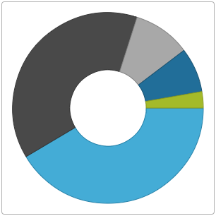

<!--
|metadata|
{
    "fileName": "igdoughnutchart-adding-using-the-mvc-helper",
    "controlName": "Doughnut Chart",
    "tags": ["Charting","Data Binding","Getting Started","How Do I"]
}
|metadata|
-->

# Adding igDoughnutChart to an ASP.NET MVC Application

## Topic Overview

### Purpose

This topic walks through using the ASP.NET MVC helper to instantiate an [`igDoughnutChart`](%%jQueryApiUrl%%/ui.igDoughnutChart#options)™ in an ASP.NET MVC application.

### Required background

The following table lists the concepts and topics required as a prerequisite to understanding this topic.

- **Concepts**
	- jQuery
	- jQuery UI
	- ASP.NET MVC
	- ASP.NET MVC HTML Helpers
- **Topics**
	- [Adding Controls to an MVC Project](Adding-NetAdvantage-Controls-to-an-MVC-Project.html): This topic explains how to get started with Ignite UI™ components in an ASP.NET MVC application.

 


### In this topic

This topic contains the following sections:

-   [**Adding *igDoughnutChart* to an ASP.NET MVC Application – Introductory Overview**](#intro)
    -   [Adding *igDoughnutChart* summary](#intro-summary)
    -   [Requirements](#summary-requirements)
-   [**Adding *igDoughnutChart* to an ASP.NET MVC Application**](#adding)
    -   [Preview](#adding-preview)
    -   [Prerequisites](#adding-prerequisites)
    -   [Overview](#adding-overview)
    -   [Steps](#adding-steps)
-   [**Related Content**](#related-content)
    -   [Topics](#topics)
    -   [Samples](#samples)


## <a id="intro"></a> Adding igDoughnutChart to an ASP.NET MVC Application – Introductory Overview

### <a id="intro-summary"></a> Adding *igDoughnutChart* summary

The successful addition of `igDoughnutChart` to an ASP.NET MVC application, using the ASP.NET MVC helper requires that you adjust its size by specifying values for its [`height`](%%jQueryApiUrl%%/ui.igDoughnutChart#options:height) and [`width`](%%jQueryApiUrl%%/ui.igDoughnutChart#options:width) options and adding at least one [`series`](%%jQueryApiUrl%%/ui.igDoughnutChart#options:series) to it.

You must provide a pre-configured data source instance, or create one internally for the series. Apart from the [`dataSource`](%%jQueryApiUrl%%/ui.igDoughnutChart#options:series.dataSource) option, in order to display the control, the [name](%%jQueryApiUrl%%/ui.igDoughnutChart#options:series.name) and [`valueMemberPath`](%%jQueryApiUrl%%/ui.igDoughnutChart#options:series.valueMemberPath) options require a value. The `valueMemberPath` parameter contains the value used in creating the slices of the series. In this example, the `ProductItemCollection` model is used to instantiate the `dataSource` option of the series. The `valueMemberPath` of the series is set to Index and uses its value to build its slices.

### <a id="summary-requirements"></a> Requirements

An ASP.NET MVC application configured with the required JavaScript files, CSS files, and ASP.NET MVC assembly as outlined in the [Adding Controls to an MVC Project](Adding-NetAdvantage-Controls-to-an-MVC-Project.html) topic.


## <a id="adding"></a> Adding igDoughnutChart to an ASP.NET MVC Application

This topic walks through using the ASP.NET MVC helper to instantiate an igDoughnutChart in an ASP.NET MVC application.

### <a id="adding-preview"></a> Preview

The following screenshot is a preview of the result.



### <a id="adding-prerequisites"></a> Prerequisites

To complete the procedure, you need the following:

-   An ASP.NET MVC application
-   Reference to the Infragistics.Web.Mvc.dll assembly added to the application project

### <a id="adding-overview"></a> Overview

Following is a conceptual overview of the process:

1.  Adding a reference to *Infragistics.Web.Mvc.dll*
2.  Configuring the view dependencies
3.  Defining the data collection
4.  Instantiating the *igDoughnutChart*

### <a id="adding-steps"></a> Steps

This topic walks through using the ASP.NET MVC helper to instantiate an `igDoughnutChart` in an ASP.NET MVC application.

1. **Add a reference to *Infragistics.Web.Mvc.dll***
	
	Add a reference to the Infragistics.Web.Mvc.dll to your ASP.NET application. The details for adding this assembly are available in the [Adding Controls to an MVC Project](Adding-NetAdvantage-Controls-to-an-MVC-Project.html) topic.

2. **Configure the view dependencies**
	
	**1.** Import the *Infragistics.Web.Mvc* namespace

	In order to use the ASP.NET MVC helper, you must first import the Infragistics.Web.Mvc namespace onto your view.

	**In ASPX:**
	```csharp
	<%@ Import Namespace="Infragistics.Web.Mvc" %>
	```
	
	**2.** Add references to the combined files for all data visualization controls
	
	Add the following file references to the HEAD tag of the ASP.NET MVC View (you might as well use igLoader or explicitly include all Doughnut Chart related files as explained in the [Adding *igDoughnutChart* to an HTML Page](igDoughnutChart-Adding-to-an-HTML-Page.html) topic) :

	**In ASPX:**
	
	```csharp
	<link href="<%=Url.Content("~/Scripts/css/structure/modules/infragistics.ui.chart.css")%>" rel="stylesheet"></link>
    <link href="<%=Url.Content("~/Scripts/css/themes/infragistics/infragistics.theme.css")%>" rel="stylesheet"></link>
    <script src="<%=Url.Content("~/Scripts/jquery.min.js")%>" type="text/javascript"></script>
    <script src="<%=Url.Content("~/Scripts/jquery-ui.min.js")%>" type="text/javascript"></script>
    <script src="<%=Url.Content("~/Scripts/js/infragistics.core.js")%>" type="text/javascript"></script>
    <script src="<%=Url.Content("~/Scripts/js/infragistics.dv.js")%>" type="text/javascript"></script>
	```

3. **Define the data collection**
	
	**1.** Define the model object `ProductItem` 
	
	Define a basic `ProductItem` object in your application to use for the data collection.
	
	**In C#:**
	
    ```csharp
    public class ProductItem
    {
        public string ProductCategory { get; set; }
        public int Index { get; set; }
    }
    ```
	
	**​2.** Create a collection of `ProductItem` objects
		
	**In C#:**
	
	```csharp
	using System.Collections.Generic;
    namespace DoughnutChartMVC
    {
        public class ProductItemCollection : List<ProductItem>
        {
            public ProductItemCollection()
            {
                this.Add(new ProductItem { ProductCategory = "Footwear", Index = 1498 });
                this.Add(new ProductItem { ProductCategory = "Clothing", Index = 1389 });
                this.Add(new ProductItem { ProductCategory = "Books", Index = 352 });
                this.Add(new ProductItem { ProductCategory = "Accessories", Index = 273 });
                this.Add(new ProductItem { ProductCategory = "Equipment", Index = 100 });
            }
        }
    }
	```
	
	**​3.** Return the collection as view model in the action method of your controller.
	
	**In C#:**
	
	```csharp
	using System.Web.Mvc;
    namespace DoughnutChartMVC.Controllers
    {
        public class HomeController : Controller
        {
            public ActionResult Index()
            {
                var products = new ProductItemCollection();
                return View("Index", new ProductItemCollection());
            }
        }
    }
	```
	
	Add the `ProductItemCollection` as a model for the view.
	
	**In ASPX:**
	
	```csharp
	<%@ Page Language="C#" Inherits="System.Web.Mvc.ViewPage<DoughnutChartMVC.ProductItemCollection>" %>
	```

4. **Instantiate the *igDoughnutChart***
	
	**Use the ASP.NET MVC helper and set basic options in order to Instantiate the `igDoughnutChart`.** Use the ASP.NET MVC helper within the body of your ASP.NET page to instantiate the `igDoughnutChart`. Several helper methods need to be set for a basic rendering when instantiating the control, there are including the following:
	
	<table class="table">
		<tbody>
			<tr>
				<th>Helper Method</th>
	
				<th>Purpose</th>
			</tr>
	
			<tr>
				<td>
					Width()
				</td>
	
				<td>
					Sets the string width of the `igDoughnutChart`
				</td>
			</tr>
	
			<tr>
				<td>
					Height()
				</td>
	
				<td>
					Sets the string height of the `igDoughnutChart`
				</td>
			</tr>
	
			<tr>
				<td>
					Series()
				</td>
	
				<td>
					Instantiates a series for the `igDoughnutChart`. <br /> Apart from its `dataSource`, a `name` must be assigned to the series and its `valueMemberPath` property must get a value which will be used to determine the size of the slices.
				</td>
			</tr>
		</tbody>
	</table>
	
	Finally, as with all of the Ignite UI ASP.NET MVC helpers, you must call the Render method to render the HTML and JavaScript to the view.
	
	**In ASPX:**
	
	```csharp
	<body>
        <%= Html.Infragistics().DoughnutChart()
                        .Width("300px")
                        .Height("300px")
                        .Series(s =>
                        {
                            s.Ring("flatSeries", Model.AsQueryable())
                                .ValueMemberPath(o => o.Index);
                            })
                         .Render()%>
    </body>
	```

**Full Application Code Listing**

**In ASPX:**

```csharp
<%@Page Language="C#" Inherits="System.Web.Mvc.ViewPage<DoughnutChartMVC.ProductItemCollection>" %>
<%@ Import Namespace="Infragistics.Web.Mvc" %>
<!DOCTYPE html>
<html>
<head>
    <title>DoughnutChart</title>
    <link href="<%=Url.Content("~/Scripts/css/structure/modules/infragistics.ui.chart.css")%>" rel="stylesheet"></link>
    <link href="<%=Url.Content("~/Scripts/css/themes/infragistics/infragistics.theme.css")%>" rel="stylesheet"></link>
    <script src="<%=Url.Content("~/Scripts/jquery.min.js")%>" type="text/javascript"></script>
    <script src="<%=Url.Content("~/Scripts/jquery-ui.min.js")%>" type="text/javascript"></script>
    <script src="<%=Url.Content("~/Scripts/js/infragistics.core.js")%>" type="text/javascript"></script>
    <script src="<%=Url.Content("~/Scripts/js/infragistics.dv.js")%>" type="text/javascript"></script>
</head>
<body>
    <%= Html.Infragistics().DoughnutChart()
                    .Width("300px")
                    .Height("300px")
                    .Series(s =>
                    {
                        s.Ring("flatSeries", Model.AsQueryable())
                            .ValueMemberPath(o => o.Index);
                        })
                     .Render()%>
</body>
</html>
```


## <a id="related-content"></a> Related Content

### <a id="topics"></a> Topics


The following topics provide additional information related to this topic.

- [Adding *igDoughnutChart* to an HTML Page](igDoughnutChart-Adding-to-an-HTML-Page.html): This topic explains how to add the `igDoughnutChart` to an HTML page.

- [jQuery and ASP.NET MVC Helper API Links (*igDoughnutChart*)](igDoughnutChart-API-Links.html): This topic provides links to the API documentation about the `igDoughnutChart` control and the ASP.NET MVC Helper for it.

### <a id="samples"></a> Samples

The following sample provides additional information related to this topic.

- [Bind to Collection](%%SamplesUrl%%/doughnut-chart/bind-to-collection): This is an example of rendering the `igDoughnutChart` using the ASP.NET MVC helper. The helper binds to a collection of objects on the server and serializes the collection to JSON objects and renders the required `igDoughnutChart` HTML and JavaScript.


 

 


