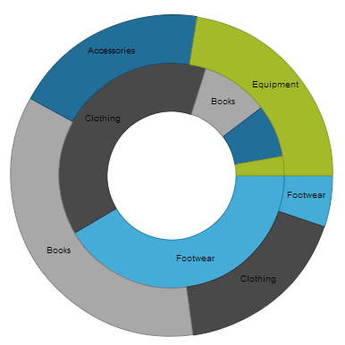

<!--
|metadata|
{
    "fileName": "igdoughnutchart",
    "controlName": "Doughnut Chart",
    "tags": ["Getting Started","How Do I"]
}
|metadata|
-->

# igDoughnutChart

## In This Group of Topics

### Introduction

The topics in this group cover the `igDoughnutChart`™ control and its use.

The `igDoughnutChart` control allows for proportionally illustrating the occurrences of a variable. The inner  radius of the control is configurable, and the Doughnut Chart’s series provides a built-in support for selecting and exploding its slices.

#### Topics

- [*igDoughnutChart* Overview](igDoughnutChart-Overview.html): This topic provides an overall look at the `igDoughnutChart` control.

- [Adding *igDoughnutChart*](igDoughnutChart-Adding.html): This is a group of topics demonstrating how to add the `igDoughnutChart` control to an HTML page and to an ASP.NET MVC application.

- [Configuring Selection and Explosion (*igDoughnutChart*)](igDoughnutChart-Configuring-Selection-and-Explosion.html): This topic explains how to configure selection and explosion for the slices of the `igDoughnutChart`.

- [jQuery and ASP.NET MVC Helper API Links (*igDoughnutChart*)](igDoughnutChart-API-Links.html): This topic provides links to the API documentation about the `igDoughnutChart` control and the ASP.NET MVC Helper for it.

- [Known Issues and Limitations (*igDoughnutChart*)](igDoughnutChart-Known-Issues-and-Limitations.html):  This topic provides information on the `igDoughnutChart` control’s known issues and limitations.

 

 

