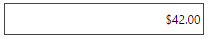
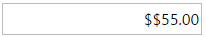

<!--
|metadata|
{
    "fileName": "igcurrencyeditor-igcurrencyeditor-overview",
    "controlName": "igEditors",
    "tags": ["Getting Started"]
}
|metadata|
-->

# igCurrencyEditor Overview


The %%ProductName%%™ currency editor, or `igCurrencyEditor`, is a control which renders an input field which only accepts numeric values, formatted as various currency types. The `igCurrencyEditor` control supports localization, by recognizing different regional options exposed from the browser.

As the user interacts with the control, the visual appearance is updated to reflect any changes. Once the editor loses focus, a value-dependent positive or negative pattern is applied to the control, along with adding the appropriate currency sign.

Figure 1: The `igCurrencyEditor` formatted for American currency



[igCurrencyEditor Options Sample](%%SamplesUrl%%/editors/currency-editor)

## Features

The `igCurrencyEditor` includes the following characteristics:

-   Theme support
-   Validation
-   Localization
-   JavaScript Client API
-   ASP.NET MVC wrapper
-   Min/Max Value


The `igCurrencyEditor` inherits the `igNumericEditor` options, but it has some unique properties of its own. For example you can use the `currencySymbol` option to change the displayed currency symbol. A full list of the `igCurrencyEditor` options can be found in the [igCurrencyEditor jQuery API](%%jQueryApiUrl%%/ui.igCurrencyEditor).

Similarly to the `igNumericEditor`, the `igCurrencyEditor` has a `negativePattern` option, which defines the display mode pattern for negative numeric values.It looks like this:
`negativePattern: '$(n)'`
The "$" character represents `currencySymbol` and the "n" character represents the value of number. The "-" and "()" characters are a static part of the pattern.

Unlike the numeric editor, the currency one has a positive pattern. The `positivePattern` option defines the display mode pattern for positive numeric values. The "$" character represents the `currencySymbol` and the "n" character represents the value of the number. Using these two characters, you can build custom patterns for maximum flexibility. One possible usage is demonstrated below:

```js
$('#currencyEditor').igCurrencyEditor({
	positivePattern:'$$n'
});
```


## Adding igCurrencyEditor using the Ignite UI CLI

The easiest way to add a new igCurrencyEditor to your application is via the Ignite UI CLI. After you have created a new application, you just need to execute the following command and a currency editor will be added to the project:
```
   ig add currency-editor newCurrencyEditor 
```

This command will add a new currency editor no matter if your application is created in Angular, React or jQuery.
For more information and the list of all available commands read [Using Ignite UI CLI](Using-Ignite-UI-CLI.html) topic.

## Adding igCurrencyEditor to a Web Page

1.  To get started, include the required and localized resources for your application. Details on which resources to include are found in the [Using JavaScript Resources in %%ProductName%%](Deployment-Guide-JavaScript-Resources.html) help topic.
2.  On your HTML page or ASP.NET MVC View, reference the required JavaScript files, CSS files, and ASP.NET MVC assemblies.

    **In HTML:**

    ```html
    <link type="text/css" href="/css/themes/infragistics/infragistics.theme.css" rel="stylesheet" />
    <link type="text/css" href="/css/structure/infragistics.css" rel="stylesheet" />
    <script type="text/javascript" src="/Scripts/jquery.min.js"></script>
    <script type="text/javascript" src="/Scripts/jquery-ui.min.js"></script>
    <script type="text/javascript" src="/Scripts/Samples/infragistics.core.js"></script>
	<script type="text/javascript" src="/Scripts/Samples/infragistics.lob.js"></script>
    ```

	**In Razor:**

    ```csharp
    @using Infragistics.Web.Mvc;

    <link type="text/css" href="@Url.Content("~/css/themes/infragistics/infragistics.theme.css")" rel="stylesheet" />
    <link type="text/css" href="@Url.Content("~/css/structure/infragistics.css")" rel="stylesheet" />

    <script type="text/javascript" src="@Url.Content("~/Scripts/jquery.min.js")"></script>
    <script type="text/javascript" src="@Url.Content("~/Scripts/jquery-ui.min.js")"></script>
    <script type="text/javascript" src="@Url.Content("~/Scripts/Samples/infragistics.core.js")"></script>
	<script type="text/javascript" src="@Url.Content("~/Scripts/Samples/infragistics.lob.js")"></script>
    <script type="text/javascript" src="@Url.Content("~/Scripts/Samples/modules/i18n/regional/infragistics.ui.regional-en.js")"></script>
    ```

3.  For purely jQuery implementations, start off by creating an INPUT, DIV or SPAN as the target element in HTML. This step is optional for ASP.NET MVC implementations as the MVC wrapper creates the containing element for you.    

    **In HTML:**

    ```html
    <input id="currencyEditor" />
    ```

4.  Once the above setup is complete, initialize the numeric editor.

    > **Note:** For the ASP.NET MVC Views, the `Render` method must be called after all other options are set.

    **In Javascript:**

    ```js
    <script type="text/javascript">
         $('#currencyEditor').igCurrencyEditor();
    </script>
    ```

	**In Razor:**

    ```csharp
    @(Html.Infragistics().CurrencyEditor()
       .ID("currencyEditor")
       .Render())
    ```

5.  Run the web page to view the resulting `igCurrencyEditor` control.

## Related Links

-   [Currency Editor Sample](%%SamplesUrl%%/editors/currency-editor)
-   [%%ProductName%% Overview](NetAdvantage-for-jQuery-Overview.html)
-   [Using JavaScript Resources in %%ProductName%%](Deployment-Guide-JavaScript-Resources.html)

 

 


