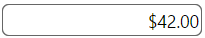
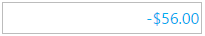

<!--
|metadata|
{
    "fileName": "igcurrencyeditor-igcurrencyeditor-styling-and-theming",
    "controlName": "igEditors",
    "tags": ["Styling","Theming"]
}
|metadata|
-->

# igCurrencyEditor Styling and Theming


The `igCurrencyEditor` jQuery widget exposes a number of options for styling. To customize the style of the currency editor, you can use a different theme, or directly apply custom CSS rules to the control. 

The Ignite UI package comes with a number of jQuery UI and Bootstrap themes. Bootstrap support also includes generating and customizing your own bootstrap themes - see [Styling and Theming](Deployment-Guide-Styling-and-Theming.html) for details. 
All of the themes will style all controls on the page, including the editors.

## Using ThemeRoller

As the `igCurrencyEditor` control uses the jQuery UI CSS framework, it can also be fully styled using the [jQuery UI ThemeRoller](http://jqueryui.com/themeroller/) where you can customize your own theme or choose from a gallery of available ones. These themes replace the ones that come by default with Ignite UI.

Currency editor using the UI Darkness theme:



## Custom styling

Your CSS may include style overrides for many more elements of the currency editor. For a full list of available classes see the [API Reference Theming classes](%%jQueryApiUrl%%/ui.igCurrencyEditor#theming). Styles can be applied both by overriding the global classes applied to all editors or by targeting specific elements by ID or other selectors to allow for more per-control customization.

The default color for a negative value in the `igCurrencyEditor` is red. Below is an example, demonstrating how to change this color:

```html
<style>
.ui-igedit-negative
{
	color: #00aeef;
}
</style>
```

>**Note:** If you don't use a negative pattern, the negative values can be displayed differently than the previous image. This is due to your regional settings.




## Related Topics

-   [igCurrencyEditor Overview](igCurrencyEditor-igCurrencyEditor-Overview.html)
 

 


