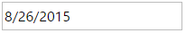

<!--
|metadata|
{
    "fileName": "igdateeditor-overview",
    "controlName": "igEditors",
    "tags": ["Editing","Getting Started"]
}
|metadata|
-->

# igDateEditor Overview


The Ignite UI™ date editor, or `igDateEditor`, is a control that renders an input field, which allows users to edit date formatted data. The `igDateEditor` control supports localization, by recognizing different regional options exposed from the browser.

The `igDateEditor` control exposes a rich client-side API, which can be configured to work with any server technology. While the Ignite UI™ controls are server-agnostic, the control does feature wrappers specific for the Microsoft® ASP.NET MVC Framework to configure the control with the .NET™ language of your choice.

The `igDateEditor` control may be extensively styled giving you an opportunity to provide a completely different look and feel for the control as opposed to the default style. Styling options include using your own styles as well as styles from jQuery UI’s ThemeRoller.

>**Note:** One of the major changes in the new date editor is that it no longer supports Lists and DropDown. Note that if you try to use methods related to dropdown and list, you will receive a notification pointing out that they are no longer available. 

Figure 1: The `igDateEditor` rendered to the user



## Features

The `igDateEditor` includes the following characteristics:

-   Overall theme support
-   Validation
-   Defining custom input format
-   Defining custom display format
-   Set Min/Max value
-   Localization
-   JavaScript Client API
-   ASP.NET MVC wrapper

## Adding igDateEditor to a Web Page

1.  To get started, include the required and localized resources for your application. Details on which resources to include can be found in the [Using JavaScript Resources in  Ignite UI](Deployment-Guide-JavaScript-Resources.html) help topic.
2.  On your HTML page or ASP.NET MVC View, reference the required JavaScript files, CSS files, and ASP.NET MVC assemblies.

    **In HTML:**

    ```html
    <link type="text/css" href="/css/themes/infragistics/infragistics.theme.css" rel="stylesheet" />
    <link type="text/css" href="/css/structure/infragistics.css" rel="stylesheet" />
    <script type="text/javascript" src="/Scripts/jquery.min.js"></script>
    <script type="text/javascript" src="/Scripts/jquery-ui.min.js"></script>
    <script type="text/javascript" src="/Scripts/Samples/infragistics.core.js"></script>
	<script type="text/javascript" src="/Scripts/Samples/infragistics.lob.js"></script>
    ```

    **In Razor:**

    ```csharp
    @using Infragistics.Web.Mvc;

    <link type="text/css" href="@Url.Content("~/css/themes/infragistics/infragistics.theme.css")" rel="stylesheet" />
    <link type="text/css" href="@Url.Content("~/css/structure/infragistics.css")" rel="stylesheet" />

    <script type="text/javascript" src="@Url.Content("~/Scripts/jquery-1.9.1.min.js")"></script>
    <script type="text/javascript" src="@Url.Content("~/Scripts/jquery-ui.min.js")"></script>
    <script type="text/javascript" src="@Url.Content("~/Scripts/Samples/infragistics.core.js")"></script>
	<script type="text/javascript" src="@Url.Content("~/Scripts/Samples/infragistics.lob.js")"></script>
    <script type="text/javascript" src="@Url.Content("~/Scripts/Samples/modules/i18n/regional/infragistics.ui.regional-en.js")"></script>
    ```

3.  For jQuery implementations, create an INPUT, DIV or SPAN as the target element in HTML. This step is optional for ASP.NET MVC implementations as the MVC wrapper creates the containing element for you.

    **In HTML:**

    ```html
    <input id="dateEditor"/>
    ```

4. Once the above setup is complete, initialize the date editor.

    > **Note:** For the ASP.NET MVC Views, the `Render` method must be called after all other options are set.

    **In Javascript:**

    ```js
    <script type="text/javascript">
          $('#dateEditor').igDateEditor();
    </script>
    ```

    **In Razor:**

    ```csharp
    @(Html.Infragistics().DateTimeEditor()
                 .ID("dateEditor")
                 .Render())
    ```

5.  Run the web page to view the basic setup of the `igDateEditor` control.

## Setting the Value option right

In this section of the topic, we are going to review few commonly used and specific scenarios showing how setting the value option is handled by the `igDateEditor`.

When the value is empty and in edit mode you enter only part of the date, for example only the day, the other part of the date will be generated by the data object. What this means is that the data object will take the current date and fill up the missing parts of the date. 

If you already have a value in input and delete part of it, again for example the day, and then blur the input the editor will take the missing part from the last entered date. For example if you have 28th of February 2015 and you delete the day, after you blur the input the date will go back to 28th of February.

The last scenario that we are going to pay attention to is the wrong value. If you enter for example 29th of February 2015, the editor will automatically correct you because 2015 is not a leap year. The displayed data will be 28th of February 2015. 

## Related Links

-   [Date and Time Formats](%%SamplesUrl%%/editors/date-and-time-formats) 
-   [Ignite UI Overview](NetAdvantage-for-jQuery-Overview.html)
-   [Using JavaScript Resources in Ignite UI](Deployment-Guide-JavaScript-Resources.html)

 

 


