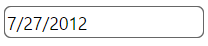
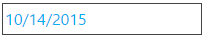

<!--
|metadata|
{
    "fileName": "igdateeditor-styling-and-theming",
    "controlName": "igEditors",
    "tags": ["Editing","Styling","Theming"]
}
|metadata|
-->

# igDateEditor Styling and Theming

The `igDateEditor` control is a jQuery-based widget that extends the `igEditor` control and it exposes a number of options for styling. To customize the style of the date editor you must use the theme option to apply a set of custom CSS rules to the control.

The Ignite UI package comes with a number of jQuery UI and Bootstrap themes. Bootstrap support also includes generating and customizing your own bootstrap themes - see [Styling and Theming](Deployment-Guide-Styling-and-Theming.html) for details. All of the themes will style all controls, including the editors on the page.

## Using ThemeRoller

As the `igDateEditor` control uses the jQuery UI CSS framework it can also be fully styled using the [jQuery UI ThemeRoller](http://jqueryui.com/themeroller/), where you can customize your own theme or choose from a gallery of available ones. These themes replace the ones that come by default with Ignite UI.

Date editor using the UI Darkness theme:



## Custom styling

Your CSS may include style overrides for many more elements of the date editor. For a full list of available classes see the [API Reference Theming classes](%%jQueryApiUrl%%/ui.igDateEditor#theming). Styles can be applied both by overriding the global classes, applied to all editors, or by targeting specific elements by ID or other selectors to allow for a more per-control customization.

```css
.ui-igedit-input{
	color: #00aeef;
}
```



## Related Topics

-   [igDateEditor Overview](igDateEditor-Overview.html)
-   [igDateEditor Known Issues](igDateEditor-Known-Issues.html)
