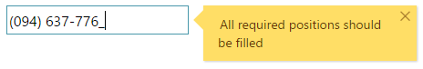

<!--
|metadata|
{
    "fileName": "igmaskeditor--overview",
    "controlName": "igEditors",
    "tags": ["Editing","Getting Started"]
}
|metadata|
-->

# igMaskEditor Overview

##Overview Of The igMaskEditor

The Ignite UI™ mask editor, or `igMaskEditor`, is a control that renders an input field enforces input restrictions as determined by a given input mask. The `igMaskEditor` control supports localization, by recognizing different regional options exposed from the browser. The `igMaskEditor` control exposes a rich client-side API, which may be configured the work with any server technology. While the Ignite UI™ controls are server-agnostic, the control does feature wrappers specific for the Microsoft® ASP.NET MVC Framework to configure the control with the .NET™ language of your choice. The `igMaskEditor` control may be extensively styled giving you an opportunity to provide a completely different look and feel for the control as opposed to the default style. Styling options include using your own styles as well as styles from jQuery UI’s ThemeRoller. <br />Figure 1: The `igMaskEditor` control apply a phone number mask.




##Features

The `igMaskEditor` includes the following characteristics:
-   Overall theme support
-   Validation
-   Defining custom masks
-   Different data modes
-   Localization
-   JavaScript Client API
-   ASP.NET MVC wrapper


>**Note:** One of the major changed in the new Mask editor is that it no longer supports Lists and DropDown. Note that if you try to use methods connected to dropdown and list, you will receive a notification pointing out that they are no longer available.

##Adding igMaskEditor to a Web Page

1.  To get started, include the required and localized resources for your application. Details on which resources to include can be found in the [Using JavaScript Resources in Ignite UI](Deployment-Guide-JavaScript-Resources.html) help topic.
2.  On your HTML page or ASP.NET MVC View, reference the required JavaScript files, CSS files, and ASP.NET MVC assemblies.

	**In HTML:**
    ```html
    <link type="text/css" href="/css/themes/infragistics/infragistics.theme.css" rel="stylesheet" />
    <link type="text/css" href="/css/structure/infragistics.css" rel="stylesheet" />
    <script type="text/javascript" src="/Scripts/jquery.min.js"></script>
    <script type="text/javascript" src="/Scripts/jquery-ui.min.js"></script>
    <script type="text/javascript" src="/Scripts/Samples/infragistics.core.js"></script>
	<script type="text/javascript" src="/Scripts/Samples/infragistics.lob.js"></script>
    ```

    **In Razor:**
    ```csharp
    @using Infragistics.Web.Mvc;
    <link type="text/css" href="@Url.Content("~/css/themes/infragistics/infragistics.theme.css")" rel="stylesheet" />
    <link type="text/css" href="@Url.Content("~/css/structure/infragistics.css")" rel="stylesheet" />
    <script type="text/javascript" src="@Url.Content("~/Scripts/jquery-1.9.1.min.js")"></script>
    <script type="text/javascript" src="@Url.Content("~/Scripts/jquery-ui.min.js")"></script>
    <script type="text/javascript" src="@Url.Content("~/Scripts/Samples/infragistics.core.js")"></script>
	<script type="text/javascript" src="@Url.Content("~/Scripts/Samples/infragistics.lob.js")"></script>
    <script type="text/javascript" src="@Url.Content("~/Scripts/Samples/modules/i18n/regional/infragistics.ui.regional-en.js")"></script>
    ```
3.  For jQuery implementations create an INPUT, DIV or SPAN as the target element in HTML. This step is optional for ASP.NET MVC implementations as the MVC wrapper creates the containing element for you.

	**In HTML:**
    ```html
    <input id="maskEditor" />
    ```

4. Once the above setup is complete, initialize the mask editor.

    >**Note:** For the ASP.NET MVC Views, the `Render` method must be called after all other options are set.

    **In Javascript:**

    ```js
    <script type="text/javascript">
           $('#maskEditor').igMaskEditor();
    </script>
    ```

    **In Razor:**

    ```csharp
    @(Html.Infragistics().MaskEditor()
                 .ID("maskEditor")
                 .Render())
    ```

5.  Run the web page to view the basic setup of the `igMaskEditor` control.

## Specific options

### Input mask

In this section, we will take a look at several key options for the `igMaskEditor`, starting with [`inputMask`](%%jQueryApiUrl%%/ui.igmaskeditor#options:inputMask). It represents the input mask and is a key option for the igMaskEditor as much of its functionality is depending on it. It basically lets you specify what is allowed for typing in the editor's input or in other words restrict the end user input based on the expected format and your requirements. Additionally, it makes the editor more "user friendly" as the `inputMask` set displays the required positions when in edit mode.

For example, to have a phone number typed in a specific format, you can specify the required digits ("9" flags) as well as the format itself (literal characters like spaces, dashes, etc.). With the mask set to `"(999) 999-999"`, upon entering edit mode the following mask `(___) ___-___` will appear for the end user and hint on what to type in. 

The mask may include filter-flags and literal characters. Literal characters are part of the mask, which cannot be modified by the end user. In order to use a filter-flag as a literal character, the escape "\\" character should be used. Default one is "CCCCCCCCCC" and allows any keyboard characters and these are optional at the same time. Please notice this option can not be set runtime.
The full list of `inputMask` option values can be seen in the [API documentation](%%jQueryApiUrl%%/ui.igmaskeditor#options:inputMask). 

### Data Mode

Next we will take a look at [`dataMode`](%%jQueryApiUrl%%/ui.igmaskeditor#options:dataMode) and several of its available values. It affects the value of the control (`value` method and submitted in forms). You can choose from a total of 6 different `dataMode` settings, which simply put let you choose what the value should contain from text, unfilled prompts and literals. The default is `allText` and when used value method returns the text entered, all prompts (positions) and literals. Notice `dataMode` indirectly depends on the `inputMask` option as well. In case you want to get only the text from the user input disregarding the unfilled prompts and literals `rawText` is the way to go. When using `rawTextWithLiterals` you will get only the text entered and literals while unfilled prompts will be ignored (removed). For example, given `inputMask` of `(999) 999-999` and `dataMode` of `rawTextWithLiterals` if you type `1234567` in the input, the value will be `(123) 456-7`. 

A complete list of the option's values can be found in [API documentation](%%jQueryApiUrl%%/ui.igmaskeditor#options:dataMode). 


### Configure 

**HTML:**

```html
<input id="phoneNumber"/>
```

**Javascript:**

```js
<script type="text/javascript">
    $('#phoneNumber').igMaskEditor({
        inputMask: '(999) 999-999',
        dataMode: 'rawTextWithLiterals',
        value:123456789
    });
});
</script>
```

**In Razor:**

```csharp
@(Html.Infragistics().MaskEditor()
    .ID("phoneNumber")
    .InputName("phoneNumber")
    .InputMask("(999) 999-999")
    .DataMode(MaskEditorDataMode.RawTextWithLiterals)
    .Value(123456789)
    .Render()
)
```

##Related Links

-   [Mask Editor Basic Sample](%%SamplesUrl%%/editors/mask-editor-basic)
-   [Ignite UI Overview](NetAdvantage-for-jQuery-Overview.html)
-   [Using JavaScript Resources in Ignite UI](Deployment-Guide-JavaScript-Resources.html)
