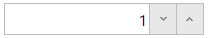

<!--
|metadata|
{
    "fileName": "ignumericeditor-overview",
    "controlName": "igEditors",
    "tags": ["Editing","Getting Started"]
}
|metadata|
-->

# igNumericEditor Overview


##Overview Of The igNumericEditor

The Ignite UI™ numeric editor, or `igNumericEditor`, is a control that renders an input field which only accepts numeric digits as determined by the `dataMode` value. The `igNumericEditor` control supports localization, by recognizing different regional options exposed from the browser.

The `igNumericEditor` control exposes a rich client-side API, which may be configured the work with any server technology. While the Ignite UI™ controls are server-agnostic, the control does feature wrappers specific for the Microsoft® ASP.NET MVC Framework to configure the control with the .NET™ language of your choice.

The `igNumericEditor` control may be extensively styled giving you an opportunity to provide a completely different look and feel for the control as opposed to the default style. Styling options include using your own styles as well as styles from jQuery UI’s ThemeRoller.

Figure 1: The `igNumericEditor` as rendered to the user



[Basic Usage Sample](%%SamplesUrl%%/editors/basic-usage)

##Features


The `igNumericEditor` includes the following characteristics:

-   Overall theme support
-   Validation
-   Different data modes
-   JavaScript Client API
-   ASP.NET MVC wrapper
-   Min/Max Value


##Adding igNumericEditor to a Web Page


1.  To get started, include the required and localized resources for your application. Details on which resources to include can be found in the [Using JavaScript Resources in Ignite UI](Deployment-Guide-JavaScript-Resources.html) help topic.
2.  On your HTML page or ASP.NET MVC View, reference the required JavaScript files, CSS files, and ASP.NET MVC assemblies.

    **In HTML:**

    ```html
    <link type="text/css" href="/css/themes/infragistics/infragistics.theme.css" rel="stylesheet" />
    <link type="text/css" href="/css/structure/infragistics.css" rel="stylesheet" />
    <script type="text/javascript" src="/Scripts/jquery.min.js"></script>
    <script type="text/javascript" src="/Scripts/jquery-ui.min.js"></script>
    <script type="text/javascript" src="/Scripts/Samples/infragistics.core.js"></script>
	<script type="text/javascript" src="/Scripts/Samples/infragistics.lob.js"></script>
    ```

    **In Razor:**

    ```csharp
    @using Infragistics.Web.Mvc;

    <link type="text/css" href="@Url.Content("~/css/themes/infragistics/infragistics.theme.css")" rel="stylesheet" />
    <link type="text/css" href="@Url.Content("~/css/structure/infragistics.css")" rel="stylesheet" />

    <script type="text/javascript" src="@Url.Content("~/Scripts/jquery.min.js")"></script>
    <script type="text/javascript" src="@Url.Content("~/Scripts/jquery-ui.min.js")"></script>
    <script type="text/javascript" src="@Url.Content("~/Scripts/Samples/infragistics.core.js")"></script>
	<script type="text/javascript" src="@Url.Content("~/Scripts/Samples/infragistics.lob.js")"></script>
    <script type="text/javascript" src="@Url.Content("~/Scripts/Samples/modules/i18n/regional/infragistics.ui.regional-en.js")"></script>
    ```

3.  For jQuery implementations create an INPUT, DIV or SPAN as the target element in HTML. This step is optional for ASP.NET MVC implementations as the MVC wrapper creates the containing element for you.

    **In HTML:**

    ```html
    <input id="numericEditor"/>
    ```

4. Once the above setup is complete, initialize the numeric editor.

    >**Note:** For the ASP.NET MVC Views, the `Render` method must be called after all other options are set.

    **In Javascript:**

    ```js
    <script type="text/javascript">
    $('#numericEditor').igNumericEditor();
    </script>
    ```

    **In Razor:**

    ```csharp
    @(Html.Infragistics().NumericEditor()
         .ID("numericEditor")
         .DataMode(NumericEditorDataMode.Int)
         .MinValue(0)
         .Value(0)
         .Width(120)
         .Render())
    ``` 

5.  Run the web page to view the basic setup of the `igNumericEditor` control.

## Specific options

The `igNumericEditor` has a set of specialized options for handling numeric input. Let's start with the `dataMode` property which defines the range that editor's value can accept based on well-known data types. The default is "double", but you can choose between "int", "float", "byte" and others. The full list of values can be seen in the [igNumericEditor jQuery API](%%jQueryApiUrl%%/ui.igNumericEditor#options). 

Another specific option is the `decimalSeparator` which allows you to choose what character to be displayed as a decimal separator. The `groupSeparator` has similar functionality but it allows you to choose a character that will be displayed between groups of digits in a large number (like thousands or more). Below you can see an example of how to use it, but before that let take a look at one more property. The `groups` takes an array as a value. This property can be used to determine after how many digits you would like to have a separator. Note that count on groups start from right to left and the option affects only display mode.

```js
$('#divEditor').igNumericEditor({
    width: "300",
    groups: [1,2,3],
    groupSeparator:"-"
});
```


### Configure drop-down list

In case you want to have a drop-down list with predefined values to work with, you can provide an array of numeric values via the `listItems` option. You can go further and limit the values igNumericEditor allows, to the ones contained in the list of items. This can be achieved setting `isLimitedToListValues` option.

**HTML:**

```html
<input id="federalTax"/>
```

**Javascript:**

```js
<script type="text/javascript">
    $("#federalTax").igNumericEditor({
        listItems: [10, 15, 25, 28, 33, 35],
        value:10,
        isLimitedToListValues: true
    });
</script>
```

**In Razor:**

```csharp
@(Html.Infragistics().NumericEditor()
    .ID("federalTax")
    .Value(10)
    .ListItems(new List<object>() { 10, 15, 25, 28, 33, 35 })
    .IsLimitedToListValues(true)
    .Render())
```

### Configure spin functionality

While the spin functionality is always available through [keyboard intearcation](igNumericEditor-Keyboard-Navigation.html) it can be enhanced and controled with additional options. The editor supports several buttons via the `buttonType` option. These include spin, clear and drop-down button. Notice this option can be set only on initialization. Combinations like `'dropdown, spin'` or `'spin, clear'` are supported too. The `spinDelta` option will specify the increment/decrement step that should be used when the values are edited via spin action. Notice the `spinDelta` value cannot be negative. Non integer value is supported only for `dataMode` "double" and "float". 

**HTML:**

```html
<input id="stateTax"/>
```

**Javascript:**

```js
<script type="text/javascript">
    $("#stateTax").igNumericEditor({
        buttonType: 'spin',
        spinDelta:0.01,
        minValue:-5.53,
        maxValue:5.52,
        value:-5.00
});
</script>
```

**In Razor:**

```csharp
@(Html.Infragistics().NumericEditor()
    .ID("stateTax")
    .ButtonType(TextEditorButtonType.Spin)
    .SpinDelta(0.01)
    .MinValue(-5.53)
    .MaxValue(5.53)
    .Value(-5.00)
    .Render())
```

>**Note:** Full list of properties can be found in the [API documentation](%%jQueryApiUrl%%/ui.igNumericEditor)

##Related Links


-   [Basic Usage Sample](%%SamplesUrl%%/editors/basic-usage)
-   [Ignite UI Overview](NetAdvantage-for-jQuery-Overview.html)
-   [Using JavaScript Resources in Ignite UI](Deployment-Guide-JavaScript-Resources.html)

 

 


