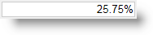

<!--
|metadata|
{
    "fileName": "igpercenteditor-overview",
    "controlName": "igEditors",
    "tags": ["Editing","Getting Started"]
}
|metadata|
-->

# igPercentEditor Overview

##Overview Of The igPercentEditor


The Ignite UI™ percent editor, or `igPercentEditor`, is a control that renders an input field which only accepts numeric digits, formatted as a percentage. The `igPercentEditor` control supports localization, by recognizing different regional options exposed from the browser.

The `igPercentEditor` control may be extensively styled giving you an opportunity to provide a completely different look and feel for the control as opposed to the default style. Styling options include using your own styles as well as styles from jQuery UI’s `ThemeRoller`.

Figure 1: The `igPercentEditor` as rendered to the user



[Basic Usage Sample](%%SamplesUrl%%/editors/basic-usage)

##Features

The `igPercentEditor` includes the following characteristics:

-   Overall theme support
-   JavaScript Client API
-   ASP.NET MVC wrapper


##Adding igPercentEditor to a Web Page


1.  To get started, include the required and localized resources for your application. Details on which resources to include can be found in the [Using JavaScript Resources in Ignite UI](Deployment-Guide-JavaScript-Resources.html) help topic.
2.  On your HTML page or ASP.NET MVC View, reference the required JavaScript files, CSS files, and ASP.NET MVC assemblies.

    **In HTML:**

    ```html
    <link type="text/css" href="/css/themes/infragistics/infragistics.theme.css" rel="stylesheet" />
    <link type="text/css" href="/css/structure/infragistics.css" rel="stylesheet" />
    <script type="text/javascript" src="/Scripts/jquery.min.js"></script>
    <script type="text/javascript" src="/Scripts/jquery-ui.min.js"></script>
    <script type="text/javascript" src="/Scripts/Samples/infragistics.core.js"></script>
	<script type="text/javascript" src="/Scripts/Samples/infragistics.lob.js"></script>
    ```

    **In Razor:**

    ```csharp
    @using Infragistics.Web.Mvc;

    <link type="text/css" href="@Url.Content("~/css/themes/infragistics/infragistics.theme.css")" rel="stylesheet" />
    <link type="text/css" href="@Url.Content("~/css/structure/infragistics.css")" rel="stylesheet" />

    <script type="text/javascript" src="@Url.Content("~/Scripts/jquery-1.9.1.min.js")"></script>
    <script type="text/javascript" src="@Url.Content("~/Scripts/jquery-ui.min.js")"></script>
    <script type="text/javascript" src="@Url.Content("~/Scripts/Samples/infragistics.core.js")"></script>
	<script type="text/javascript" src="@Url.Content("~/Scripts/Samples/infragistics.lob.js")"></script>
    <script type="text/javascript" src="@Url.Content("~/Scripts/Samples/modules/i18n/regional/infragistics.ui.regional-en.js")"></script>
    ```

3.  For jQuery implementations create an INPUT, DIV or SPAN as the target element in HTML. This step is optional for ASP.NET MVC implementations as the MVC wrapper creates the containing element for you.

    **In HTML:**

    ```html
    <input id="percentEditor" />
    ```

4. Once the above setup is complete, initialize the numeric editor.

    >**Note:** For the ASP.NET MVC Views, the `Render` method must be called after all other options are set.

    **In Javascript:**

    ```js
    <script type="text/javascript">
      $('#percentEditor').igPercentEditor();
    </script>
    ```

    **In Razor:**

	```csharp
	@(Html.Infragistics().PercentEditor()
		.ID("percentEditor")
		.Render())
	```

5.  Run the web page to view the basic setup of the `igPercentEditor` control.

##Related Links

-   [Basic Usage Sample](%%SamplesUrl%%/editors/basic-usage)
-   [Ignite UI Overview](NetAdvantage-for-jQuery-Overview.html)
-   [Using JavaScript Resources in Ignite UI](Deployment-Guide-JavaScript-Resources.html)

 

 


