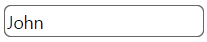
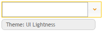
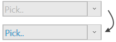

<!--
|metadata|
{
    "fileName": "igtexteditor-styling-and-theming",
    "controlName": "igEditors",
    "tags": ["Editing","Styling","Theming"]
}
|metadata|
-->

# igTextEditor Styling and Theming

The `igTextEditor` control is jQuery-based with a number of options for styling. To customize style of the text editor you can use different themes or apply custom CSS rules to the control. 

The Ignite UI package comes with a number of jQuery UI and Bootstrap themes. Bootstrap support also includes generating and customizing your own bootstrap themes - see [Styling and Theming](Deployment-Guide-Styling-and-Theming.html) for details. All of the themes will style all controls including the editors on the page.


## Using ThemeRoller

As the `igTextEditor` control uses the jQuery UI CSS framewrok it can also be fully styled using the [jQuery UI ThemeRoller](http://jqueryui.com/themeroller/) where you can customize your own theme or choose from a gallery of available ones. These themes replace the ones that come by default with Ignite UI.

Text editor with drop list using the Dark Hive theme:



Text editor with drop list using the UI Lightness theme:




## Custom styling

Your CSS may include style overrides for many more elements of the text editor. For a full list of available classes see the [API Reference Theming classes](%%jQueryApiUrl%%/ui.igTextEditor#theming). Styles can be applied both by overriding the global classes applied to all editors or by targeting specific elements by ID or other specific trait to allow for more per-control customization.

The default class applied to the top element when editor is rendered in container is `'ui-igedit-container ui-state-default'` which can be used to target general element overrides or very specific ones, such as the placeholder `ui-igedit-placeholder`:

```html
<style>
.ui-igedit-placeholder
{
	text-shadow: 1px 0px #00aeef;
}
</style>
```



##Related Topics  

-   [igTextEditor Overview](igTextEditor-Overview.html)
-   [igTextEditor Known Issues](igTextEditor-Known-Issues.html)

 

 


