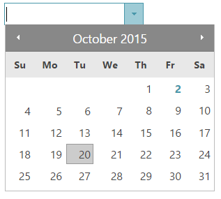

<!--
|metadata|
{
    "fileName": "igdatepicker-overview",
    "controlName": "igDatePicker",
    "tags": ["Editing","Getting Started"]
}
|metadata|
-->

# igDatePicker Overview


The `igDatePicker`, allows you to have input field with dropdown calendar and specified by developer display date format. The `igDatePicker` control supports localization, by recognizing different regional options exposed from the browser.

> **Note on localization:** The `igDatePicker` control depends on `jQuery.datepicker` and thus also requires its localization files to be referenced on the page.

The `igDatePicker` control exposes a rich client-side API, which may be configured the work with any server technology. While the %%ProductName%%™ controls are server-agnostic, the editor control does feature wrappers specific for the Microsoft® ASP.NET MVC Framework to configure the control with the .NET™ language of your choice.

The `igDatePicker` control may be extensively styled giving you an opportunity to provide a completely different look and feel for the control as opposed to the default style. Styling options include using your own styles as well as styles from jQuery UI’s ThemeRoller.

> **Note:** The `igDatePicker` control reuses the drop-down calendar from `jQuery.datepicker` as it doesn’t implement its own drop-down.

Figure 1: The `igDatePicker` control during date selection



-   [igDatePicker Sample](%%SamplesUrl%%/editors/date-picker-overview)

## Features

The `igDatePicker` includes the following characteristics:

-   Overall theme support
-   Validation
-   Defining custom display format
-   Set Min/Max value
-   Localization
-   JavaScript Client API
-   ASP.NET MVC wrapper
-   All features supported by the jquery.ui.datepicker


## Adding igDatePicker to a Web Page

1.  To get started, include the required and localized resources for your application. Details on which resources to include can be found in the [Using JavaScript Resources in %%ProductName%%](Deployment-Guide-JavaScript-Resources.html) help topic.
2.  On your HTML page or ASP.NET MVC View, reference the required JavaScript files, CSS files, and ASP.NET MVC assemblies.

    **In HTML:**

    ```html
    <link type="text/css" href="/css/themes/infragistics/infragistics.theme.css" rel="stylesheet" />
    <link type="text/css" href="/css/structure/infragistics.css" rel="stylesheet" />
    <script type="text/javascript" src="/Scripts/jquery.min.js"></script>
    <script type="text/javascript" src="/Scripts/jquery-ui.min.js"></script>
    <script type="text/javascript" src="/Scripts/Samples/infragistics.core.js"></script>
	<script type="text/javascript" src="/Scripts/Samples/infragistics.lob.js"></script>
    ```

    **In Razor:**

    ```csharp
    @using Infragistics.Web.Mvc;

    <link type="text/css" href="@Url.Content("~/css/themes/infragistics/infragistics.theme.css")" rel="stylesheet" />
    <link type="text/css" href="@Url.Content("~/css/structure/infragistics.css")" rel="stylesheet" />

    <script type="text/javascript" src="@Url.Content("~/Scripts/jquery.min.js")"></script>
    <script type="text/javascript" src="@Url.Content("~/Scripts/jquery-ui.min.js")"></script>
    <script type="text/javascript" src="@Url.Content("~/Scripts/Samples/infragistics.core.js")"></script>
	<script type="text/javascript" src="@Url.Content("~/Scripts/Samples/infragistics.lob.js")"></script>
    <script type="text/javascript" src="@Url.Content("~/Scripts/Samples/modules/i18n/regional/infragistics.ui.regional-en.js")"></script>
    ```

3.  For jQuery implementations create an INPUT, DIV or SPAN as the target element in HTML. This step is optional for ASP.NET MVC implementations as the MVC wrapper creates the containing element for you.

    **In HTML:**

    ```html
    <input id="datePicker" type="text" />
    ```

4.  Once the above setup is complete, initialize the date editor.

    > **Note:** For the ASP.NET MVC Views, the Render method must be called after all other options are set.

    **In Javascript:**

    ```js
    <script type="text/javascript">
          $("#datePicker").igDatePicker();
     </script>
    ```

    **In Razor:**

    ```csharp
    @(Html.Infragistics().DatePicker()
         .ID("datePicker")
         .Render())
    ```

5.  Run the web page to view the basic setup of the `igDatePicker` control.

## Setting the Value option right

In this section of the topic, we are going to review few commonly used and specific scenarios showing how setting the value option is handled by the `igDatePicker`.

When the value is empty and in edit mode you enter only part of the date, for example only the day, the other part of the date will be generated by the date object. What this means is that the date object will take the current date and fill up the missing parts of the date. For example if the current Date is 1st of January 2017 and the dateInputFormat is specified as "dd", when the user enters "25", then the year and the month will be filled up with 2017 and January. As a result, value would be interpreted as 25th of January 2017 in this case.

If you already have a value in input and delete part of it, again for example the day, and then blur the input the editor will take the missing part from the last entered date. For example if you have 28th of February 2015 and you delete the day, after you blur the input the date will go back to 28th of February.

But if you change a single field of the date, the editor will validate whether the newly created date is correct and if it is not correct it will recalculate it. For example, lets assume that the initially entered value was 01/31/2016 and you change only the month to February. Than the editor will take the day field and recalculate it as February has only 29 days. So the date will become 02/29/2016. Lets take a look at one more example. What will happen if we change only the date? If for example, you try to change manually the 02/29/2016 date to 02/30/2016 the editor will return the day to 29th as it will assume that you entered a wrong, not existing date.

Lets consider another scenario where we have the value set to the last day of a particular month. What will happen if you change the whole date by only adding a month in edit mode? The result will be that the editor will try to create the date by using the JavaScript Date object. For the sake of clarity lets take a look at the following example. The initially set value is again 01/31/2016, than we focus the editor and enter 2 for the month so the date in edit mode will look like this _2/__/__. Then the editor will try to use the previously used day and year and to fill in the deleted fields, but as we know February has only 29 days (two less then January) and that is why the JavaScript object will recalculate the date and add two more days to 29th of February and thus the date will become 3/2/2016.

The last scenario that we are going to pay attention to is the wrong value. If you enter for example 29th of February 2015, the editor will automatically correct you because 2015 is not a leap year. The displayed date will be 28th of February 2015. 

When you use a string value for the `minValue`, `maxValue` and the `value` options, the editors will use the JavaScript Date Object constructor to create date object out of it and use it as a value for the corresponding option.
 >**Note:** These properties don't use the `displayInputFormat` setting to extract the date. 

## Related Links

-   [igDatePicker Sample](%%SamplesUrl%%/editors/date-picker-overview)
-   [%%ProductName%% Overview](NetAdvantage-for-jQuery-Overview.html)  
-   [Using JavaScript Resources in %%ProductName%%](Deployment-Guide-JavaScript-Resources.html)
