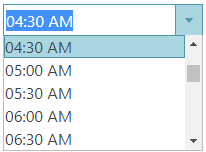

<!--
|metadata|
{
    "fileName": "igtimepicker-overview",
    "controlName": "igEditors",
    "tags": ["Editing","Getting Started"]
}
|metadata|
-->

# igTimePicker Overview


The %%ProductName%%™ `igTimePicker` allows you to have an editor with time-only input and a drop-down with listed hours:minutes values. By default, the listed time values are with 30 minutes delta. 

The `igTimePicker` input and display format are configurable. By default, the control uses a 12-hour format.

Depending on the specified time format (12-hour or 24-hour format), the drop-down list begins with 12:00 AM or 00:00 AM and ends with 11:30 PM or 23:30 PM.

The control supports localization by recognizing different regional options provided by the browser.

The `igTimePicker` control exposes a rich client-side API, which may be configured to work with any server technology. While the %%ProductName%%™ controls are server-agnostic, the picker control provides wrappers specific for the Microsoft® ASP.NET MVC Framework to configure the control with the .NET™ language of your choice.

The `igTimePicker` control may be extensively styled giving you an opportunity to provide a completely different look and feel for the control as opposed to the default style. Styling options include using your own styles as well as styles from jQuery UI's ThemeRoller.

Figure 1: The igTimePicker control during time selection



-   [igTimePicker Sample](http://https://www.igniteui.com/editors/time-picker-overview)


## Features

The `igTimePicker` includes the following characteristics:

-   Overall theme support
-   Validation
-   [Different modes](#button-types)
-   [Defining custom input format](#time-formats)
-   [Defining custom display format](#time-formats)
-   [Min/Max values](#min-max-values)
-   Localization
-   JavaScript Client API
-   ASP.NET MVC wrapper

## Adding igTimePicker to a Web Page

1.  To get started, include the required and localized resources in your application. Details on which resources to include can be found in the [Using JavaScript Resources in %%ProductName%%](Deployment-Guide-JavaScript-Resources.html) help topic.
2.  On your HTML page or ASP.NET MVC View, reference the required JavaScript files, CSS files, and ASP.NET MVC assemblies.

    **In HTML:**

    ```html
    <link type="text/css" href="/css/themes/infragistics/infragistics.theme.css" rel="stylesheet" />
    <link type="text/css" href="/css/structure/infragistics.css" rel="stylesheet" />
    <script type="text/javascript" src="/Scripts/jquery.min.js"></script>
    <script type="text/javascript" src="/Scripts/jquery-ui.min.js"></script>
    ```

    **In Razor:**

    ```csharp
    @using Infragistics.Web.Mvc;

    <link type="text/css" href="@Url.Content("~/css/themes/infragistics/infragistics.theme.css")" rel="stylesheet" />
    <link type="text/css" href="@Url.Content("~/css/structure/infragistics.css")" rel="stylesheet" />

    <script type="text/javascript" src="@Url.Content("~/Scripts/jquery-1.9.1.min.js")"></script>
    <script type="text/javascript" src="@Url.Content("~/Scripts/jquery-ui.min.js")"></script>
    ```

3.  For jQuery implementations, create an `INPUT`, `DIV` or `SPAN` as a target element in HTML. This step is optional for ASP.NET MVC implementations as the MVC wrapper creates the containing element for you.

    **In HTML:**

    ```html
    <input id="timePicker"/>
    ```

4. Once the above setup is complete, initialize the time picker.

    > **Note:** For the ASP.NET MVC Views, the `Render` method must be called after all other options are set.

    **In Javascript:**

    ```js
    <script type="text/javascript">
          $('#timePicker').igTimePicker();
    </script>
    ```

    **In Razor:**

    ```csharp
    @(Html.Infragistics().TimePicker()
                 .ID("timePicker")
                 .Render())
    ```

5.  Run the web page to view the basic setup of the `igTimePicker` control.

## Configuring igTimePicker

### <a id="time-formats"></a>Time Formats

The `timeInputFormat` and `timeDisplayFormat` options specify how time is formatted when the control is being edited or is simply displaying a value.

If specific format is not set, the `timeInputFormat` is used with its default value - "time". Presets like "time" map to the patterns defined by the regional options.  

Supported formats follow the general patterns for [Formatting Dates and Time](Formatting-Dates-Numbers-and-Strings.html). The time format can also be defined using a common set of time specifiers - for example, a format of "HH:mm" would display time similar to "16:35" where "HH" displays the hour number in 24-hour format and "mm" - the minute numbers, excluding the AM/PM part.


### <a id="button-types"></a>Button Types
The `buttonType` option defines the type of buttons applied to the time picker control. This option defines as well provided interactions. Available button types are:

- **clear** - a clear button is added to the editor
- **dropdown** - a dropdown button is added to open a dropdown list with time items
- **none** -  an editor without any buttons is displayed
- **spin**  - spin buttons are added to enable incrementing/decrementing of time parts 

 >**Note:** This option can not be set run-time and a combination like "dropdown, spin" is not allowed.

### Items Delta and Spin Delta

The `itemsDelta` option specifies the delta between the displayed consecutive time items. By default, the items delta is 30 minutes. This option defines also the step for increment/decrement when using the <kbd>Up Arrow</kbd> and <kbd>DOWN Arrow</kbd>. Use this option when you have `buttonType` set to "dropdown".

The `spinDelta` option specifies the increment/decrement step applied when the spin buttons are used in the time picker control. This option defines also the step for increment/decrement when using the <kbd>Up Arrow</kbd> and <kbd>DOWN Arrow</kbd>. Use this option when you have `buttonType` set to "spin". Note that when the input is not focused, clicking the spin buttons changes the minute part.

If you use the `limitSpinToCurrentField` option and set it to true, you can limit the spinning in only one time field without affecting the other parts.

### <a id="min-max-values"></a>Min/Max Values

The `minValue` and `maxValue` options specify the minimum\maximum value, which can be displayed/entered in the time picker by the end user. These two options also define the range of items in the control dropdown list. 

### Support for ISO Date Format
In order to support ISO dates, the time picker value should be set to a date rather than to a string. 

```js
$("#timePicker").igTimePicker("option","value", new Date("2019-02-21T00:00:00.000Z"));
```   