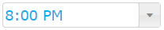
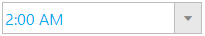

<!--
|metadata|
{
    "fileName": "igtimepicker-styling-and-theming",
    "controlName": "igEditors",
    "tags": ["Editing","Styling","Theming"]
}
|metadata|
-->

# igTimePicker Styling and Theming

The `igTimePicker` control is a jQuery-based widget and exposes a number of options for styling. To customize the style of the time picker, you can use a different theme, or directly apply custom CSS rules to the control.

The %%ProductName%% package comes with a number of jQuery UI and Bootstrap themes. In addition, Bootstrap support includes generating and customizing your own bootstrap themes - see [Styling and Theming](Deployment-Guide-Styling-and-Theming.html) for details.

## Using ThemeRoller

As the `igTimePicker` control uses the jQuery UI CSS framework, it can be fully styled using the [jQuery UI ThemeRoller](http://jqueryui.com/themeroller/). You can customize your own theme or choose from a gallery of available ones. These themes replace the ones that come by default with %%ProductName%%.

Time picker using the ThemeRoller Smoothness theme:



## Custom styling

Your CSS may include style overrides for the elements of the time picker. For the full list of available classes, see the [API Reference Theming classes](%%jQueryApiUrl%%/ui.igDateEditor#theming). Styles can be applied both by overriding the global classes, applied to all editors, or by targeting specific elements by ID or other selectors to allow for a more per-control customization.

```css
.ui-igedit-input{
	color: #00aeef;
}
```



## Related Topics

-   [igTimePicker Overview](igtimepicker-overview.html)