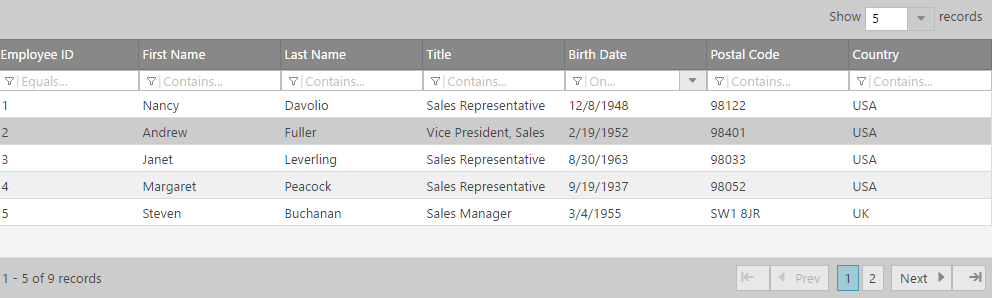

<!--
|metadata|
{
    "fileName": "iggrid-overview",
    "controlName": "igGrid",
    "tags": ["Getting Started","Grids"]
}
|metadata|
-->

# igGrid Overview

## About igGrid

The `igGrid` is a jQuery-based client-side grid that is responsible for presenting and manipulating tabular data. Its whole lifecycle is on the client-side, which makes it independent from server-side technology.

 

## Features

The `igGrid` control supports a number of different features:

-   Column Resizing
-   Column Hiding
-   Column Summaries
-   Row Selectors
-   GroupBy
-   Tooltips
-   Sorting
-   Filtering
-   Paging
-   Selection
-   Updating
-   jQuery templates
-   Virtual Scrolling

Further, the grid also includes support for:

-   High Performance data manipulation
-   Keyboard Navigation
-   Rich client-side API
-   ASP.NET MVC wrapper

## Adding igGrid to a Web Page

The following steps demonstrate how to create a basic implementation of the jQuery Grid on a web page using either jQuery client code. To read about which implementation to choose, see [Ignite UI Overview](NetAdvantage-for-jQuery-Overview.html).

[igGrid Overview Sample](%%SamplesUrl%%/grid/overview)

To get started, include the required and localized resources for your application. Details on which resources to include can be found in the [Using JavaScript Resources in Ignite UI](Deployment-Guide-JavaScript-Resources.html) help topic.

1.  On your HTML page, **reference the required JavaScript and CSS** files. **In HTML:**

    ```html
    <script src="scripts/jquery.js" type="text/javascript"></script>
    <script src="scripts/jquery-ui.js" type="text/javascript"></script>
    <script src="scripts/infragistics.core.js" type="text/javascript"></script><script src="scripts/infragistics.lob.js" type="text/javascript"></script>
    <link href="css/themes/infragistics/infragistics.theme.css" rel="stylesheet" type="text/css" />
    <link href="css/structure/infragistics.css" rel="stylesheet" type="text/css" />
    ```

2. Next, **create a JSON array** which serves as a data source for the grid.

    **In Javascript:**

    ```js
    var products = [  
		{ "ProductID": 1, "Name": "Adjustable Race", "ProductNumber": "AR-5381" },  
		{ "ProductID": 2, "Name": "Bearing Ball", "ProductNumber": "BA-8327" },  
		{ "ProductID": 3, "Name": "BB Ball Bearing", "ProductNumber": "BE-2349" },  
		{ "ProductID": 4, "Name": "Headset Ball Bearings", "ProductNumber": "BE-2908" },  
		{ "ProductID": 316, "Name": "Blade", "ProductNumber": "BL-2036" },  
		{ "ProductID": 317, "Name": "LL Crankarm", "ProductNumber": "CA-5965" },  
		{ "ProductID": 318, "Name": "ML Crankarm", "ProductNumber": "CA-6738" },  
		{ "ProductID": 319, "Name": "HL Crankarm", "ProductNumber": "CA-7457" },  
		{ "ProductID": 320, "Name": "Chainring Bolts", "ProductNumber": "CB-2903" },  
		{ "ProductID": 321, "Name": "Chainring Nut", "ProductNumber": "CN-6137" }
	];
    ```

3. **Define a table DOM element**, that *igGrid* will use to render the given data.

    **In HTML:**

    ```html
    <table id=”grid1”></table>
    ```

4. Once the above setup is complete, begin to **set options** including *ID*, *columns* and *dataSource*.

    1.  [columns](%%jQueryApiUrl%%/ui.iggrid#options:columns) – the column object definition for `igGrid`
        -   `headerText` – the text in the header of a column
        -   `key` – the name of the key field in the data source
        -   `dataType` – the data type of a column. Could be “string”, “number” or “date”

    2.  [dataSource](%%jQueryApiUrl%%/ui.iggrid#options:dataSource) – the data that the `igGrid` is displaying data for. Options include:
	    -   JSON object
	    -   JavaScript array
	    -   XML
	    -   Remote data
	    -   Table DOM element
	    
	    **In Javascript:**
	
	    ```js
	    $(function () {
            $("#grid1").igGrid({
                columns: [
                    { headerText: "Product ID", key: "ProductID", dataType: "number" },
                    { headerText: "Product Name", key: "Name", dataType: "string" },
                    { headerText: "Product Number", key: "ProductNumber", dataType: "string" },
                ],
                width: '500px',
                dataSource: products
            });
        });
	    ```

5.  Run the web page. The `igGrid` binds to the JSON array and displays the data.

     

## Related Content

### Topics

-   [igGrid/igDataSource Architecture Overview](igGrid-igDataSource-Architecture-Overview.html)
-   [Ignite UI Overview](NetAdvantage-for-jQuery-Overview.html) 
-   [Using JavaScript Resources in Ignite UI](Deployment-Guide-JavaScript-Resources.html)

### Samples

-   [igGrid Overview Sample](%%SamplesUrl%%/grid/overview) 

 

 


