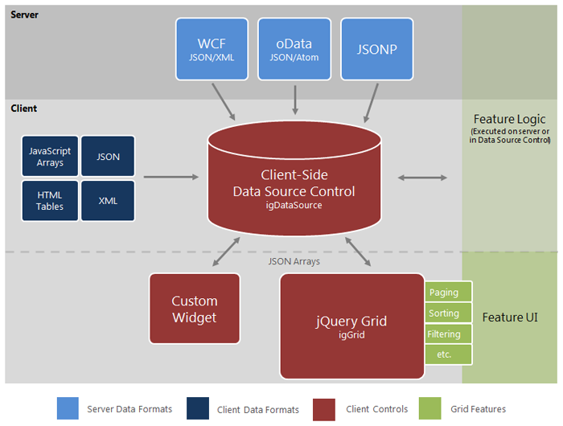

<!--
|metadata|
{
    "fileName": "iggrid-igdatasource-architecture-overview",
    "controlName": "igGrid",
    "tags": ["Getting Started","Grids"]
}
|metadata|
-->

# igGrid/igDataSource Architecture Overview

### In this topic

This topic contains the following sections:

-   [Overview](#overview)
-   [The Data Source Control](#data-source-control)
-   [The Grid Control](#grid-control)
-   [Configuration](#configuration)
-   [Features](#features)
-   [Dependencies](#dependencies)
-   [External References](#external-references)
-   [Related Content](#related-content)

## <a id="overview"></a>Overview

The Ignite UI™ grid, or `igGrid`™, is a client-side grid control built entirely with JavaScript, HTML and CSS. The client-only nature of the control makes the grid agnostic to server-side technologies allowing seamless interaction with applications built in PHP, Ruby on Rails®, Java™, Python™, Microsoft® ASP.NET™ and more.

The grid is constructed using a modular architecture where the data source and optional features are logically separated from the grid control. The separation of logic from presentation allows the associated data source control to take on the responsibility for processing features such as paging, sorting, filtering and the like. The grid itself, on the other hand, is only concerned with presentation details. While the grid is built with this modular construction, you are not required to first setup the data source and then the grid. You can easily configure the data source through the public interface of the grid control.

> **Note:** A grid “feature” in this context is defined as a common characteristic of grid controls like paging, sorting, filtering and other similar interactive attributes. While most often these features are executed in the browser, the data source control is able to send messages to the server to accommodate server-side processing. See Feature section below for more details.

Features of the grid are added modularly making the associated script and style sheet files served to the client on demand and only when necessary. The grid itself does not take a dependency on any grid features.

The grid extends the jQuery UI base widget and all the grid features are also implemented as jQuery widgets. The base grid code is implemented in `infragistics.ui.grid.framework.js` (this is the file name in the non-combined script instance). This script file contains code for the following building blocks of the grid:

-   `igGrid` widget code
-   Virtualization support
-   Scrolling support
-   Rendering engine
-   Client-side events
-   Options handling
-   Column creation engine
-   Dimensions calculator (height & width)
-   Basic styling

The grid communicates with different modules by firing events to which the features subscribe and consume to inject markup to the grid. Further, each feature has full access to the grid API and object model while consuming grid events.

Figure 1 depicts the grid architecture from a high level. The client-side data source control, or `igDataSource`™, is at the heart of the grid’s core functionality. As data comes into the data source, either from the client or the server, the data source control is responsible for processing and preparing the data to expose to the grid for final rendering. When optional features are added to the grid, their logical counterparts are automatically added to the data source control for execution. Feature logic may execute on the client or on the sever depending on how you configure the data source control.



Figure 1: Infragistics jQuery grid architecture layout

> **Note:** Due to the disconnected architecture surrounding the grid, you may choose to develop your own custom widgets that use the `igDataSource` control for data processing.


## <a id="data-source-control"></a>The Data Source Control

As discussed previously, the client-side data source serves as an intermediate layer between the client-side data bound components (such as the grid) and the actual data source. As opposed to the `igGrid` control, the data source control is implemented as a simple JavaScript class (not a widget or jQuery plugin). [John Resig](http://ejohn.org/blog/simple-javascript-inheritance/)’s simple inheritance approach is used in order to compose the control into separate classes.

#### Supported data formats for the data source control include:

-   Server Data (Web Services)
    -   [REST GET](http://en.wikipedia.org/wiki/Representational_State_Transfer#RESTful_web_services)
    -   [WCF REST (JSON & XML)](http://en.wikipedia.org/wiki/Windows_Communication_Foundation)
    -   JSONP Service
    -   Any REST Service
-   Local Data
    -   JSON
    -   XML
    -   JavaScript Object Arrays
    -   Strings of XML or JSON
    -   JavaScript functions returning data in any of the formats above
    -   Existing HTML structures (such as a HTML table filled with data)
        -   The client-side data source is responsible for extracting this data and managing the data
-   Mashup scenarios (eg: the combination of multiple flat data sources achieved through use of the  `$.ig.MashupDataSource` extension)

This architecture enables you to easily create extensions of the data source that serve a specific purpose. Examples of these cases consist of the following classes which extend the base data source control:

-   ***$.ig.MashupDataSource***
    -   The `dataSource` property accepts an array of supported data formats, from local or remote origin, which are combined to achieve mashup scenarios through use of a primary key/foreign key relation.
-   ***$.ig.JSONDataSource***
    -   This class is pre-configured to work specifically with [JSON](http://en.wikipedia.org/wiki/JSON) data.
-   ***$.ig.XMLDataSource***
    -   This class is pre-configured to work specifically with [XML](http://en.wikipedia.org/wiki/XML) data.

> **Note:** The controls listed above are included in the Ignite UI data source JavaScript library.

Further, you can extend the data source control to override any of its implementation in order to achieve a highly customized data binding functionality. Listing 1 demonstrates how to extend the base data source to pre-configure the options to work with JSON data.

**Listing 1**: Extending `igDataSource` to pre-configure options to with JSON data

**In Javascript:**

```js
$.ig.JSONDataSource = $.ig.DataSource.extend({
    init: function (options) {
        if (!options) {
            options = {};
        }
        // set the type to ‘json’ so you don’t have to explicitly set it later
        options.type = "json";
        this._super(options);
        return this;
    },
});
```

Listing 2 depicts a more complex example that implements a data source customized to use [Web Sockets](http://en.wikipedia.org/wiki/WebSockets) rather than Ajax, thus demonstrating the flexibility of the data source architecture.

**Listing 2**: Extending `igDataSource` to interact with Web Sockets

**In Javascript:**

```js
(function ($) {
    $.ig.WebSocketsDataSource = $.ig.DataSource.extend({

        init: function (options) {

            options.responseDataType = "json";
            options.responseContentType = "json";
            options.type = 'remoteUrl';
            this._super(options);
            return this;
        },
        // use the HTML5 WebSockets API here instead of calling $.ajax
        _processRequest: function (options) {
            if(!("WebSocket" in window)) {
                throw new Error("Sorry, the build of your browser does not support WebSockets. Please use latest Chrome or Webkit nightly.");
            }
            //options.dataSource is the one to initiate the connection to
            var ws = new WebSocket(options.url);
            this.context = this;
            ws.onmessage = $.proxy(this._dataFilter, this);
        },
        _dataFilter: function (evt, type) {
            var resp = this._super(JSON.parse(evt.data), "json");
            if (this.settings.responseBehavior === "append") {
                this._data.push(resp);
                this._dataView.push(resp);
            } else {
                this._data = [resp];
                this._dataView = [resp];
            }
            this._completeCallback();
        }
    });
}(jQuery));
```

## <a id="grid-control"></a>The Grid Control
If the purpose of the data source control is to process and manage data, then the primary responsibility of the grid control is to act as the user interface layer for the data. Upon responding to events raised by the data source control, the grid is in charge of binding to the data and generating the required DOM elements in JavaScript to create the UI. As features are added, the grid consumes events raised by the features to further customize the UI in response to data source actions.


```js
var igDs = $('#grid1').data('igGrid').dataSource;
```

## <a id="configuration"></a>Configuration

The grid is configured by passing JSON objects as a parameters following standard jQuery practice. For more information on how to work with options parameters, refer to [Working with jQuery UI Widgets](http://wiki.jqueryui.com/w/page/12137708/How%20to%20use%20jQuery%20UI%20widgets) to get acquainted with how jQuery UI widgets are used in general.

## <a id="features"></a>Features

Grid features are declared during grid initialization by providing JSON objects as grid parameters, as demonstrated in Listing 3.

**Listing 3**: Configuring the `igGrid` control with JSON object parameters.


**In Javascript:**

```js
$("#grid2").igGrid({
    dataSource: "/server.php",
    columns: [ "<columns definitions>" ],
    features: [
        {
            name: "Paging",
            type: "local",
            pageSize: 10
        },
        {
            name: "Sorting",
            type: "local",
            caseSensitive: true,
            columnSettings: [
                { columnKey: "ProductID", allowSorting: true }
            ]
        }
    ]
});
```

Once the grid is instantiated by the jQuery UI Framework, the next operation is to parse and apply all the selected features. The grid begins by instantiating internal jQuery UI widgets for every feature, and they become bound to the element to which the grid was originally bound. After initialization and creation, you can access any feature and its associated API via an instance of the grid.

Listing 4 demonstrates how to access feature options, in this case sorting, from a current instance of the grid.

**Listing 4**: Access feature instance directly from the grid

**In Javascript:**

```js
var sortingObject = $("#grid1").data("igGridSorting");
```

Listing 5 depicts how to manipulate the feature API. The first example demonstrates how to enable case sensitivity of sorting, while the second example executes a simple sort to the data.

**Listing 5**: Working with feature API members

**In Javascript:**

```js
// changes the case sensitive option of the sorting feature. This options works only for local sorting.
$("#grid1").igGridSorting("option", "caseSensitive", true);

// sorts a column
$("#grid1").igGridSorting("sortColumn", … ) ;
```


## <a id="dependencies"></a>Dependencies

Since the `igGrid` control is built as a jQuery UI widget, it is dependent on the jQuery core library as well as jQuery UI. While no specific version of jQuery UI is required, the following versions are recommended for the best results:

### Dependent Script Versions

-   jQuery 3.1.1
-   jQuery UI 1.12.*


## <a id="external-references"></a>External References

-   [jQuery UI](http://jqueryui.com/)
-   [jQuery UI - Getting Started](http://docs.jquery.com/UI/Getting_Started)
-   [jQuery Themeroller](http://jqueryui.com/themeroller/)
-   [Theming jQuery UI](http://docs.jquery.com/UI/Theming)
-   [jQuery UI CSS Framework](http://docs.jquery.com/UI/Theming/API)

## <a id="related-content"></a> Related Content

### <a id="topics"></a> Topics

-   [Performance Guide (igGrid)](igGrid-Performance-Guide.html)
-   [Styling igGrid](igGrid-Styling-and-Theming.html)
-   [Styling and Theming in Ignite UI](Deployment-Guide-Styling-and-Theming.html)


