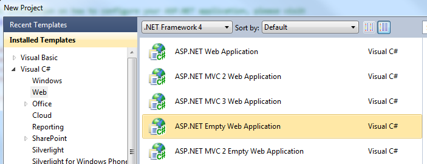
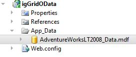
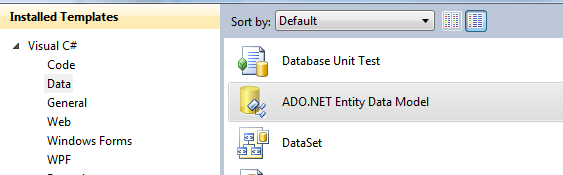
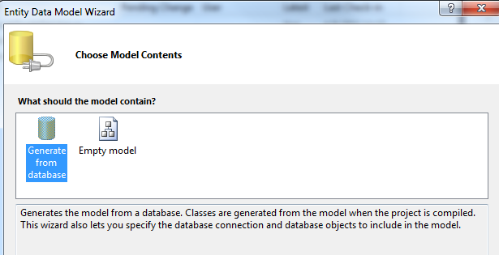
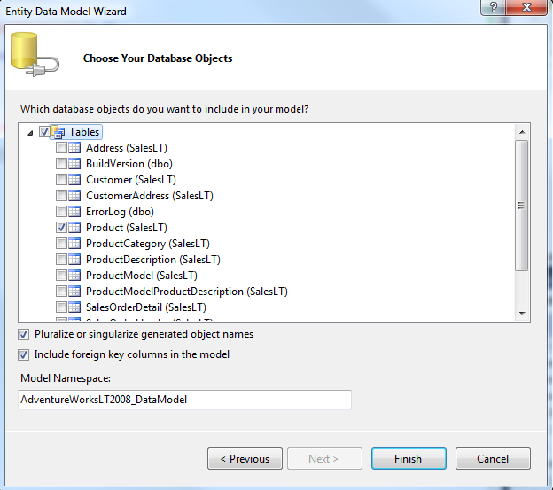
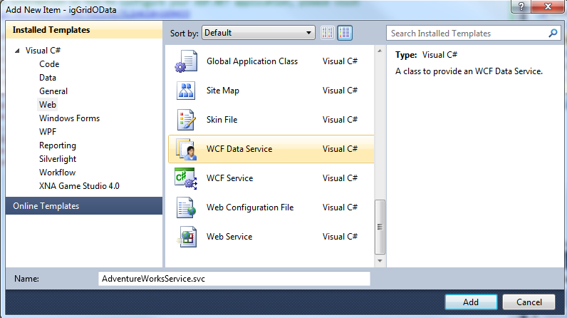
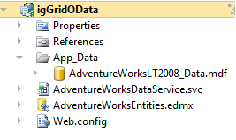
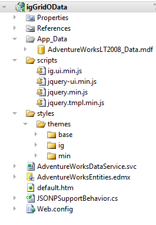
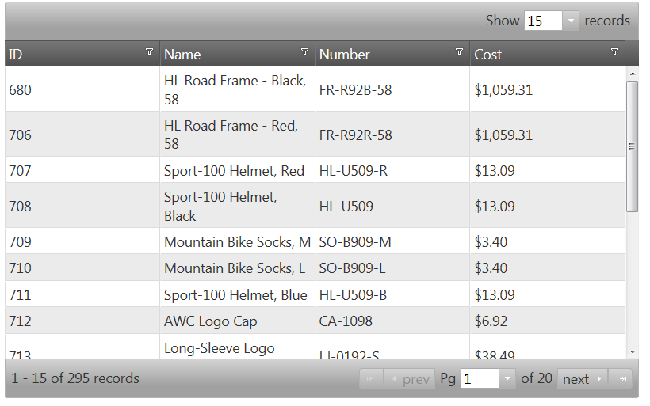

<!--
|metadata|
{
    "fileName": "iggrid-getting-started-with-iggrid-odata-and-wcf-data-services",
    "controlName": "igGrid",
    "tags": ["Data Binding","Getting Started","Grids","How Do I"]
}
|metadata|
-->

# Getting Started with igGrid, oData and WCF Data Services


The `igGrid` is a client-side data grid control that includes paging, filtering, and sorting functionality. The grid can bind to local data including XML, JSON, JavaScript arrays, HTML tables and remote data returned through web services.

The most seamless way to bind the `igGrid` control to remote data is to use it in conjunction with [OData](http://en.wikipedia.org/wiki/OData). OData, or Open Data Protocol, operates over HTTP and provides a means of querying and updating data in JSON and AtomPub formats through a set of common URL conventions. This means that you can provide the grid with a URL to the OData service, set one property, and all of the paging, filtering, and sorting is handled on the server without any additional configuration.

This topic demonstrates how to setup a client-side jQuery grid with remote paging, filtering, and sorting by setting up a WCF Data Service in an ASP.NET Web Application and setting two options on the `igGrid`.

## Example

1.  Open Microsoft Visual Studio® and create a new ASP.NET Empty Web Application named ‘igDataSourceWCFService’:

    > **Note**: The `igGrid` control uses the underlying `igDataSource` component is server-agnostic. Therefore this exercise demonstrates how you can implement *OData* support in ASP.NET WebForms as opposed to ASP.NET MVC which Ignite UI supports out-of-the-box.

    

2.  Add an *App_Data* folder to your project and add the *AdventureWorks* database into that folder:

    > **Note:** To obtain the AdventureWorks database, download it here.

    

3.  Next, add an ADO.NET Entity Data Model named *AdventureWorksEntities.edmx* to the project and point it to the *AdventureWorks* database:

    

    

4.  Choose the Product table to be included in the Entity Data Model:

    

5.  Next add a WCF Data Service to the project named ‘AdventureWorksService.svc’:

    

6.  At this point your project should look like this:

    

7.  Next, open the ‘AdventureWorksDataService’. This class derives from `DataService<T>` where T has not yet been defined. Specify the type of your Entity Data Model here:

    **In C#:**

	```csharp
	public class AdventureWorksDataService : DataService<AdventureWorksLT2008_DataEntities>
	```

8.  Next, enable access to the Products table through the Data Service by adjusting the `DataServiceConfiguration` in the `InitializeService` method:

    **In C#:**

	```csharp
	public static void InitializeService(DataServiceConfiguration config)
    {

	    config.SetEntitySetAccessRule("Products", EntitySetRights.AllRead);

	    config.DataServiceBehavior.MaxProtocolVersion = DataServiceProtocolVersion.V2;

    }
	```

9.  WCF Data Services natively support for the Atom and JSON formats. To enable JSONP formatted data, you must download the [JSONPSupportBehavior](https://github.com/schotime/NerdDinner-PetaPoco/blob/master/NerdDinner/Services/JSONPSupportBehavior.cs) code file and include it in your application.

10. Once the *JSONPSupportBehavior.cs* file is included in your application, make sure to change the namespace to match the namespace used in your application. Also, add the `JSONPSupportBehavior` attribute to your `AdventureWorksDataService` class:

    **In C#:**

	```csharp
	[JSONPSupportBehavior]
    public class AdventureWorksDataService : DataService<AdventureWorksLT2008_DataEntities>
	```

11. At this point, you can run the Web Application and access the data of the service so now it’s time to setup the `igGrid` control.

12. You will need the Ignite UI combined and minified script files, infragistics.core.js and infragistics.lob.js, which come with the product. In addition, you must reference the jQuery core and jQuery UI scripts to run the sample. [This help article](Deployment-Guide-JavaScript-Resources.html) discusses referencing the required scripts and where the combined and minified scripts are available to add to your application.

    > **Note**: You can [download the full or trial product here](http://www.infragistics.com/products/jquery#Downloads).

13. Create a “scripts” directory in your project and copy the JavaScript files into this folder.

14. Setup a styles directory and add the Infragistics themes directory to this folder. For more information on working with the jQuery themes for the `igGrid`, [see this help topic](igGrid-Styling-and-Theming.html).

15. Next, you can setup the sample page. You are going to add a new html page to the application and call it ‘default.htm’. Once that is done your project will look like this:

    

16. Open the default.htm file and include CSS links and script tags for the jQuery resources:

    **In HTML:**

	```html
	<head>
	    <link href="css/themes/infragistics/infragistics.theme.css" rel="stylesheet" type="text/css" />
	    <link href="css/structure/infragistics.css" rel="stylesheet" type="text/css" />

	    <script src="scripts/jquery.min.js" type="text/javascript"></script>
		<script src="scripts/jquery-ui.min.js" type="text/javascript"></script>
		<script src="scripts/infragistics.core.js" type="text/javascript"></script>
		<script src="scripts/infragistics.lob.js" type="text/javascript"></script>
	</head>
	```

17. Next, add a TABLE element to the body of the HTML which will serve as the base element for the grid:

    **In HTML:**

    ```html
    <body>
        <table id='tableProducts'></table>
    </body>
    ```

18. Add another script tag to the HEAD and instantiate an `igGrid` and define columns:

    **In HTML:**

	```html
	<script type="text/javascript">

		$(function () {

			$('#tableProducts').igGrid({
				height: '500px',
				width: '800px',
				autoGenerateColumns: false,
				columns: [
					{ headerText: 'ID', key: 'ProductID', dataType: 'number' },
					{ headerText: 'Name', key: 'Name', dataType: 'string' },
					{ headerText: 'Number', key: 'ProductNumber', dataType: 'string' },
					{ headerText: 'Cost', key: 'StandardCost', dataType: 'number', format: 'currency'}
				]
			});

		});

     </script>
	```

19. To bind the `igGrid` control to data, two options are required - URL for the data and the `responseDataKey`:

	```
	responseDataKey: 'd.results',
	dataSource: 'AdventureWorksDataService.svc/Products?$format=json',
	```

    > **Note:** The value d.results is a standard response key for JSON data coming from a ‘V2’ OData service

20.  Finally, enable the features of the grid including the option to make them operate remotely:

	**In Javascript:**

		```js
		features : [{
				name : 'Selection',
				mode : 'row',
				multipleSelection : true
			}, {
				name : 'Paging',
				type : 'remote',
				pageSize : 15
			}, {
				name : 'Sorting',
				type : 'remote'
			}, {
				name : 'Filtering',
				type : 'remote',
				mode : 'advanced'
			}
		]
		```


Run the sample to see the `igGrid` control populated with data from an *OData* service. Combined with *OData*, the grid can filter, sort, and page data remotely by supplying a single URL as the `dataSource`.



[**Download Sample**](http://dl.infragistics.com/community/jquery/codesamples/aaronm/2011-07-28/igGridOData.zip)

> **Note**: The AdventureWorks database and Ignite UI resources are not included in the sample. Visit these links to obtain the software:
>
> * [AdventureWorks Database](http://msftdbprodsamples.codeplex.com/releases/view/37109)
>
> * [Ignite UI](http://www.infragistics.com/products/jquery#Downloads)


## Related Topics

Following are some other topics you may find useful.

-   [igGrid/igDataSource Architecture Overview](igGrid-igDataSource-Architecture-Overview.html)
-   [Binding to Web Services](igGrid-Binding-to-Web-Services.html)


