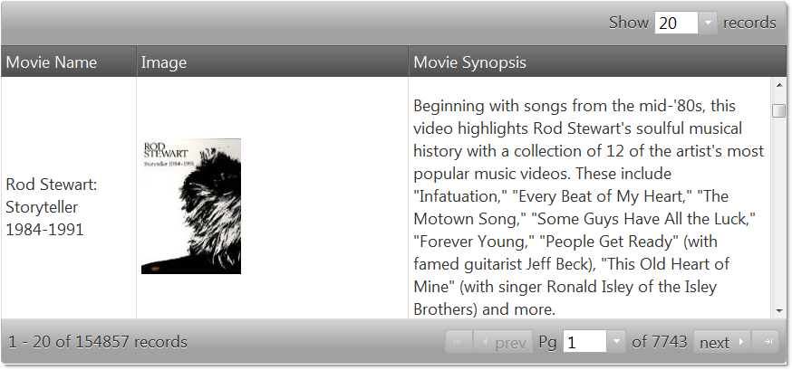

<!--
|metadata|
{
    "fileName": "iggrid-binding-to-web-services",
    "controlName": "igGrid",
    "tags": ["Data Binding","Grids","How Do I"]
}
|metadata|
-->

# Binding igGrid to Web Services

## Overview

This document demonstrates how to bind the Ignite UI® `igGrid`, to an *oData* protocol web-based data source.

## Follow These Steps

1.  On your HTML page, reference the required JavaScript and CSS files.

    **In HTML:**
   
    ```html
    <script src="jquery.min.js" type="text/javascript"></script>
    <script src="jquery-ui.min.js" type="text/javascript"></script>
    <script src="infragistics.core.js" type="text/javascript"></script>
	<script src="infragistics.lob.js" type="text/javascript"></script>
    <link href="infragistics.theme.css" rel="stylesheet" type="text/css" />
    <link href="infragistics.css" rel="stylesheet" type="text/css" />
    ```

2.  This tutorial uses [Netflix oData catalog API](http://developer.netflix.com/docs/oData_Catalog), which returns     JSONP data format. In your script tag of your HTML page, add a variable which holds the URL.

    **In Javascript:**

    ```js
    url = “http://odata.netflix.com/Catalog/Titles?$format=json&$callback=?";
    ```

3.  Create an instance of `JSONPDataSource` setting the `dataSource` and `responseDataKey` properties.

    **In Javascript:**

    ```js
    jsonp = new $.ig.JSONPDataSource({ dataSource: url, responseDataKey: "d.results" });
    ```

    > **Note:** Data returned from the service is in the following format:

    **In Javascript:**

    ```js
    ?({
    "d" : {
    "results": [
    {
    "__metadata": {…
    ```

    That is why you must set the `responseDataKey` to `"d.results"`.

4.  In order to represent the data source, you will need to use column template. The following code represents column templates that displays image and description from the data, returned from the web service.

    **In Javascript:**

    ```js
    template: ""
	...
	template: "<p> ${Synopsis} </p>"
    ```

5.  Next, you must initialize the grid by defining columns for name, image and synopsis.

    **In Javascript:**

	```js
	$("#netflixGrid").igGrid({
        columns: [
            {headerText:"Movie Name", key:"Name", width: "150px"},
            {headerText:"Image", key:"BoxArt", width: "300px", template: "" },
            {headerText:"Movie Synopsis", key:"Synopsis", width: "400px", template: "<p> ${Synopsis} </p>"}
        ],
        dataSource: jsonp,
        height:'400px',
        features: [
            {
               name : 'Paging',
               pageSize : 20
            }
        ]
        });
    });
	```

6.  Define a table DOM element, that `igGrid` will use to render the given data.

    **In HTML:**

    ```html
    <table id=”netflixGrid”></table>
    ```

7.  Run the web page. The `igGrid` binds to the web service and displays the returned data.

	

## Related Links

-   [Binding *igDataSource* to REST Services](igDataSource-Binding-to-REST-Services.html)

 

 


