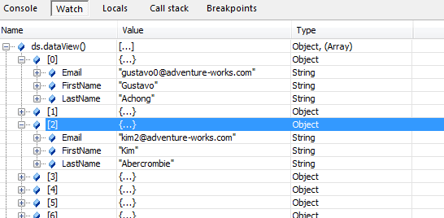

<!--
|metadata|
{
    "fileName": "iggrid-binding-iggrid-to-xml",
    "controlName": "igGrid",
    "tags": ["Data Binding","Grids","How Do I"]
}
|metadata|
-->

# Binding igGrid to XML

## Overview

The Ignite UI™ data source control , or `igDataSource`, can seamlessly bind to both namespaced, as well as non-namespaced XML documents. 

One limitation of XML with namespaces is that most browsers do not natively support executing XPath expressions. Fortunately, the data source control supports XPath expression out-of-the-box, so you can still point a specific part of the XML to be included in your schema. 

Once the control is bound, all your data is available in the form of an array of JavaScript objects.

This document demonstrates how to load, transform and bind XML data, and apply the `Paging`, `Sorting` and `Filtering` features to the control.

## Example

Consider a XML structure which defines a set of persons as showing in Listing 1.

**Listing 1:** Person data declared in XML

**In XML:**

```xml
<personContacts>
  <person>
    <generalInfo contactID="1" firstName="Gustavo" lastName="Achong" emailPromotion="true">
    	gustavo0@adventure-works.com
	</generalInfo>
    <modifiedDate FictionalFloat="0.31831">May 16 2005 4:33</modifiedDate>
  </person>
  <person>
    <generalInfo contactID="2" firstName="Catherine" middleName="R." lastName="Abel" emailPromotion="true">
    	catherine0@adventure-works.com
	</generalInfo>
    <modifiedDate FictionalFloat="0.63662">May 16 2005 4:33</modifiedDate>
  </person>
</personContacts>
```

The first step is to load the document. Listing 2 demonstrates one approach available to load the document from the server; your implementation may vary.

> **Note:** The approach shown in Listing 2 assumes the data is located on the same server as the web page.

**Listing 2:** Loading the XML document

**In Javascript:**

```js
function loadXMLDoc(dname) {
    if (window.XMLHttpRequest) {
    	xhttp = new XMLHttpRequest();
    }
    else {
    	xhttp = new ActiveXObject("Microsoft.XMLHTTP");
    }
    xhttp.open("GET", dname, false);
    xhttp.send();
    return xhttp.responseText;
}
```

> **Note:** You may also elect to use jQuery’s `$.ajax` API instead of making manual `XMLHttpRequest` calls.

Next, the data source control must have a data schema in order to read the incoming XML. Listing 3 shows you how to create the data schema (`$.ig.DataSchema`) and apply it to the data source control (`$.ig.DataSource` class).

**Listing 3:** Configuring data schema and binding the data source

**In Javascript:**

```js
$(document).ready(function () {
var xmldoc = loadXMLDoc("http://myurl.com/XML100.Pretty.Printed.xml")
    var xmlSchema = new $.ig.DataSchema("xml", { 
           fields: [
               { name: "FirstName", xpath: "generalInfo/@firstName" }, 
               { name: "LastName", xpath: "generalInfo/@lastName" }, 
               { name: "Email", xpath: "generalInfo"}], 
           searchField: "//person" 
       });

    var ds = new $.ig.DataSource({ 
           type: "xml", 
           dataSource: xmldoc, 
           schema: xmlSchema 
       });

    ds.dataBind();
}
```

Keep in mind the following points from this example:

-   XPath: Notice how the fields are defined by specifying an “xpath” property for every field definition. This is unique to XML data sources. In this way you are telling the data source the path to the property you are binding, in every hierarchical object that is in the list
-   Notice how the `searchField` is defined again using XPath expressions. Basically this expression tells the data source that the business objects it needs to bind to are the ones returned by the “//person” Xpath expression
-   Binding to values is also very easy, an example of this is the Email field, its XPath property is just “generalInfo” in that case
-   Binding to node attributes, on the other hand, is achieved by following the following syntax: “generalInfo/@lastName”
-   After the schema is created, it is passed to the data source, and its type is set to “xml”.
-   The `dataSource` property of the `dataSource` initialization code can point to either a string of XML data, or to an already parsed XML Document object (the data source handles both internally).

Figure 1 shows the data source state after it is data-bound.

**Figure 1:** Output from the data source object after it is bound




<div class="embed-sample">
   [XML Binding](%%SamplesEmbedUrl%%/grid/xml-binding)
</div>

## Related Topics

-   [igDataSource Overview](igDataSource-igDataSource-Overview.html)
-   [Performing Data Transformations Using DataSchema (igDataSource)](igDataSource-Using-DataSchema.html)

 

 


