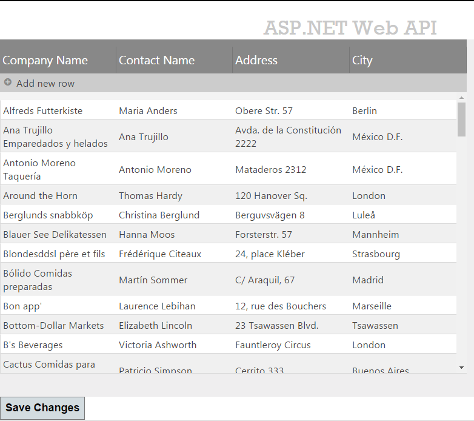
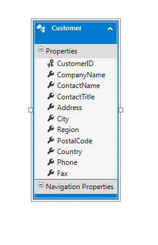

<!--
|metadata|
{
    "fileName": "iggrid-binding-to-webapi",
    "controlName": "igGrid",
    "tags": ["Data Binding","Grids","How Do I"]
}
|metadata|
-->

# Binding to ASP.NET MVC WebAPI

## Topic Overview

### Purpose
This topic will explain how to bind the igGrid™ to a Web API Service.

### Required background
The following list includes links to topics useful as background information for understanding this topic.

- [REST Updating (igGrid)](igGrid-REST-Updating.html): This topic explains igGrid support for REST services.
- [igGrid Overview](igGrid-Overview.html): This topic provides conceptual information about the igGrid including information regarding features, binding to data sources, requirements, templates, and interaction.

### In this topic

This topic contains the following sections:

-   [Binding to ASP.NET MVC Web API – Conceptual Overview](#overview)
-   [Binding to ASP.NET MVC Web API – Example](#example)
-   [Related Content](#related-content)

## <a id="overview"></a> Binding to ASP.NET MVC Web API – Conceptual Overview

### Binding to REST Service summary

Binding the igGrid to an MVC4 Web API is a two stage process:

-   Configure REST settings on the client
-   Configure REST on the server

By default, Web API supports JSON, XML, and form-url-encoded data serialization. The `$.ig.RESTDataSource` supports JSON serialization by default. JSON is used in this example.

#### Requirements

Following are the general requirements for binding to an ASP.NET MVC 4 Web API.

-   ASP.NET MVC 4

#### Steps

Following are the general conceptual steps for binding to an ASP.NET MVC 4 Web API.

1. Setup the model
2. Initialize the *igGrid* with the REST settings
3. Configure controller actions for the *igGrid*


## <a id="example"></a> Binding to ASP.NET MVC Web API – Example

### Introduction

This sample explains how to bind the igGrid and enable REST updating. 

The example is using data from the `Customers` table of the `Northwind` database.

### Preview

The following screenshot is a preview of the final result.



### Prerequisites

To complete the procedure, you need the following:

-   Microsoft ® Visual Studio 2010 or newer installed
-   MVC 4 Framework installed
-   Northwind Database installed
-   Infragistics.Web.Mvc.dll
-   Ignite UI JavaScript and Theme Files

### Steps

The following steps demonstrate how to bind igGrid to MVC 4 Web API.

### Step ​1: Setup the project

1. Create the project
  - From the Visual Studio menu choose File-> New Project
  - From the Installed Templates on the left choose Visual C#->Web
  - In the projects list at the center choose ASP.NET MVC 4 Web Application
  - In the Name field enter “igGridRESTSample” and press the OK button
  - From the “New ASP.NET MVC Project” dialog choose Web API and press the OK button

2. Add a reference to the `Infragistics.Web.Mvc.dll`
  - Right click on the References folder and choose Add Reference…
  - Locate the `Infragistics.Web.Mvc.dll` from the .NET tab or alternatively Browse for it.

3. Add reference to Ignite UI Scripts
  - Copy the Ignite UI distributable files to your project Scripts directory
  - In the `_Layout.cshtml` file under the `Views\Shared` folder add the reference to Infragistics loader

**In HTML:**

```html
<script src="http://ajax.aspnetcdn.com/ajax/modernizr/modernizr-2.8.3.js"></script>
<script src="http://code.jquery.com/jquery-1.11.3.min.js"></script>
<script src="http://code.jquery.com/ui/1.11.1/jquery-ui.min.js"></script>
<script src="~/Scripts/Infragistics/js/infragistics.loader.js"></script>
```

In the `_Layout.cshtml` file under `Views\Shared` folder delete the following lines

**In C#:**

```csharp
@Scripts.Render("~/bundles/modernizr")
@Scripts.Render("~/bundles/jquery")
```

## Step ​2: Setup the model

### Create the entity model
Add an ADO.NET Entity Data Model for the *Customers* tables in the `Northwind` Database and name it `NorthwindModel`.



### Create the Customer model class
You only need a subset of the `Customer` fields so create a separate class which hold only the data needed for this example.

  - Create the `Customer` class
  - Add a new class to the Models folder and name it `Customer.cs`

Add the following properties to the `Customer.cs` file:

**In C#:**

```csharp
public class Customer
{
    public string CustomerID { get; set; }
    public string CompanyName { get; set; }
    public string ContactName { get; set; }
    public string Address { get; set; }
    public string City { get; set; }
}
```


## Step ​3: Initialize the *igGrid* with REST settings

### Configure the Home controller
Replace the `Index` action method with the following code:

**In C#:**

```csharp
public ActionResult Index()
{
    NorthwindModel.NorthwindEntities db = new NorthwindModel.NorthwindEntities();
    var customers = from c in db.Customers
                    select new Customer() { CustomerID = c.CustomerID, CompanyName = c.CompanyName, ContactName = c.ContactName, City = c.City, Address = c.Address };
    return View(customers.AsQueryable());
}
```

Enable REST support by setting the `Rest` property to `true`. Also, define the `RestSettings` property and the Updating feature.

### Configure the Home view

Define a strongly typed model

**In C#:**

```csharp
@model IQueryable<igGridRESTSample.Models.Customer>
```

Reference the `Infragistics.Web.Mvc.dll` assembly

**In C#:**

```csharp
@using Infragistics.Web.Mvc
```

Define the Infragistics loader

**In C#:**

```csharp
@Html.Infragistics().Loader().ScriptPath("~/Scripts/Infragistics/js/").CssPath("~/Scripts/Infragistics /css/").Render()
```

> Note: You must change the `ScriptPath` and `CssPath` to match your Ignite UI file locations.

Define the grid:

**In C#:**

```csharp
@(Html.Infragistics().Grid(Model).
    ID("grid1").
    AutoCommit(true).
    AutoGenerateColumns(false).
    AutoGenerateLayouts(false).
    Height("500px").
    Width("700px").
    ResponseDataKey(null).
    PrimaryKey("CustomerID").
    Rest(true).
    Columns(column =>
    {
        column.For(x => x.CustomerID).HeaderText("Customer ID").DataType("string").Hidden(true);
        column.For(x => x.CompanyName).HeaderText("Company Name").DataType("string");
        column.For(x => x.ContactName).HeaderText("Contact Name").DataType("string");
        column.For(x => x.Address).HeaderText("Address").DataType("string");
        column.For(x => x.City).HeaderText("City").DataType("string");
    }).
    RestSettings(rest =>
    {
        rest.RestSetting().Create(r => r.RestVerbSetting().Url("/api/customers/").Batch(false)).
        Update(r => r.RestVerbSetting().Url("/api/customers/").Batch(false)).
        Remove(r => r.RestVerbSetting().Url("/api/customers/").Batch(false));
    }).
    Features(f => f.Updating()).
    DataSourceUrl("/api/customers/").
    Render())
```

## Step 4: Configure a controller actions for the *igGrid*

### 1. Create a Customers controller
Add a new empty Web API controller to the Controllers folder and name it `CustomersController.cs`.

> **Note:** The difference between normal ASP.NET MVC controllers and Web API controllers is that the former inherit from the Controller class and the later inherit from the `ApiController` class.

### 2. Add a NorthwindModel private field

**In C#:**

```csharp
private NorthwindModel.NorthwindEntities db = new NorthwindModel.NorthwindEntities();
```

### ​3. Define the GET controller action

Add a new method to the `CustomersController` to handle the grid’s GET requests:

**In C#:**

```csharp
public IEnumerable<Customer> GetCustomers()
{
    var customers = from c in db.Customers
                    select new Customer() { CustomerID = c.CustomerID, CompanyName = c.CompanyName, ContactName = c.ContactName, City = c.City, Address = c.Address };
    return customers;
}
```

In the `GetCustomers` method, wrap the data from the `Customers` table in the `Customer` object defined earlier. 

> **Note:** For the sake of simplicity, this example doesn’t use the [Repository design pattern](http://msdn.microsoft.com/en-us/library/ff649690.aspx) but instead directly accesses the Entity Framework API to modify the data store.

### ​4. Define the PUT controller action

Add the new method to the `CustomersController` to handle the grid’s PUT requests:

**In C#:**

```csharp
public HttpResponseMessage PutCustomer(string id, Customer customer)
{
    if (ModelState.IsValid && id == customer.CustomerID)
    {
        NorthwindModel.Customer changedCustomer = new NorthwindModel.Customer()
        {
            CustomerID = customer.CustomerID,
            CompanyName = customer.CompanyName,
            ContactName = customer.ContactName,
            Address = customer.Address,
            City = customer.City
        };
        db.Customers.Attach(changedCustomer);
        db.ObjectStateManager.ChangeObjectState(customer, EntityState.Modified);
        try
        {
            db.SaveChanges();
        }
        catch (DbUpdateConcurrencyException)
        {
            return Request.CreateResponse(HttpStatusCode.NotFound);
        }
        return Request.CreateResponse(HttpStatusCode.OK, customer);
    }
    else
    {
        return Request.CreateResponse(HttpStatusCode.BadRequest);
    }
}
```

The `PutCustomer` method is executed when there is a PUT request, i.e. when a customer is updated. The id parameter is mapped according to the `{id}` placeholder in the route template. The `Customer` parameter is constructed from the default model binder.

The default model binder is checked for errors using the `ModelState.IsValid` property. If the model is valid then a new `Customer` instance is attached to the `Customers` entity and its object state is set to `EntityState.Modified`. Finally the changed customer is saved to the database by calling the `SaveChanges` method and a proper status code is sent to the client as described in the REST specification.

### ​5. Define the POST controller action
Add a new method to the `CustomersController` to handle the grid’s POST requests:

**In C#:**

```csharp
public HttpResponseMessage PostCustomer(Customer customer)
{
    if (ModelState.IsValid)
    {
        NorthwindModel.Customer newCustomer = new NorthwindModel.Customer() {
            CustomerID = customer.CustomerID,
            CompanyName = customer.CompanyName,
            ContactName = customer.ContactName,
            Address = customer.Address,
            City = customer.City
        };
        db.Customers.AddObject(newCustomer);
        db.SaveChanges();
        HttpResponseMessage response = Request.CreateResponse(HttpStatusCode.Created, customer);
        response.Headers.Location = new Uri(Url.Link("DefaultApi", new { id = customer.CustomerID }));
        return response;
    }
    else
    {
        return Request.CreateResponse(HttpStatusCode.BadRequest);
    }
}
```

The `PostCustomer` method is executed when there is a POST request i.e. a new customer is created. The `Customer` parameter is constructed from the default model binder.

The default model binder is checked for errors using the `ModelState.IsValid` property. If the model is valid, then a new `Customer` instance is attached to the `Customers` entity with the `AddObject` method.

Finally, the customer is saved to the database by calling the `SaveChanges` method and a proper status code is sent to the client as described in the REST specification.

### ​6. Define the DELETE controller action

Add new method to the `CustomersController` which will handle grid’s DELETE requests:

**In C#:**

```csharp
public HttpResponseMessage DeleteCustomer(string id)
{
    NorthwindModel.Customer customer = db.Customers.Single(c => c.CustomerID == id);
    if (customer == null)
    {
        return Request.CreateResponse(HttpStatusCode.NotFound);
    }
    db.Customers.DeleteObject(customer);
    try
    {
        db.SaveChanges();
    }
    catch (DbUpdateConcurrencyException)
    {
        return Request.CreateResponse(HttpStatusCode.NotFound);
    }
    return Request.CreateResponse(HttpStatusCode.OK, customer);
}
```

The `DeleteCustomer` method is executed when there is a `DELETE` request, i.e. a customer is deleted. The id parameter is mapped according to the `{id}` placeholder in the route template.

In the method, the customer is extracted from the `Customers` entity by its `CustomerID` and passed to the `DeleteObject` method. Finally, the `SaveChanges` method deletes the customer from the database and the proper status code is sent to the client.

## Step 5: Configure a button to save the local changes and send them to the server via REST requests

Add a button and attach an event handler for it's click event. In it call the igGrid's [saveChanges](%%jQueryApiUrl%%/ui.igGrid#methods:saveChanges) method to send the pending changes to the server.

```html
<button id="saveBtn">Save Changes</button>
```

```js
	$("#saveBtn").click(function () {
		$("#grid1").igGrid("saveChanges");
	});
```

The changes will be send to the server in REST format and the previously specified controller actions will proccess them and save the data to the database.


## <a id="related-content"></a>Related Content

### Topics

The following topics provide additional information related to this topic.

- [REST Updating (igGrid)](igGrid-REST-Updating.html): This topic explains *igGrid* support for REST services.

### Samples
The following samples provide additional information related to this topic.

- [igGrid REST Editing](%%SamplesUrl%%/grid/rest-editing): This sample shows how to configure *igGrid* to work with REST Service.

### Resources
The following material (available outside the Infragistics family of content) provides additional information related to this topic.

- [Getting Started with ASP.NET Web API](http://www.asp.net/web-api): ASP.NET Web API is a framework that makes it easy to build HTTP services that reach a broad range of clients, including browsers and mobile devices. ASP.NET Web API is an ideal platform for building RESTful applications on the .NET Framework.
