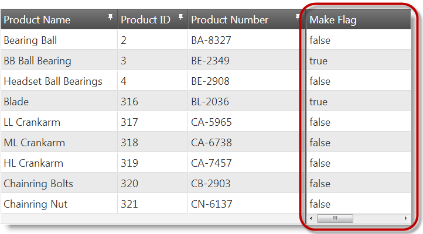
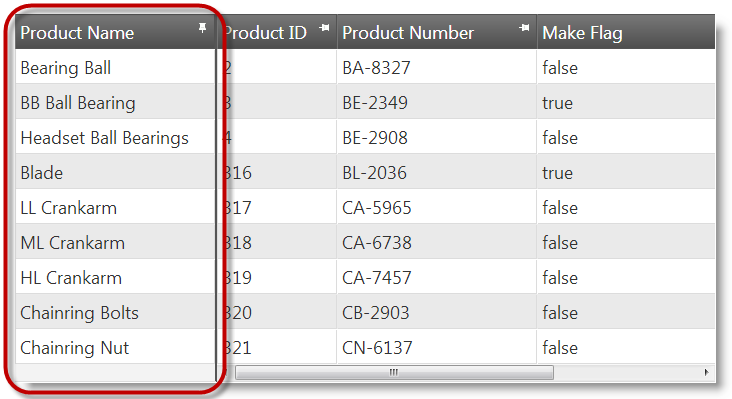
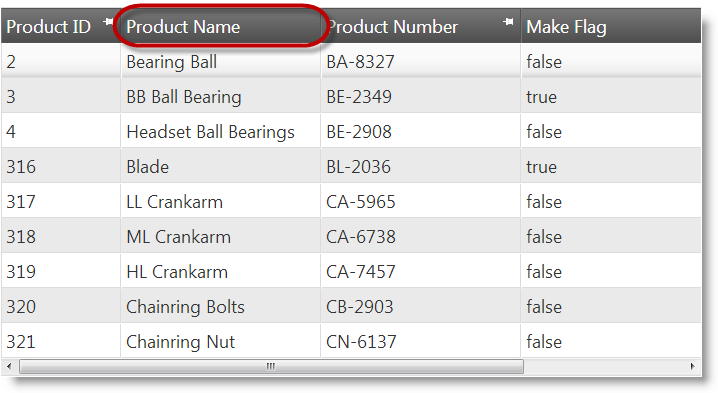

<!--
|metadata|
{
    "fileName": "iggrid-columnfixing-configuring",
    "controlName": "",
    "tags": []
}
|metadata|
-->

# Configuring Column Fixing (igGrid)

## Topic Overview

### Purpose

This topic explains, with code examples how to configure Column Fixing feature of the `igGrid`™ control including the position of the Fixed Columns area, the initial column fix state, and the minimum Unfixed Columns area width.

### Required background

The following topics are prerequisites to understanding this topic:

- [igGrid Overview](igGrid-Overview.html): This topic provides a conceptual overview of the `igGrid` control and its features explains, with code examples, how to add it to an HTML page.

- [igGrid/igDataSource Architecture Overview](igGrid-igDataSource-Architecture-Overview.html): This topic explains the inner workings of the `igGrid` control and its interaction with the data source component (`igDataSource`™).

- [Column Fixing Overview (igGrid)](igGrid-ColumnFixing-Overview.html): This topic provides conceptual overview of the `igGrid` Column Fixing feature including the supported user interactions and the main configuration options.

- [Enabling Column Fixing (igGrid)](igGrid-ColumnFixing-Enabling.html): This topic explains, with code examples, how to enable the Column Fixing feature of the `igGrid` in both JavaScript and ASP.NET MVC.


### In this topic

This topic contains the following sections:

-   [**Column Fixing Configuration Summary**](#configuration-summary)
-   [**Configuring the Column Fixing Direction**](#direction)
    -   [Property settings](#direction-property-settings)
    -   [Example: Configure fixing direction on the right](#direction-example)
-   [**Configuring the Column Initial Fixed State**](#initial-state)
    -   [Overview](#initial-overview)
    -   [Property settings](#initial-property-settings)
    -   [Example](#initial-example)
-   [**Disabling Column Fixing for a Column**](#disable)
    -   [Overview](#disable-overview)
    -   [Property settings](#disable-property-settings)
    -   [Example](#disable-example)
-   [**Configuring the non-fixable column area minimal width**](#non-fixable-min-width)
    -   [Property settings](#non-fixable-min-width-property)
    -   [Example](#non-fixable-min-width-example)
-   [**Related Content**](#related-content)
    -   [Topics](#topics)
    -   [Samples](#samples)


## <a id="configuration-summary"></a> Column Fixing Configuration Summary

The following table lists the configurable aspects of `igGrid` Column Fixing. Additional details are available after the table.

<table class="table table-striped">
	<tbody>
		<tr>
			<th>
Configurable aspect
			</th>
			<th width="462">
Details
			</th>
			<th>
Properties
			</th>
		</tr>
		<tr>
			<td>Enabling/Disabling</td>
			<td width="462">
By default, columns can be fixed by users. You can enable/disable column from fixing.
			</td>
			<td>
				<ul>
					<li>
					[columnSettings](%%jQueryApiUrl%%/ui.iggridcolumnfixing#options:columnSettings)
					</li>
					<li>
					 [columnSettings.columnKey](%%jQueryApiUrl%%/ui.iggridcolumnfixing#options:columnSettings.columnKey)
					</li>
					<li>
					[columnSettings.allowFixing](%%jQueryApiUrl%%/ui.iggridcolumnfixing#options:columnSettings.allowFixing)
					</li>
				</ul>
			</td>
		</tr>
		<tr>
			<td>
[Fixed columns placement](igGrid-ColumnFixing-Configuring.html)
			</td>
			<td width="462">
By default, the fixed columns are placed on the left and the unfixed columns – on the right. You can swap the positions of the fixed and unfixed columns (i.e. fixed columns are placed on the right and the unfixed columns – on the left).
			</td>
			<td>
[fixingDirection](%%jQueryApiUrl%%/ui.iggridcolumnfixing#options:fixingDirection)
			</td>
		</tr>
		<tr>
			<td>
[Initial fix state](igGrid-ColumnFixing-Configuring.html)
			</td>
			<td width="462">
By default, the initial fix state of a column is unfixed. You can configure the initial fix state to be fixed.
			</td>
			<td>
				<ul>
					<li>
					[columnSettings](%%jQueryApiUrl%%/ui.iggridcolumnfixing#options:columnSettings)
					</li>
					<li>
					[columnSettings.columnKey](%%jQueryApiUrl%%/ui.iggridcolumnfixing#options:columnSettings.columnKey)
					</li>
					<li>
					[columnSettings.isFixed](%%jQueryApiUrl%%/ui.iggridcolumnfixing#options:columnSettings.isFixed)
					</li>
				</ul>
			</td>
		</tr>
		<tr>
			<td>
[Minimum Non-Fixed Columns area width](igGrid-ColumnFixing-Configuring.html)
			</td>
			<td width="462">
You configure the minimum width of the Non-Fixed Columns area. The minimum width ensures that the scrollbar will always be kept operational for the user. The default width of the Non-Fixed Columns area is 30 px.
			</td>
			<td>
[minimalVisibleAreaWidth](%%jQueryApiUrl%%/ui.iggridcolumnfixing#options:minimalVisibleAreaWidth)
			</td>
		</tr>
		<tr>
			<td>
Initial fix state of data-skip columns
			</td>
			<td width="462">
Some features like Row Selectors use data-skip columns to render additional content to the grid. These columns are not bindable to data and serve functional purposes (e.g. the Row Selector column) so their initial fix state is managed separately from the data-bound columns. This is done with a special property, [`fixNondataColumns`](%%jQueryApiUrl%%/ui.iggridcolumnfixing#options:fixNondataColumns).
<blockquote> **Note:**  This property works only when fixed columns are positioned on the left (i.e. the [`fixingDirection`](%%jQueryApiUrl%%/ui.iggridcolumnfixing#options:fixingDirection) option is set to “left”).</blockquote>
			</td>
			<td>
[fixNondataColumns](%%jQueryApiUrl%%/ui.iggridcolumnfixing#options:fixNondataColumns)
			</td>
		</tr>
	</tbody>
</table>


## <a id="direction"></a> Configuring the Placement of the Fixed Columns in the Grid

By default, the fixed columns (the [Fixed Columns area](igGrid-ColumnFixing-Overview.html)) are placed on the left and the non-fixed columns (i.e. the [Non-Fixed Columns area](igGrid-ColumnFixing-Overview.html)) – on the right. You can swap the positions of the fixed and unfixed columns (resulting with the fixed columns are placed on the right and the non-fixed columns – on the left).

The placement of the Fixed Columns and Non-Fixed columns areas relative to each other is managed by the [`fixingDirection`](%%jQueryApiUrl%%/ui.iggridcolumnfixing#options:fixingDirection) property of the Column Fixing feature.

### <a id="direction-property-settings"></a> Property settings

The following table maps the desired configuration to property settings.

In order to: | Use this property: | And set it to:
---- | ----- | -----
Place fixed columns on the left | [fixingDirection](%%jQueryApiUrl%%/ui.iggridcolumnfixing#options:fixingDirection) | ”left”
Place fixed columns on the right | [fixingDirection](%%jQueryApiUrl%%/ui.iggridcolumnfixing#options:fixingDirection) | “right”

### <a id="direction-example"></a> Example

The screenshot below demonstrates the Fixed Columns area placed in the right-hand side of the grid as a result of the following settings:

Property | Value
---|---
[fixingDirection](%%jQueryApiUrl%%/ui.iggridcolumnfixing#options:fixingDirection) | "right"




Following is the code that implements this example.

**In JavaScript:**

```js
$("#grid").igGrid({
    dataSource: adventureWorks,
    autoGenerateColumns: true,
    features: [
        {
            name: "ColumnFixing",
            fixingDirection: "right"
        }
    ]
});
```

**In ASPX:**

```csharp
@(Html.Infragistics().Grid(Model)
.AutoGenerateColumns(true)
.ID("grid1")
.Features(f => f.ColumnFixing().FixingDirection(ColumnFixingDirection.Right))
.DataBind()
.Render())
```


## <a id="initial-state"></a> Configuring the Initial Fix State of a Column

### <a id="initial-overview"></a> Overview

You can specify which columns to be fixed upon the initial initialization of the grid and which to be non-fixed. By default, all columns are initially non-fixed. Configuring initial fixed columns is done on each column individually.

To fix a column upon the initial initialization of the grid, you need to specify the column (through a column identifier – either the column key or the column index) and set the [`isFixed`](%%jQueryApiUrl%%/ui.iggridcolumnfixing#options:isFixed) property to true:

-   In JavaScript –set the [`columnSettings`](%%jQueryApiUrl%%/ui.iggridcolumnfixing#options:columnSettings) property of the Column Fixing feature to an array the objects of which consist of the column identifier and the setting of the isFixed property for that column.
-   In ASP.NET MVC – when configuring the grid in the View with the chaining method, use the `ColumnSettings` method of the Column Fixing feature.

When Column Fixing is disabled for a column, the column header pin button for that column is hidden.

### <a id="initial-property-settings"></a> Property settings

The following table lists the properties and their settings that enable the initial column fixing.

In order to: | Use these properties: | And set it to:
---- | ----- | -----
Fix column initially | [columnSettings.columnKey](%%jQueryApiUrl%%/ui.iggridcolumnfixing#options:columnSettings.columnKey) <br /> or  <br /> [columnSettings.columnIndex](%%jQueryApiUrl%%/ui.iggridcolumnfixing#options:columnSettings.columnIndex) | the key of the column  <br /> or  <br /> the index number of the column
 | [columnSettings.isFixed](%%jQueryApiUrl%%/ui.iggridcolumnfixing#options:columnSettings.isFixed) | true


### <a id="initial-example"></a> Example

The screenshot below demonstrates the Product Name column (with column key “Name”) configured as fixed upon `igGrid`’s initialization as a result of the following settings:


Property | Value
---|---
[columnSettings.columnKey](%%jQueryApiUrl%%/ui.iggridcolumnfixing#options:columnSettings.columnKey) | "Name"
[columnSettings.isFixed](%%jQueryApiUrl%%/ui.iggridcolumnfixing#options:columnSettings.isFixed) | true




Following is the code that implements this example.

**In JavaScript:**

```js
$("#grid").igGrid({
    dataSource: adventureWorks,
    autoGenerateColumns: true,
    features: [
        {
            name: "ColumnFixing",
            columnSettings: [
                {
                    columnKey: "Name",
                    isFixed: true
                }
            ]
        }
    ]});
```

**In ASPX:**

```csharp
@(Html.Infragistics().Grid(Model)
.AutoGenerateColumns(true)
.ID("grid1")
.Features(f => 
    f.ColumnFixing()
    .ColumnSettings(cs => cs.ColumnSetting().ColumnKey("Name").IsFixed(true)))
.DataBind()
.Render())
```


## <a id="disable"></a> Disabling Column Fixing for a Column

### <a id="disable-overview"></a> Overview

You can specify which columns the user should be allowed to fix and which – should not. By default, Column Fixing is enabled for all columns in the grid. Disabling Column Fixing is done on each column individually.

To disable fixing a column, you need to specify the column (through a column identifier – either the column key or the column index)) and set the [`allowFixing`](%%jQueryApiUrl%%/ui.iggridcolumnfixing#options:allowFixing) property to false:

-   In JavaScript –set the columnSettings property of the feature to an array the objects of which consist of the column identifier and the setting of the [`allowFixing`](%%jQueryApiUrl%%/ui.iggridcolumnfixing#options:allowFixing) property for that column.
-   In ASP.NET MVC – when configuring the grid in the View with the chaining method, use the `ColumnSettings` of the Column Fixing feature.

When Column Fixing is disabled for a column, the column header pin
button for that column is hidden.

### <a id="disable-property-settings"></a> Property settings

The following table lists the properties and their settings that disable Column Fixing for a column.

In order to: | Use these properties: | And set it to:
---- | ----- | -----
Fix column initially | [columnSettings.columnKey](%%jQueryApiUrl%%/ui.iggridcolumnfixing#options:columnSettings.columnKey) <br /> or  <br /> [columnSettings.columnIndex](%%jQueryApiUrl%%/ui.iggridcolumnfixing#options:columnSettings.columnIndex) | the key of the column  <br /> or  <br /> the index number of the column
 | [columnSettings.allowFixing](%%jQueryApiUrl%%/ui.iggridcolumnfixing#options:columnSettings.allowFixing) | false


### <a id="disable-example"></a> Example

The screenshot below demonstrates Column Fixing being disabled for the *Product Name* column (with column key “Name”) as a result of the following settings:

Property | Value
---|---
[columnSettings.columnKey](%%jQueryApiUrl%%/ui.iggridcolumnfixing#options:columnSettings.columnKey) | "Name"
[columnSettings.allowFixing](%%jQueryApiUrl%%/ui.iggridcolumnfixing#options:columnSettings.allowFixing) | false




Following is the code that implements this example.

**In JavaScript:**

```js
$("#grid").igGrid({
    dataSource: adventureWorks,
    autoGenerateColumns: true,
    features: [
        {
            name: "ColumnFixing",
            columnSettings: [
                {
                    columnKey: "Name",
                    allowFixing: false
                }
            ]
        }
    ]});
```

**In ASPX:**

```csharp
@(Html.Infragistics().Grid(Model)
.AutoGenerateColumns(true)
.ID("grid1")
.Features(f => 
    f.ColumnFixing()
    .ColumnSettings(cs => cs.ColumnSetting().ColumnKey("Name").AllowFixing(false)))
.DataBind()
.Render())
```


## <a id="non-fixable-min-width"></a> Configuring the Minimum Width of the Non-Fixed Columns Area

The [Non-Fixed Columns area](igGrid-ColumnFixing-Overview.html) has a horizontal scrollbar and automatically shrinks when a column is fixed. As a result, the Non-Fixed Columns area can become very thin, so, as a precaution, a minimum threshold width can be configured for it to preserve the operation ability of the scrollbar for the user. When the minimum threshold width is reached, a [`columnFixingRefused`](%%jQueryApiUrl%%/ui.iggridcolumnfixing#events) event is raised to indicate that no more columns can be fixed until some of the already fixed columns are unfixed.

### <a id="non-fixable-min-width-property"></a> Property settings

The following table maps the desired configuration to property settings.

In order to: | Use these properties: | And set it to:
---- | ----- | -----
Configure non-fixable column area minimum width | [minimalVisibleAreaWidth](%%jQueryApiUrl%%/ui.iggridcolumnfixing#options:minimalVisibleAreaWidth) | A value indicating the minimum width in pixels.


### <a id="non-fixable-min-width-example"></a> Example

The screenshot below demonstrates what the minimum width of the Non-Fixed Columns area looks like as a result of the following settings:

Property | Value
---|---
[minimalVisibleAreaWidth](%%jQueryApiUrl%%/ui.iggridcolumnfixing#options:minimalVisibleAreaWidth) | 100


Following is the code that implements this example.

**In JavaScript:**

```js
$("#grid").igGrid({
    dataSource: adventureWorks,
    autoGenerateColumns: true,
    features: [
        {
            name: "ColumnFixing",
            minimalVisibleAreaWidth: 100
        }
    ]
});
```

**In ASPX:**

```csharp
@(Html.Infragistics().Grid(Model)
.AutoGenerateColumns(true)
.ID("grid1")
.Features(f => f.ColumnFixing().MinimalVisibleAreaWidth(100)
.DataBind()
.Render())
```


## <a id="related-content"></a> Related Content

### <a id="topics"></a> Topics

The following topics provide additional information related to this topic.

- [Method Reference (Column Fixing, igGrid)](igGrid-ColumnFixing-Method-Reference.html): This topic provides reference information about the methods related to the Column Fixing feature of the `igGrid` control.


### <a id="samples"></a> Samples

The following samples provide additional information related to this topic.

- [Column Fixing](%%SamplesUrl%%/grid/column-fixing): This sample demonstrates the basic functionalities of the `igGrid`’s Column Fixing feature – setting columns fixed by default and preventing columns from being fixed by the user.


 

 


