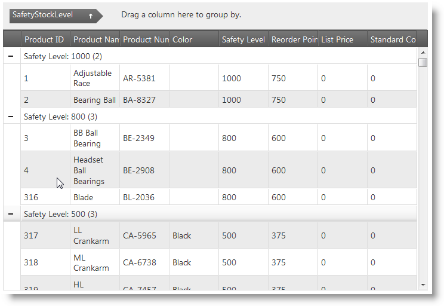

<!--
|metadata|
{
    "fileName": "iggrid-groupby-overview",
    "controlName": "igGrid",
    "tags": ["Getting Started","Grids","Grouping"]
}
|metadata|
-->

# Column Grouping Overview (igGrid)

## Topic Overview

### Purpose

This topic introduces the grouping functionality of the `igGrid`™.


### In this topic

This topic contains the following sections:

-   [Introduction](#introduction)
-   [GroupBy Persistence](#groupBy-persistence)
-   [Grouping Features Overview](#grouping-features)
-   [API Usage](#api-usage) 
-   [Keyboard Interactions](#keyboard-interaction) 
-   [Related Content](#related-content)

## <a id="introduction"></a> Introduction

The `igGrid` supports a column grouping functionality that enables the user to employ the data in one or more columns in a grid as a primary and, respectively, secondary criteria for organizing the records in the group in groups. The picture bellow demonstrate a grid in which the values of the `SafetyStockLevel` column – 500, 8000, 1,000, etc. – are used to group and arrange the data in the grid, i.e. the grid is grouped by its `SafetyStockLevel` column. 



Grouping in the `igGrid` works the same as the analogous functionality in Microsoft® Office Outlook® – you drag a column that you want to group by and drop it into a special grouping area above the grid. This re-arranges the grid with as many groups as distinct value are there in the selected column. In addition, inside the groups, the records are sorted. If you drop additional columns, then, within the already existing groups, further groupings are applied.

You can define your own custom grouping method. For details about custom grouping, refer to the Grid Outlook Group By Overview topic.

Grouping is implemented and managed by the Group By widget.

## <a id="groupBy-persistence"></a> GroupBy Persistence

Persisting grouped columns between `igGrid` re-bindings is made easy in version 14.1 and in fact replaces the previous default behavior.

> **Note** GroupBy persistence is true by default. This is a breaking change.

When you enable `igGridGroupBy` you are already using it in a [`persist`](%%jQueryApiUrl%%/ui.iggridgroupby#options:persist) mode. This means that after explicitly calls of `dataBind()`, that persistence is applied for UI and data source view (the grouped columns are not cleared and the data source remains sorted)

GroupBy persistence is implemented for `igHierarchicalGrid` too.

The following sample demonstrates the persistance capabilities of the GroupBy feature.

<div class="embed-sample">
   [Feature Persistence](%%SamplesEmbedUrl%%/grid/feature-persistence)
</div>

If you would like to retain the previous behavior of group by being cleared after user re-binds the `igGrid`, you can do this by disabling the feature through the [`persist`](%%jQueryApiUrl%%/ui.iggridgroupby#options:persist) option as shown in the code snippet below:

**In JavaScript:**

```js
features: [
  { 
     name: “GroupBy”, 
     persist: false 
  }
] 
```

## <a id="grouping-features"></a> Grouping Features Overview

The table below briefly explains the grouping main features and the Group By widget properties that manage them.

> **Note:** In the following table, the properties and events specific to the [Group By Dialog](igGrid-Group-By-Dialog-Overview.html) are not listed. They are available in the [Group By Dialog](igGrid-Group-By-Dialog-Overview.html) topic.

<table class="table table-bordered">
    <tbody>
        <tr>
            <th>Feature</th>
            <th>Description</th>
            <th>jQuery Property</th>
            <th>MVC Property</th>
        </tr>
        <tr>
            <td>Grouping mode</td>
            <td>There are several grouping modes supported by the Group By widget.</td>
            <td>[type](%%jQueryApiUrl%%/ui.iggridgroupby#options:type)</td>
            <td>[Type](Infragistics.Web.Mvc~Infragistics.Web.Mvc.GridGroupBy~Type.html)</td>
        </tr>
        <tr>
            <td>Column Settings</td>
            <td>This option allows configuring every column’s group by separately.</td>
            <td>[columnSettings](%%jQueryApiUrl%%/ui.iggridgroupby#options:columnSettings)</td>
            <td>[ColumnSettings](Infragistics.Web.Mvc~Infragistics.Web.Mvc.GridGroupBy~ColumnSettings.html)</td>
        </tr>
        <tr>
            <td>Group summaries</td>
            <td>Group summaries are provide some group-specific information about every group, like the the count of the rows in the group. Group summaries are configured individually for every group.</td>
            <td>[summarySettings](%%jQueryApiUrl%%/ui.iggridgroupby#options:summarySettings)</td>
            <td>[SummarySettings](Infragistics.Web.Mvc~Infragistics.Web.Mvc.GridGroupBy~SummarySettings.html)</td>
        </tr>
        <tr>
            <td>Grouped row text templates</td>
            <td>
Template for the text of the grouped row. (Follows the jQuery templating guidelines.)
            </td>
            <td>
[groupedRowTextTemplate](%%jQueryApiUrl%%/ui.iggridgroupby#options:groupedRowTextTemplate)
            </td>
            <td>
[GroupedRowTextTemplate](Infragistics.Web.Mvc~Infragistics.Web.Mvc.GridGroupBy~GroupedRowTextTemplate.html)
            </td>
        </tr>
        <tr>
            <td>Client events</td>
            <td>
The Group By widget has special events that can be handled during its lifecycle. They are events, which are fired when: <br />
the grouping action begins. (This event is cancelable.)<br />
the grouping action ends. **This event is fired also when group/ungroup from Group By modal dialog.**
            </td>
            <td>
[groupedColumnsChanging](%%jQueryApiUrl%%/ui.iggridgroupby#events:groupedColumnsChanging) <br />
[groupedColumnsChanged](%%jQueryApiUrl%%/ui.iggridgroupby#events:groupedColumnsChanged)
            </td>
            <td>
[groupedColumnsChanging](%%jQueryApiUrl%%/ui.iggridgroupby#events:groupedColumnsChanging) <br />
[groupedColumnsChanged](%%jQueryApiUrl%%/ui.iggridgroupby#events:groupedColumnsChanged)
            </td>
        </tr>
        <tr>
            <td>Appearance</td>
            <td>Plenty of features that allow you changing the look-and-feel of the group indicators and their text.</td>
            <td>
[groupByAreaVisibility](%%jQueryApiUrl%%/ui.iggridgroupby#options:groupByAreaVisibility)
<br />
[initialExpand](%%jQueryApiUrl%%/ui.iggridgroupby#options:initialExpand)
<br />
[emptyGroupByAreaContent](%%jQueryApiUrl%%/ui.iggridgroupby#options:emptyGroupByAreaContent)
<br />
[expansionIndicatorVisibility](%%jQueryApiUrl%%/ui.iggridgroupby#options:expansionIndicatorVisibility)
<br />
[groupByLabelWidth](%%jQueryApiUrl%%/ui.iggridgroupby#options:groupByLabelWidth)
<br />
[labelDragHelperOpacity](%%jQueryApiUrl%%/ui.iggridgroupby#options:labelDragHelperOpacity)
<br />
[indentation](%%jQueryApiUrl%%/ui.iggridgroupby#options:indentation)
<br />
[expandTooltip](%%jQueryApiUrl%%/ui.iggridgroupby#options:expandTooltip)
<br />
[collapseTooltip](%%jQueryApiUrl%%/ui.iggridgroupby#options:collapseTooltip)
<br />
[removeButtonTooltip](%%jQueryApiUrl%%/ui.iggridgroupby#options:removeButtonTooltip)
            </td>
            <td>
[GroupByAreaVisibility](Infragistics.Web.Mvc~Infragistics.Web.Mvc.GridGroupBy~GroupByAreaVisibility.html)
<br />
[InitialExpand](Infragistics.Web.Mvc~Infragistics.Web.Mvc.GridGroupBy~InitialExpand.html)
<br />
[EmptyGroupByAreaContent](Infragistics.Web.Mvc~Infragistics.Web.Mvc.GridGroupBy~EmptyGroupByAreaContent.html)
<br />
[ExpansionIndicatorVisibility](Infragistics.Web.Mvc~Infragistics.Web.Mvc.GridGroupBy~ExpansionIndicatorVisibility.html)
<br />
[GroupByLabelWidth](Infragistics.Web.Mvc~Infragistics.Web.Mvc.GridGroupBy~GroupByLabelWidth.html)
<br />
[LabelDragHelperOpacity](Infragistics.Web.Mvc~Infragistics.Web.Mvc.GridGroupBy~LabelDragHelperOpacity.html)
<br />
[Indentation](Infragistics.Web.Mvc~Infragistics.Web.Mvc.GridGroupBy~Indentation.html)
<br />
[ExpandTooltip](Infragistics.Web.Mvc~Infragistics.Web.Mvc.GridGroupBy~ExpandTooltip.html)
<br />
[CollapseTooltip](Infragistics.Web.Mvc~Infragistics.Web.Mvc.GridGroupBy~CollapseTooltip.html)
<br />
[RemoveButtonTooltip](Infragistics.Web.Mvc~Infragistics.Web.Mvc.GridGroupBy~RemoveButtonTooltip.html)
            </td>
        </tr>
    </tbody>
</table>

The following sample demonstrates how to use the [compareFunc](%%jQueryApiUrl%%/ui.iggridgroupby#options:columnSettings.compareFunc) to customize the grouping: 
 
<div class="embed-sample">    
    [Grouping Customization](%%SamplesEmbedUrl%%/grid/grouping-customization)
</div>

## <a id="api-usage"></a> API Usage

In order to group a column programmatically, you need to do this in the following way:

**In JavaScript:**

```js
$('#grid1').igGridGroupBy('groupByColumn', 'ProductID');
```


The applied sorting expressions can be retrieved from the data source of the grid. In order to get them programmatically, you can use the following:

**In JavaScript:**

```js
var expressions = $('#grid1').data('igGrid').dataSource.settings.sorting.expressions; // array of expressions
// expression structure
{compareFunc: <type="function" comparer function>, dir: <type="string" sort direction>, fieldName: <type="string" column key>, isGroupBy: <type="bool" is the expression created by the Group By widget>, layout: <type="string" the key of the layout if done in igHierarchicalGrid>}
```

Expressions created by the Group By widget have a property "isGroupBy" equals to "true" to distinguish them from the ones created by the Sorting widget.

To get the grouped data (data rows and group rows) programmatically you need to do this:

**In JavaScript:**

```js
var data = $('#grid1').data('igGrid').dataSource.groupByData();
// group rows' structure
{collapsed: <type="bool" collapsed state>, fieldName: <type="string" column key>, gbExpr: <type="object" group by expression object>, id: <type="string" identificator of the group row>, len: <type="number" the number of data rows in the group>, level: <type="number" level of grouping>, recs: <type="array" set of the data records in the group>, val: <type="string" the value of the group>}
```

The group rows in the group by data are objects which contain the generated ID of the physical group row. The ID can be used to [`collapse`](%%jQueryApiUrl%%/ui.iggridgroupby#methods:collapse) and [`expand`](%%jQueryApiUrl%%/ui.iggridgroupby#methods:expand) the row programmatically:

**In JavaScript:**

```js
var data = $('#grid1').data('igGrid').dataSource.groupByData(), 
	id = data[0].id; 
// collapse
$('#grid1').igGridGroupBy("collapse", id); 
// expand
$('#grid1').igGridGroupBy("expand", id);
```

The following sample provides additional information related to the API usage: 

<div class="embed-sample">
   [Grouping API](%%SamplesEmbedUrl%%/grid/grouping-api)
</div>

## <a id="keyboard-interaction"></a> Keyboard Interactions

The following keyboard interactions are available.

When focus is on the grid:

-	TAB: Can move focus between the focusable elements of the GroupBy feature: the select columns link in the GroupBy area.

When focus is on the element:

-	ENTER: Opens the GroupBy dialog.

When focus is on the dialog:

-	TAB: Moves focus between the focusable elements of the dialog – “Group By” buttons, “Clear all” buttons, “Apply” and “Cancel” buttons. The related actions can be applied by hitting ENTER while the focus is on the related element.
-	ESCAPE: Closes the dialog.

## <a id="related-content"></a> Related Content

### <a id="topics"></a> Topics

The following topics provide additional information related to this topic.

- [Grid Outlook Group By Getting Started](igGrid-Enabling-GroupBy.html)

- [Grid Outlook Group By Properties Reference](%%jQueryApiUrl%%/ui.iggridgroupby#options)

- [Grid Known Issues and Breaking Changes](igGrid-Known-Issues.html)

### <a id="samples"></a> Samples

The following samples provide additional information related to this topic.

- [Grouping with summaries](%%SamplesUrl%%/grid/grouping)

 


